# 👨🏾‍💻 Project: Foodies Next.js App

## 📋 Project Overview
This project is a modern web application built with **Next.js** to showcase a food-sharing community. It features dynamic routing, server-side data fetching, and high-performance image optimization.

- **What This Project Does**: 
  - Allows users to browse a collection of meals shared by others.
  - Enables users to share their own culinary creations.
  - Provides a dedicated community space for food enthusiasts.
  - Implements an interactive image slideshow for the landing page.
- **Technology Stack**: 
  - **Framework**: Next.js (App Router)
  - **Language**: JavaScript / React
  - **Styling**: Vanilla CSS with CSS Modules
  - **Assets**: Optimized images via `next/image`
- **Key Components**: 
  - `MainHeader`: Global navigation and branding.
  - `NavLink`: Interactive links with active-state detection.
  - `ImageSlideshow`: Automated, performant hero slideshow.
  - `MainHeaderBackground`: Decoupled decorative SVG background.

## 📑 Table of Contents
- [👨🏾‍💻 Project Overview](#-project-overview)
- [📑 Table of Contents](#-table-of-contents)
- [📁 Visual Project Tree](#-visual-project-tree)
- [🧳 Section 03: NextJS Essential (App Router)](#-section-03-nextjs-essential-app-router)
  - [📚 Lesson 097: Exercise: Task and solution](#-97-lesson-097--exercise-task-and-solution)
  - [📚 Lesson 098: Revisiting: The Concept Of Layouts](#-98-lesson-098--revisiting-the-concept-of-layouts)
  - [📚 Lesson 099: Adding a Custom Component To A Layout](#-99-lesson-099--adding-a-custom-component-to-a-layout)
  - [📚 Lesson 100: Styling NextJS Project: Your Options & Using CSS Modules](#-100-lesson-100--styling-nextjs-project-your-options--using-css-modules)
  - [📚 Lesson 101: Optimizing Images with the NextJS Image Component](#-101-lesson-101--optimizing-images-with-the-nextjs-image-component)
  - [📚 Lesson 102: Using More Custom Components](#-102-lesson-102--using-more-custom-components)
  - [📚 Lesson 103: Populating The Starting Page Content](#-103-lesson-103--populating-the-starting-page-content)
  - [📚 Lesson 104: Preparing an Image Slideshow](#-104-lesson-104--preparing-an-image-slideshow)
  - [📚 Lesson 105: React Server Components vs Client Components](#-105-lesson-105--react-server-components-vs-client-components---when-to-use-what)
  - [📚 Lesson 106: Using Client Components Efficiently](#-106-lesson-106--using-client-components-efficiently)
  - [📚 Lesson 107: Outputting Meals Data & Images With Unknown Dimensions](#-107-lesson-107--outputting-meals-data--images-with-unknown-dimensions)
  - [📚 Lesson 108: Setting Up A SQLite Database](#-108-lesson-108--setting-up-a-sqlite-database)
  - [📚 Lesson 109: Fetching Data By Leveraging NextJS & Fullstack Capabilities](#-109-lesson-109--fetching-data-by-leveraging-nextjs--fullstack-capabilities)
  - [📚 Lesson 110: Adding A Loading Page](#-110-lesson-110--adding-a-loading-page)
  - [📚 Lesson 111: Using Suspense & Streamed Responses For Granular Loading State Management](#-111-lesson-111--using-suspense--streamed-responses-for-granular-loading-state-management)
  - [📚 Lesson 112: Handling Errors](#-112-lesson-112--handling-errors)
  - [📚 Lesson 113: Handling "Not Found" States](#-113-lesson-113--handling-not-found-states)
  - [📚 Lesson 114: Loading and Rendering Meal Details via Dynamic Routes & Route Parameters](#-114-lesson-114--loading-and-rendering-meal-details-via-dynamic-routes--route-parameters)
  - [📚 Lesson 115: Throwing Not Found Errors For Individual Meals](#-115-lesson-115--throwing-not-found-errors-for-individual-meals)
  - [📚 Lesson 116: Getting Started with the "Share Meal" Form](#-116-lesson-116---getting-started-with-the-share-meal-form)
  - [📚 Lesson 117: Getting Started with a Custom Image Picker Input Component](#-117-lesson-117--getting-started-with-a-custom-image-picker-input-component)

## 📁 Visual Project Tree
```
03-onwards-foodies-starting-project/
├── app/
│   ├── community/
│   │   ├── page.js                # 📄 Community page displaying social features
│   │   └── page.module.css        # 📄 Scoped styles for the community page
│   ├── components/
│   │   ├── images/
│   │   │   ├── image-slideshow.js # 📄 Animated slideshow component
│   │   │   └── image-slideshow.module.css
│   │   ├── meals/
│   │   │   ├── image-picker.js    # 📄 Custom image picker client component
│   │   │   └── image-picker.module.css # 📄 Styles for image picker
│   │   └── main-header/
│   │       ├── main-header.js     # 📄 Global navigation header
│   │       ├── main-header.module.css
│   │       ├── main-header-background.js
│   │       ├── main-header-background.module.css
│   │       ├── nav-link.js        # 📄 Individual navigation link component
│   │       └── nav-link.module.css
│   ├── meals/
│   │   ├── [mealSlug]/
│   │   │   └── page.js            # 📄 Dynamic route for meal details
│   │   ├── share/
│   │   │   └── page.js            # 📄 Page for sharing new meals
│   │   ├── layout.js              # 📄 Layout for meals section
│   │   └── page.js                # 📄 Main meals listing page
│   ├── globals.css                # 📄 Global application styles
│   ├── icon.png                   # 📄 App icon
│   ├── layout.js                  # 📄 Root application layout
│   ├── page.js                    # 📄 Landing/Home page
│   └── page.module.css            # 📄 Styles for the landing page
├── assets/                        # 📁 Static assets (images, icons)
├── docs/
│   └── LECTURE_STEPS.md           # 📄 This educational documentation
├── img/                           # 📁 Screenshots for documentation
├── public/                        # 📁 Static assets served directly
├── jsconfig.json                  # 📄 Path aliases configuration
├── next.config.js                 # 📄 Next.js configuration
├── package.json                   # 📄 Project dependencies
└── README.md                      # 📄 General project information
```

<br>

## 🧳 Section 03: *NextJS Essential (App Router)*

### 📑 Table of Contents
- [📚 Lesson 097: Exercise: Task and solution](#-97-lesson-097--exercise-task-and-solution)
- [📚 Lesson 098: Revisiting: The Concept Of Layouts](#-98-lesson-098--revisiting-the-concept-of-layouts)
- [📚 Lesson 099: Adding a Custom Component To A Layout](#-99-lesson-099--adding-a-custom-component-to-a-layout)
- [📚 Lesson 100: Styling NextJS Project: Your Options & Using CSS Modules](#-100-lesson-100--styling-nextjs-project-your-options--using-css-modules)
- [📚 Lesson 101: Optimizing Images with the NextJS Image Component](#-101-lesson-101--optimizing-images-with-the-nextjs-image-component)
- [📚 Lesson 102: Using More Custom Components](#-102-lesson-102--using-more-custom-components)
- [📚 Lesson 103: Populating The Starting Page Content](#-103-lesson-103--populating-the-starting-page-content)
- [📚 Lesson 104: Preparing an Image Slideshow](#-104-lesson-104--preparing-an-image-slideshow)
- [📚 Lesson 105: React Server Components vs Client Components](#-105-lesson-105--react-server-components-vs-client-components---when-to-use-what)
- [📚 Lesson 106: Using Client Components Efficiently](#-106-lesson-106--using-client-components-efficiently)

<br>

## 🔧 97. Lesson 097 — *Exercise: Task and solution*

- [Lecture 097: Exercise: Task and solution](#-97-lesson-097--exercise-task-and-solution)
    - [97.1 Context](#971-context)
    - [97.2 Updating code according the context](#972-updating-code-according-the-context)
        - [97.2.1 create `/community` route](#9721-create-community-route)
        - [97.2.2 create `/meals/[mealSlug]` route](#9722-create-mealsmealslug-route)
        - [97.2.3 create `/meals/share` route](#9723-create-mealsshare-route)
        - [97.2.4 Create `/meals` route](#9724-create-meals-route)
        - [97.2.5 Create `/app` route](#9725-create-app-route)
    - [97.3 Pending Fixes (TODO)](#973-pending-fixes-todo)

### 🧠 97.1 Context:

Next.js uses a **file-system based router**, where folders are used to define routes. Each folder represents a route segment that maps to a URL segment. To create a nested route, you nest folders inside each other. A special `page.js` file is required to make a route segment publicly accessible.

- **Static Routes**: Defined by standard folder names (e.g., `app/community` maps to `/community`).
- **Nested Routes**: Defined by nesting folders (e.g., `app/meals/share` maps to `/meals/share`).
- **Dynamic Routes**: Defined by wrapping folder names in square brackets (e.g., `app/meals/[mealSlug]` maps to `/meals/any-id`). This allows the segment to act as a placeholder for dynamic data.

**When to use:**
- Static routes are used for fixed pages like "About", "Contact", or "Community".
- Dynamic routes are essential for resource-specific pages like "Product Details" or "Blog Posts" where the content depends on an ID or slug.

**Advantages:**
- Highly intuitive once the convention is understood.
- Enables automatic code splitting per route.
- Simplifies navigation management without complex configuration files.

**Disadvantages:**
- Strict naming requirements (`page.js`, `layout.js`, etc.) can be restrictive.
- Moving files physically changes the URL structure, which requires care for SEO and links.

**Alternatives:**
- In some scenarios, **Catch-all Routes** (`[...slug]`) or **Optional Catch-all Routes** (`[[...slug]]`) might be more appropriate for highly flexible URL structures.


### ⚙️ 97.2 Updating code according the context:

**Summary**
This section documents the practical implementation of the application's core routing structure. It covers the creation of static routes for general sections (`/meals`, `/community`), a nested route for a specific feature (`/meals/share`), and a dynamic route for individual meal details (`/meals/[mealSlug]`). Finally, it connects these routes with navigation links on the home page.


Project Tree:
```
03-onwards-foodies-starting-project/
├── app
│   ├── community
│   │   └── page.js                # Community page displaying social features
│   ├── meals
│   │   ├── [mealSlug]
│   │   │   └── page.js            # Dynamic route for specific meal details
│   │   ├── share
│   │   │   └── page.js            # Page for users to share their own meals
│   │   └── page.js                # Main meals list page (all meals)
│   ├── globals.css                # Global CSS styles and Tailwind imports
│   ├── icon.png                   # Main application favicon/icon
│   ├── layout.js                  # Root layout wrapping all pages
│   └── page.js                    # Home/Landing page of the application
├── assets
│   ├── icons                      # UI icons (community.png, events.png, etc.)
│   └── images                     # Original food images and brand assets
├── docs                           # Documentation and lesson notes
├── public
│   └── images                     # Static food images served via /images URL
├── .eslintrc.json                 # Linting rules for code quality
├── .gitignore                     # Files and folders ignored by Git
├── jsconfig.json                  # JS configuration for path aliases (@/...)
├── next.config.js                 # Next.js specific settings
├── package.json                   # Project dependencies (Next.js, React)
└── README.md                      # Project documentation
```


#### 97.2.1 create `/community` route:

Having this project:
* [starting project (local)](https://github.com/mschwarzmueller/nextjs-complete-guide-course-resources/blob/main/attachments/02-nextjs-essentials/foodies-starting-project.zip)

* [Starting project (CodeSandbox)](https://codesandbox.io/p/devbox/meals-app-starting-project-8vjnw3)
**Subsection Summary**
Defines the `/community` static route. This serves as the foundation for the social/collaboration features of the application.

```tsx
/* app/community/page.js */
export default function CommunityPage() {
  return <h1>Community Page</h1>
}
```

#### 97.2.2 create `/meals/[mealSlug]` route:

**Subsection Summary**
Implements a dynamic route segment using `[mealSlug]`. This allows the application to respond to any URL under `/meals/` that doesn't match a static route, passing the segment as a parameter to the component.

```tsx
/* app/meals/[mealSlug]/page.js */
// localhost:3000/meals/some-meals
export default function MealDetailsPage() {
  return <h1>Meal Details</h1>
}
```

#### 97.2.3 create `/meals/share` route:

**Subsection Summary**
Creates a nested static route `/meals/share` within the `meals` directory. This demonstrates how to organize feature-specific sub-routes.

```tsx
/* app/meals/share/page.js */
export default function ShareMealPage() {
  return <h1>Share Meal</h1>
}
```

#### 97.2.4 Create `/meals` route:

**Subsection Summary**
Sets up the main `/meals` landing page. This will eventually act as the hub for browsing all available food entries.

```tsx
/* app/meals/page.js */
export default function MealsPage(){
  return <h1>Meals Page</h1>
}
```

#### 97.2.5 Create `/app` route:

**Subsection Summary**
Links the root landing page to the new routes using the Next.js `Link` component. Linking is crucial for enabling smooth client-side transitions instead of full-page reloads.

```tsx
/* app/page.js */
import Link from "next/link";
export default function Home() {
  return (
    <main>
      <h1 style={{ color: 'white', textAlign: 'center' }}>
        Time to get started!
      </h1>
      <p><Link href="/meals">Meals</Link></p>
      <p><Link href="/meals/share">Share Meal</Link></p>
      <p><Link href="/community">Community</Link></p>
    </main>
  );
}
```


### 🧱 97.3 Pending Fixes (TODO)

- [ ] Replace placeholder `<h1>` tags with actual functional components and UI for all routes.
- [ ] Implement data fetching logic for `[mealSlug]` to display real meal details.
- [ ] Add specific CSS modules or Tailwind classes to new pages.
- [ ] Configure `generateMetadata` for dynamic routes to improve SEO.
- [ ] Address **Placeholder Content**: All new route components (`page.js`) currently only contain placeholder `<h1>` elements.
- [ ] Address **Missing Styling**: Newly created pages lack specific styling beyond global defaults.
- [ ] Address **Incomplete Dynamic Metadata**: Dynamic routes like `[mealSlug]` will need metadata for SEO purposes.

<br>

## 🔧 98. Lesson 098 — *Revisiting: The Concept Of Layouts*

- [Lecture 098: Revisiting: The Concept Of Layouts](#-98-lesson-098--revisiting-the-concept-of-layouts)
    - [98.1 Context](#981-context)
    - [98.2 Updating code according the context](#982-updating-code-according-the-context)
        - [98.2.1 Adding a `Layout` in `meals/` folder](#9821-adding-a-layout-in-meals-folder)
    - [98.3 Pending Fixes (TODO)](#983-pending-fixes-todo)

### 🧠 98.1 Context:

In Next.js App Router, **Layouts** are special React components that wrap route segments and persist across navigation. Unlike pages, layouts preserve their state and don't re-render when navigating between child routes. A `layout.js` file must export a default component that accepts a `children` prop, which represents the nested route segments.

**When layouts are used:**
- **Root Layout** (`app/layout.js`): Required for every Next.js app. Wraps all routes and typically includes `<html>` and `<body>` tags, global styles, metadata, and shared UI elements like headers or navigation.
- **Nested Layouts**: Created in route folders (e.g., `app/meals/layout.js`) to wrap specific route segments. They apply only to routes within that folder and its subfolders.
- **Shared UI**: When you need consistent navigation bars, sidebars, or section-specific headers that persist across multiple pages.
- **State Preservation**: When you want to maintain component state (like open menus or scroll positions) during client-side navigation.

**Examples from the project:**
- `app/layout.js`: Root layout that wraps the entire application, includes global CSS imports, metadata, and a decorative SVG header background.
- `app/meals/layout.js`: Nested layout that wraps all meals-related routes (`/meals`, `/meals/share`, `/meals/[mealSlug]`), displaying a "🧇 Meals Layout" indicator that appears on all meals pages.

**Advantages:**
- **Code Reusability**: Shared UI elements (headers, navigation, sidebars) are defined once and reused across multiple pages.
- **Performance**: Layouts don't re-render on navigation, reducing unnecessary work and improving perceived performance.
- **State Preservation**: Component state in layouts persists during client-side navigation, improving user experience.
- **Nested Structure**: Multiple layouts can be nested, allowing for hierarchical UI organization (root → section → subsection).
- **Automatic Wrapping**: Next.js automatically wraps route segments with their parent layouts, following the folder structure.

**Disadvantages:**
- **Strict Naming**: Must be named exactly `layout.js` (case-sensitive), which can be restrictive.
- **Nested Behavior**: Can be confusing when multiple nested layouts exist, as they all render simultaneously.
- **Limited Flexibility**: All routes in a segment inherit the layout, making it difficult to have exceptions without restructuring folders.
- **State Management**: Shared state in layouts can lead to unexpected behavior if not carefully managed.

**When to consider alternatives:**
- **Client Components**: If you need interactivity (event handlers, state, effects), layouts must be Client Components (`'use client'`), which can impact performance.
- **Template Components**: Use `template.js` instead of `layout.js` if you want the component to re-render on every navigation (useful for animations or analytics).
- **Route Groups**: Use route groups (`(folderName)`) to organize routes without affecting the URL structure when you need different layouts for different route sets.

**Layout Hierarchy:**
In this project, the layout hierarchy is:
1. `app/layout.js` (Root Layout) → wraps everything
2. `app/meals/layout.js` (Meals Layout) → wraps only `/meals/*` routes

When visiting `/meals/share`, both layouts render: Root Layout → Meals Layout → ShareMealPage component.

### ⚙️ 98.2 Updating code according the context:

**Summary**
This section demonstrates the implementation of nested layouts in Next.js by creating a section-specific layout for the meals routes. The `MealsLayout` component wraps all routes under `/meals`, providing a consistent UI wrapper that persists across navigation between meals-related pages. This showcases how layouts can be nested hierarchically and how they automatically apply to all child routes within their directory.

#### 98.2.1 Adding a `Layout` in `meals/` folder:

**Subsection Summary**
Creates a nested layout component specifically for the meals section. This layout wraps all routes under `/meals` (including `/meals`, `/meals/share`, and `/meals/[mealSlug]`), displaying a visual indicator ("🧇 Meals Layout") that appears on all meals-related pages. The layout receives `children` as a prop, which represents the nested page components that will be rendered inside it.
```tsx
/* app/meals/layout.js */
export default function MealsLayout({ children }){
  return (
    <>
      <p>🧇 Meals Layout</p>
      { children }
    </>
  )
}
```

```
03-onwards-foodies-starting-project/
├── app
│   ├── community
│   │   └── page.js                # Community page displaying social features
│   ├── meals
│   │   ├── [mealSlug]
│   │   │   └── page.js            # Dynamic route for specific meal details
│   │   ├── share
│   │   │   └── page.js            # Page for users to share their own meals
│   │   ├── layout.js              # 👈🏽 ✅ Meals layout wrapping all Meals pages
│   │   └── page.js                # Main meals list page (all meals)
│   ├── globals.css                # Global CSS styles and Tailwind imports
│   ├── icon.png                   # Main application favicon/icon
│   ├── layout.js                  # Root layout wrapping all pages
│   └── page.js                    # Home/Landing page of the application
├── assets
│   ├── icons                      # UI icons (community.png, events.png, etc.)
│   └── images                     # Original food images and brand assets
├── docs                           # Documentation and lesson notes
├── public
│   └── images                     # Static food images served via /images URL
├── .eslintrc.json                 # Linting rules for code quality
├── .gitignore                     # Files and folders ignored by Git
├── jsconfig.json                  # JS configuration for path aliases (@/...)
├── next.config.js                 # Next.js specific settings
├── package.json                   # Project dependencies (Next.js, React)
└── README.md                      # Project documentation
```

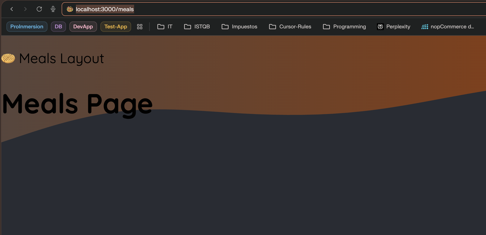

### 🧱 98.3 Pending Fixes (TODO)

- [ ] Replace placeholder paragraph in `MealsLayout` with meaningful UI structure (e.g., section header, navigation, or breadcrumbs).
- [ ] Add TailwindCSS classes or CSS modules to style the `MealsLayout` component consistently with the application design.
- [ ] Wrap layout content in semantic HTML elements (`<main>`, `<section>`, or `<nav>`) instead of fragments for better accessibility.
- [ ] Consider adding a shared header or navigation component specific to the meals section within the layout.
- [ ] Add proper spacing and layout structure to ensure child pages render correctly within the layout container.
- [ ] Address **Placeholder Layout Content**: The `MealsLayout` component (`app/meals/layout.js`) only contains a placeholder paragraph tag with an emoji. It lacks meaningful structure, styling, or functional purpose.
- [ ] Address **Missing Layout Styling**: The layout component has no CSS classes or styling applied. It should integrate with the application's design system (TailwindCSS) for consistent appearance.
- [ ] Address **No Semantic HTML Structure**: The layout uses a fragment (`<>...</>`) instead of semantic HTML elements like `<main>`, `<section>`, or `<nav>` that would improve accessibility and SEO.
- [ ] Address **Layout Not Client Component**: If the layout needs interactivity in the future (state, event handlers), it will need to be converted to a Client Component with `'use client'` directive. Currently, it's a Server Component, which is fine for static content.


<br>

## 🔧 99. Lesson 099 — *Adding a Custom Component To A Layout*

- [Lecture 099: Adding a Custom Component To A Layout](#-99-lesson-099--adding-a-custom-component-to-a-layout)
    - [99.1 Context](#991-context)
    - [99.2 Updating code according the context](#992-updating-code-according-the-context)
        - [99.2.1 Adding `main-header.js` file](#9921-adding-main-headerjs-file)
        - [99.2.2 Adding the `main-header.js` reference in `layout.js` file](#9922-adding-the-main-headerjs-reference-in-layoutjs-file)
    - [99.3 Pending Fixes (TODO)](#993-pending-fixes-todo)

### 🧠 99.1 Context:

In Next.js, **custom components** are reusable React components that can be imported and used within layouts, pages, or other components. When added to a layout, these components become part of the shared UI that persists across all routes wrapped by that layout. This pattern promotes code reusability, maintainability, and separation of concerns.

**When custom components in layouts are used:**
- **Shared UI Elements**: When you need consistent headers, navigation bars, footers, or sidebars that appear on multiple pages.
- **Code Organization**: To break down complex layouts into smaller, manageable, and testable pieces.
- **Reusability**: When the same component needs to be used across different layouts or pages.
- **Separation of Concerns**: To keep layout files clean and focused, delegating specific UI responsibilities to dedicated components.

**Examples from the project:**
- `app/components/main-header.js`: A custom header component that includes the application logo, branding, and main navigation links. This component is imported and used in the root layout (`app/layout.js`), making it visible on every page of the application.
- The `MainHeader` component encapsulates all header-related logic and markup, keeping the root layout clean and focused on its primary responsibility of wrapping the application structure.

**Advantages:**
- **Modularity**: Components can be developed, tested, and maintained independently.
- **Reusability**: Once created, components can be imported and used in multiple places without code duplication.
- **Maintainability**: Changes to shared UI elements only need to be made in one place, reducing the risk of inconsistencies.
- **Readability**: Layout files remain clean and easy to understand when complex UI is extracted into named components.
- **Testability**: Individual components can be unit tested in isolation.
- **Performance**: Next.js can optimize component rendering independently, and components can be lazy-loaded if needed.

**Disadvantages:**
- **File Organization**: Requires careful planning of component structure and folder organization to avoid confusion.
- **Import Overhead**: Additional import statements are needed, though this is minimal.
- **Prop Drilling**: If components need shared data, you may need to pass props through multiple component layers or use context.
- **Component Coupling**: Over-extraction can lead to tightly coupled components that are difficult to modify independently.

**When to consider alternatives:**
- **Client Components**: If the component needs interactivity (state, event handlers, browser APIs), it must be marked with `'use client'`, which can impact performance.
- **Server Components**: By default, components are Server Components, which is ideal for static content and better performance. Only convert to Client Components when necessary.
- **Layout-specific Components**: For components that are only used in one layout, consider keeping them co-located with that layout rather than in a global components folder.
- **Third-party Libraries**: For complex UI elements (modals, dropdowns, etc.), consider using established component libraries instead of building from scratch.

**Image Import Pattern:**
When importing images in Next.js, the import returns an object with properties like `src`, `width`, `height`, and `blurDataURL`. Using `logoImg.src` accesses the optimized image path that Next.js generates. This pattern enables automatic image optimization, lazy loading, and responsive image generation.

### ⚙️ 99.2 Updating code according the context:

**Summary**
This section demonstrates how to create and integrate a custom reusable component (`MainHeader`) into a Next.js layout. The process involves creating a dedicated component file that encapsulates header functionality (logo, branding, navigation), then importing and rendering it within the root layout. This pattern allows the header to persist across all pages while keeping the layout code clean and maintainable. The lesson also covers Next.js image import patterns and how to properly reference imported images.

#### 99.2.1 Adding `main-header.js` file:

**Subsection Summary**
Creates a new reusable header component (`MainHeader`) that encapsulates the application's header structure, including the logo, branding text, and main navigation links. The component uses Next.js `Link` components for client-side navigation and demonstrates the pattern of importing static images from the assets folder. The component is designed to be imported and used in layouts, making it available across all pages.
```tsx
/* app/components/main-header.js */
import Link from "next/link";
import logoImg from '@/assets/logo.png';

export default function MainHeader(){
  return <header>
    <Link href="/">
      
      NextLevel Food
    </Link>
    <nav>
      <li>
        <Link href="/meals">Browse Meals</Link>
      </li>
      <li>
        <Link href="/community">Foodies Community</Link>
      </li>
    </nav>
  </header>
}
```

* Why `logoImg.src`?

When importing images in Next.js using `import logoImg from '@/assets/logo.png'`, Next.js returns an object (not a string URL) that contains optimized image metadata. The `src` property contains the actual URL path to the optimized image that Next.js generates. This enables automatic image optimization, lazy loading, and responsive image generation. Using `logoImg.src` instead of a direct string path ensures you're using Next.js's optimized image handling.

```js
{
  src: "/_next/static/media/logo.abc123.png",
  height: 200,
  width: 200,
  blurDataURL: "data:image/..."
}
```

#### 99.2.2 Adding the `main-header.js` reference in `layout.js` file:

**Subsection Summary**
Integrates the `MainHeader` component into the root layout by importing it and rendering it within the layout's JSX structure. This makes the header component visible on every page of the application since the root layout wraps all routes. The component is placed after the decorative SVG background and before the `{children}` prop, ensuring it appears at the top of every page while maintaining the layout hierarchy.
```tsx
/* app/layout.js */
import './globals.css';
import MainHeader from './components/main-header';    // 👈🏽 ✅

export const metadata = {
  title: 'NextLevel Food',
  description: 'Delicious meals, shared by a food-loving community.',
};

export default function RootLayout({ children }) {
  return (
    <html lang="en">
      <body>
        <div className="header-background">
          <svg xmlns="http://www.w3.org/2000/svg" viewBox="0 0 1440 320">
            <defs>
              <linearGradient id="gradient" x1="0%" y1="0%" x2="100%" y2="0%">
                <stop
                  offset="0%"
                  style={{ stopColor: '#59453c', stopOpacity: '1' }}
                />
                <stop
                  offset="100%"
                  style={{ stopColor: '#8f3a09', stopOpacity: '1' }}
                />
              </linearGradient>
            </defs>
            <path
              fill="url(#gradient)"
              d="M0,256L48,240C96,224,192,192,288,181.3C384,171,480,181,576,186.7C672,192,768,192,864,181.3C960,171,1056,149,1152,133.3C1248,117,1344,107,1392,101.3L1440,96L1440,0L1392,0C1344,0,1248,0,1152,0C1056,0,960,0,864,0C768,0,672,0,576,0C480,0,384,0,288,0C192,0,96,0,48,0L0,0Z"
            ></path>
          </svg>
        </div>
        <MainHeader />    {/* 👈🏽 ✅ */}
        {children}
      </body>
    </html>
  );
}
```

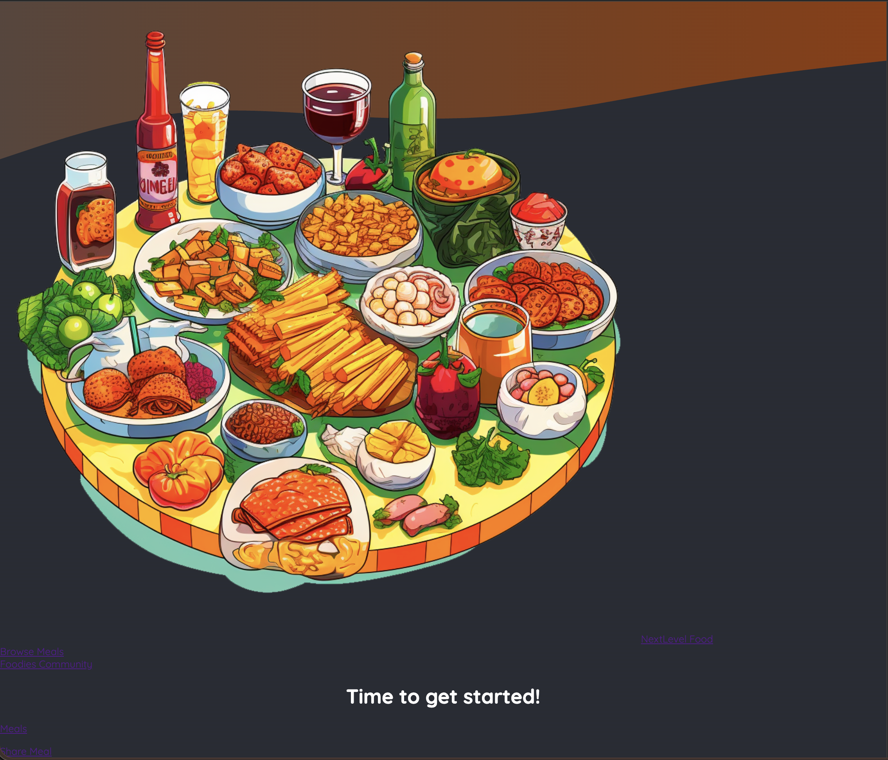

### 🧱 99.3 Pending Fixes (TODO)

- [ ] Fix HTML semantics in `MainHeader` component: Wrap `<li>` elements in a `<ul>` container within the `<nav>` element (`app/components/main-header.js`, lines 10-17).
- [ ] Add TailwindCSS classes or CSS modules to style the `MainHeader` component, including proper layout, spacing, and visual design for the header, logo, and navigation links.
- [ ] Improve accessibility of the logo link by adding `aria-label` attribute and restructuring the link content to be more semantic (`app/components/main-header.js`, lines 6-9).
- [ ] Add proper semantic structure to navigation: Ensure `<nav>` contains `<ul>` with `<li>` items, and add `aria-label` to the navigation element for screen readers.
- [ ] Consider replacing `` with Next.js `<Image>` component from `next/image` for better image optimization, lazy loading, and responsive image handling.
- [ ] Add keyboard event handlers (`onKeyDown`) to navigation links if custom keyboard navigation behavior is needed beyond default Next.js `Link` functionality.
- [ ] Add active state styling and `aria-current` attribute to navigation links to indicate the current page for better accessibility and UX.
- [ ] Address **Invalid HTML Structure in Navigation**: In `app/components/main-header.js` (lines 10-17), `<li>` elements are used directly inside `<nav>` without a parent `<ul>` or `<ol>` element. This violates HTML semantics and accessibility standards. Navigation lists should be wrapped in a proper list container.
- [ ] Address **Missing Styling and CSS Classes**: The `MainHeader` component (`app/components/main-header.js`) has no CSS classes or styling applied. The header, logo link, and navigation elements lack visual styling and layout structure, making them appear unstyled in the browser.
- [ ] Address **Accessibility Concerns with Logo Link**: The logo link in `app/components/main-header.js` (lines 6-9) wraps both an `` and text content. This can cause accessibility issues with screen readers and keyboard navigation. The link should have proper `aria-label` attributes and the text should be structured more semantically.
- [ ] Address **Missing Semantic Navigation Structure**: The navigation in `MainHeader` lacks proper semantic structure. The `<nav>` element should contain a `<ul>` wrapping the `<li>` items, and navigation links should have proper accessibility attributes like `aria-label` or `aria-current` for active states.
- [ ] Address **No Keyboard Navigation Support**: The header component doesn't implement keyboard event handlers (`onKeyDown`) for accessibility. While Next.js `Link` components support keyboard navigation by default, custom event handlers could enhance the user experience for keyboard users.
- [ ] Address **Image Optimization Not Utilized**: The component uses `` tag instead of Next.js's optimized `<Image>` component from `next/image`. While `logoImg.src` provides some optimization, using the `Image` component would provide better performance, lazy loading, and responsive image handling.


<br>

## 🔧 100. Lesson 100 — *Styling NextJS Project: Your Options & Using CSS Modules*

- [Lecture 100: Styling NextJS Project: Your Options & Using CSS Modules](#-100-lesson-100--styling-nextjs-project-your-options--using-css-modules)
    - [100.1 Context](#1001-context)
    - [100.2 Updating code according the context](#1002-updating-code-according-the-context)
        - [100.2.1 Creating `main-header.module.css` file](#10021-creating-main-headermodulecss-file)
        - [100.2.2 Importing and using `main-header.module.css` file inside `main-header.js` file](#10022-importing-and-using-main-headermodulecss-file-inside-main-headerjs-file)
    - [100.3 Pending Fixes (TODO)](#1003-pending-fixes-todo)

### 🧠 100.1 Context:

**CSS Modules** are a CSS file format that automatically generates unique class names scoped to a specific component, preventing style conflicts and ensuring styles only apply where intended. In Next.js, CSS Modules are created by naming CSS files with the `.module.css` extension (e.g., `component.module.css`). When imported, they return an object mapping original class names to generated, scoped class names.

**When CSS Modules are used:**
- **Component-scoped styling**: When you need styles that belong to a specific component and shouldn't leak to other components.
- **Avoiding naming conflicts**: In large applications where multiple developers might use similar class names like `.button` or `.header`.
- **Maintainability**: When you want styles co-located with components for easier maintenance and refactoring.
- **Scoped styling without build tools**: CSS Modules provide scoping out of the box without needing additional CSS-in-JS libraries or complex build configurations.

**Styling options in Next.js:**
1. **Global CSS** (`globals.css`): Applied globally across the entire application. Best for base styles, resets, typography, and shared utilities.
2. **CSS Modules** (`.module.css`): Scoped to individual components. Best for component-specific styles that shouldn't affect other parts of the application.
3. **TailwindCSS**: Utility-first CSS framework. Best for rapid UI development with pre-built utility classes.
4. **Styled Components / CSS-in-JS**: Runtime CSS-in-JavaScript solutions. Best for dynamic styling based on props or state.
5. **Sass/SCSS**: CSS preprocessor with variables, nesting, and mixins. Can be used as global CSS or CSS Modules (`.module.scss`).

**Examples from the project:**
- `app/globals.css`: Global stylesheet imported in the root layout (`app/layout.js`). Contains base styles, font imports, body background, and utility classes like `.not-found` and `.error`.
- `app/components/main-header.module.css`: CSS Module file scoped to the `MainHeader` component. Contains styles for `.header`, `.logo`, `.nav`, and `.active` classes that only apply to the header component.
- The `MainHeader` component imports the CSS Module as `classes` and applies scoped class names using `className={classes.header}`, `className={classes.logo}`, etc.

**Advantages:**
- **Style Encapsulation**: Styles are automatically scoped to the component, preventing unintended style leakage and conflicts.
- **No Naming Conflicts**: Generated unique class names eliminate the need for BEM or other naming conventions to avoid collisions.
- **Co-location**: CSS files can be placed next to component files, improving code organization and maintainability.
- **Standard CSS Syntax**: Uses regular CSS (or SCSS/Sass), making it easy for developers familiar with CSS.
- **Build-time Optimization**: Next.js automatically optimizes and minifies CSS Modules during the build process.
- **Type Safety**: When using TypeScript, CSS Modules can provide type definitions for class names.

**Disadvantages:**
- **No Dynamic Styles**: CSS Modules don't support dynamic styling based on props or state without additional JavaScript logic.
- **Limited Runtime Flexibility**: Unlike CSS-in-JS solutions, you can't generate styles at runtime based on component props.
- **Class Name Obfuscation**: Generated class names are hashed (e.g., `header_abc123`), making debugging slightly more difficult.
- **No Shared Styles**: Each component needs its own CSS Module file, which can lead to code duplication for shared styles (though global CSS can complement this).
- **Learning Curve**: Developers need to understand the import pattern (`import classes from './file.module.css'`) and how to reference classes.

**When to consider alternatives:**
- **Global CSS**: Use for base styles, resets, typography, and application-wide utilities that should apply everywhere.
- **TailwindCSS**: Consider when you want rapid UI development with utility classes and don't need component-scoped styles.
- **CSS-in-JS (Styled Components)**: Use when you need dynamic styles based on props, state, or theme values that change at runtime.
- **Sass/SCSS**: Use when you need CSS preprocessor features (variables, nesting, mixins) while maintaining CSS Module scoping (`.module.scss`).

**CSS Module Import Pattern:**
When importing a CSS Module in Next.js, the import returns an object where keys are the original class names and values are the generated, scoped class names:
```javascript
import classes from './main-header.module.css';
// classes = { header: 'main-header_header_abc123', logo: 'main-header_logo_def456', ... }
```

### ⚙️ 100.2 Updating code according the context:

**Summary**
This section demonstrates how to style a Next.js component using CSS Modules. The process involves creating a CSS Module file (`main-header.module.css`) with component-specific styles, then importing and applying those styles to the `MainHeader` component using the `className` prop. This approach provides scoped styling that prevents style conflicts while maintaining clean, maintainable code organization. The lesson covers responsive design with media queries, hover/active states, and proper CSS Module import patterns.

#### 100.2.1 Creating `main-header.module.css` file:

[main-header.module.css](https://github.com/mschwarzmueller/nextjs-complete-guide-course-resources/blob/main/attachments/02-nextjs-essentials/lecture-specific/components/main-header/main-header.module.css)

**Subsection Summary**
Creates a CSS Module file specifically for the `MainHeader` component. The stylesheet defines scoped styles for the header container (flexbox layout with responsive padding), navigation (flex list with gap spacing), navigation links (hover/active states with gradient text effects), logo link (flex layout with typography), and an unused `.active` class for future active state implementation. The CSS includes responsive design via media queries and modern CSS features like `background-clip` for gradient text effects.
```css
/* app/components/main-header.module.css */
.header {
  display: flex;
  justify-content: space-between;
  align-items: center;
  padding: 2rem 1rem;
}

@media (min-width: 768px) {
  .header {
    padding: 2rem 10%;
  }
}

.nav ul {
  list-style: none;
  margin: 0;
  padding: 0;
  display: flex;
  gap: 1.5rem;
  /* font-family: 'Montserrat', sans-serif; */
  font-size: 1.25rem;
}

.nav a {
  text-decoration: none;
  color: #ddd6cb;
  font-weight: bold;
  padding: 0.5rem 1rem;
  border-radius: 0.5rem;
}

.nav a:hover,
.nav a:active {
  background: linear-gradient(90deg, #ff8a05, #f9b331);
  background-clip: text;
  -webkit-background-clip: text;
  -webkit-text-fill-color: transparent;
  text-shadow: 0 0 18px rgba(248, 190, 42, 0.8);
}

.active {
  background: linear-gradient(90deg, #ff8a05, #f9b331);
  background-clip: text;
  -webkit-background-clip: text;
  -webkit-text-fill-color: transparent;
}

.logo {
  display: flex;
  align-items: center;
  justify-content: center;
  gap: 2rem;
  text-decoration: none;
  color: #ddd6cb;
  font-weight: bold;
  font-family: 'Montserrat', sans-serif;
  letter-spacing: 0.15rem;
  text-transform: uppercase;
  font-size: 1.5rem;
}

.logo img {
  width: 5rem;
  height: 5rem;
  object-fit: contain;
  filter: drop-shadow(0 0 0.75rem rgba(0, 0, 0, 0.5));
}
```

#### 100.2.2 Importing and using `main-header.module.css` file inside `main-header.js` file:

**Subsection Summary**
Demonstrates the CSS Module import pattern and application in the React component. The CSS Module is imported as `classes`, which provides an object mapping original class names to scoped, generated class names. These scoped classes are then applied to JSX elements using the `className` prop (`classes.header`, `classes.logo`, `classes.nav`). This ensures that styles from the CSS Module only apply to this component and won't conflict with styles from other components.

```tsx
/* app/components/main-header.js */
import Link from "next/link";
import logoImg from '@/assets/logo.png';
import classes from './main-header.module.css';   // 👈🏽 ✅

export default function MainHeader(){
  return <header className={classes.header}>      {/* 👈🏽 ✅ */}
    <Link className={classes.logo} href="/">      {/* 👈🏽 ✅ */}
      
      NextLevel Food
    </Link>
    <nav className={classes.nav}>      {/* 👈🏽 ✅ */}
      <ul>
        <li>
          <Link href="/meals">Browse Meals</Link>
        </li>
        <li>
          <Link href="/community">Foodies Community</Link>
        </li>
      </ul>
    </nav>
  </header>
}
```

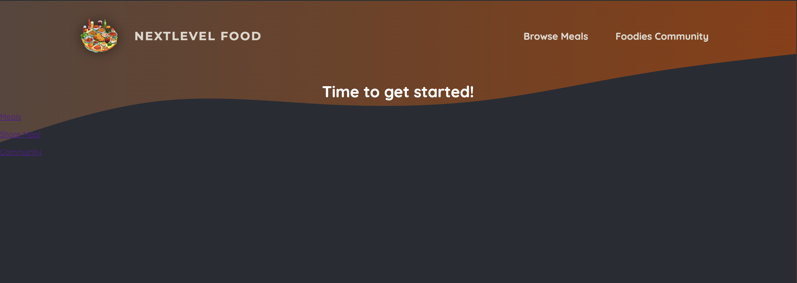

### 🧱 100.3 Pending Fixes (TODO)

- [ ] Implement active state logic in `MainHeader` component: Use Next.js `usePathname()` hook (requires `'use client'`) or compare `href` prop with current route to conditionally apply `classes.active` to navigation links (`app/components/main-header.js`).
- [ ] Add `:focus` pseudo-class styles to `.nav a` selector in `main-header.module.css` for keyboard navigation accessibility. Include visible focus indicators (e.g., outline or box-shadow) that meet WCAG accessibility standards.
- [ ] Remove unused `.active` class from CSS Module or implement its usage. If keeping it, ensure it's properly applied via JavaScript logic; otherwise, remove it to reduce dead code.
- [ ] Resolve commented-out font-family declaration: Either uncomment and use it if intended, or remove the comment if the font choice is finalized. Consider if Montserrat should be applied to navigation or if Quicksand (from globals.css) is sufficient.
- [ ] Add mobile-responsive navigation: Implement a hamburger menu or collapsible navigation for small screens. This may require converting `MainHeader` to a Client Component and adding state management for mobile menu visibility.
- [ ] Consider adding explicit CSS classes to navigation `<Link>` components if more granular styling control is needed, or document that `.nav a` selector is intentionally used for all navigation links.
- [ ] Add `aria-current="page"` attribute to active navigation links for better screen reader support when active state logic is implemented.
- [ ] Address **Unused `.active` CSS Class**: The `.active` class is defined in `app/components/main-header.module.css` (lines 41-45) but is never applied to any element in `app/components/main-header.js`. This class appears intended for active navigation state but lacks implementation logic.
- [ ] Address **Missing Active State Logic**: Navigation links in `MainHeader` component don't have active state detection or styling. The component doesn't check the current route to apply the `.active` class, so users can't visually identify which page they're currently viewing.
- [ ] Address **Missing Focus States for Accessibility**: Navigation links in `app/components/main-header.module.css` have `:hover` and `:active` states but lack `:focus` states for keyboard navigation. This creates accessibility issues for users navigating with keyboard or screen readers.
- [ ] Address **Commented Out Font Family**: Line 20 in `main-header.module.css` contains a commented-out `font-family: 'Montserrat', sans-serif;` declaration. This suggests uncertainty about typography choices or incomplete styling decisions.
- [ ] Address **No Mobile Navigation Handling**: The CSS Module includes responsive padding via media queries but doesn't address mobile navigation patterns (e.g., hamburger menu, collapsible navigation). The navigation may overflow or become cramped on small screens.
- [ ] Address **Missing Link Styling in Navigation**: Navigation links (`<Link>` components) inside `<li>` elements don't have explicit CSS classes applied. They inherit styles from `.nav a` selector, but this creates tight coupling between CSS structure and HTML structure, making it harder to style links differently if needed.


<br>

## 🔧 101. Lesson 101 — *Optimizing Images with the NextJS Image Component*

- [Lecture 101: Optimizing Images with the NextJS Image Component](#-101-lesson-101--optimizing-images-with-the-nextjs-image-component)
    - [101.1 Context](#1011-context)
    - [101.2 Updating code according the context](#1012-updating-code-according-the-context)
        - [101.2.1 Upgrade the logo from `` to `<Image>`](#10121-upgrade-the-logo-from-img-to-image)
        - [101.2.2 Adding `priority` to `<Image>` next component](#10122-adding-priority-to-image-next-component)
        - [101.2.3 Benefits using `<Image>` next built-in component](#10123-benefits-using-image-next-built-in-component)
    - [101.3 Pending Fixes (TODO)](#1013-pending-fixes-todo)

### 🧠 101.1 Context:

The **Next.js Image component** (`next/image`) is an extension of the HTML `` element, evolved for the modern web. It includes various built-in performance optimizations to help you achieve good Core Web Vitals. These scores are a key measurement of user experience on your website, and are factored into Google's search rankings.

**When to use:**
- Always use `<Image>` instead of standard `` tags for UI elements and content images within a Next.js application.
- Use the `priority` prop for any image that is the Largest Contentful Paint (LCP) element or visible "above the fold" to ensure it preloads.

**Examples from the project:**
- `app/components/main-header.js`: The application logo is implemented using the `<Image>` component. Since it is part of the header and always visible at the top of the page, the `priority` prop is applied to optimize initial load and remove browser warnings.

**Advantages:**
- **Improved Performance:** Automatically serves correctly sized images for each device using modern formats like WebP and AVIF.
- **Visual Stability:** Automatically prevents Layout Shift (CLS) by requiring dimensions or using `fill` mode.
- **Faster Page Loads:** Images are lazy-loaded by default as they enter the viewport, reducing initial load weight.
- **Asset Flexibility:** Features on-demand image resizing, even for images hosted on remote servers.

**Disadvantages:**
- **Complexity with Remote Images:** Requires explicit domain/pattern configuration in `next.config.js` for external sources.
- **Strict Sizing:** Requires developers to be more explicit about image dimensions compared to standard `` tags.

**Alternatives:**
- Standard `` tag: Useful for cases where you need absolute control over the element without Next.js interventions, or for non-web environments (like generated emails).
- External Optimization Services: Services like Cloudinary or Imgix if you prefer to offload optimization entirely from the Next.js server.


### ⚙️ 101.2 Updating code according the context:

**Summary**
This section demonstrates the transition from standard HTML `` tags to the optimized Next.js `<Image>` component. It focuses on implementing this change in the `MainHeader` component for the application logo. The lesson covers importing the component, updating the JSX structure, and resolving performance warnings by utilizing the `priority` attribute for critical above-the-fold content.

Previous the changing:
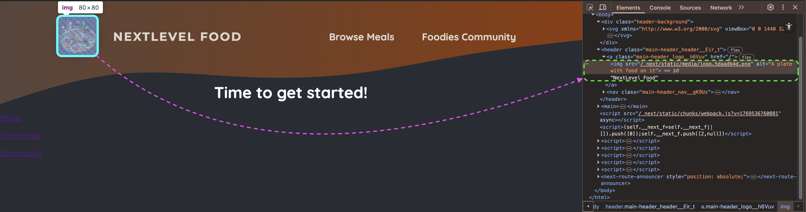

> Attributes:
* src
* alt

#### 101.2.1 Upgrade the logo from `` to `<Image>`:

[Image Component](https://nextjs.org/docs/app/api-reference/components/image)

**Subsection Summary**
Replaces the standard `` tag with the Next.js `<Image>` component in the `MainHeader`. This update enables automatic image optimization, properly sized assets, and prevents layout shifts, ensuring a more stable and faster user experience.
```tsx
/* app/components/main-header.js */
import Link from "next/link";
import Image from "next/image";   // 👈🏽 ✅

import logoImg from '@/assets/logo.png';
import classes from './main-header.module.css';

export default function MainHeader(){
  return <header className={classes.header}>
    <Link className={classes.logo} href="/">
      <Image src={logoImg} alt="A plate with food on it" />   {/* 👈🏽 ✅ */}
      NextLevel Food
    </Link>
    <nav className={classes.nav}>
      <ul>
        <li>
          <Link href="/meals">Browse Meals</Link>
        </li>
        <li>
          <Link href="/community">Foodies Community</Link>
        </li>
      </ul>
    </nav>
  </header>
}
```

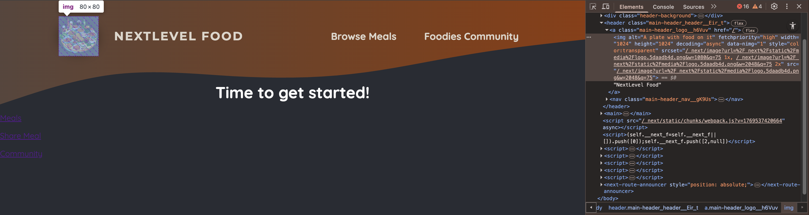

> Attributes:
* alt
* fetchPriority
* width
* height
* decoding
* data-nimg
* style
* srcset
* src

#### 101.2.2 Adding `priority` to `<Image>` next component:

**Subsection Summary**
Applies the `priority` attribute to the logo image. This instructs the browser to preload the image as it's identified as a critical asset for the initial page render (above the fold), effectively improving the LCP (Largest Contentful Paint) metric.

Due to this issue:

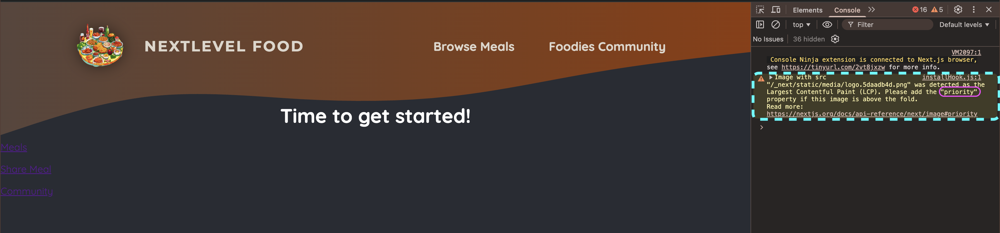

```tsx
/* app/components/main-header.js */
import Link from "next/link";
import Image from "next/image";

import logoImg from '@/assets/logo.png';
import classes from './main-header.module.css';

export default function MainHeader(){
  return <header className={classes.header}>
    <Link className={classes.logo} href="/">
      <Image src={logoImg} alt="A plate with food on it" priority/>  {/* 👈🏽 ✅ */}
      NextLevel Food
    </Link>
    <nav className={classes.nav}>
      <ul>
        <li>
          <Link href="/meals">Browse Meals</Link>
        </li>
        <li>
          <Link href="/community">Foodies Community</Link>
        </li>
      </ul>
    </nav>
  </header>
}
```


#### 101.2.3 Benefits using `<Image>` next built-in component:

**Subsection Summary**
Highlights the technical benefits of using the Next.js `Image` component over standard tags. Key advantages include automatic WebP conversion, built-in lazy loading for off-screen images, and the generation of multiple `srcset` variants for different screen resolutions.

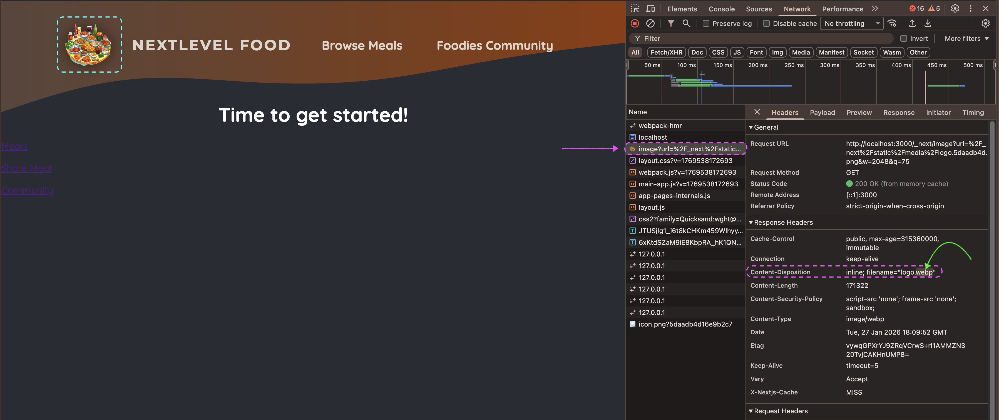

### 🧱 101.3 Pending Fixes (TODO)

- [ ] Optimize `app/icon.png` to a standard favicon size (e.g., 32x32 or 512x512) and reduce file size.
- [ ] Create a reusable `MealImage` component that handles consistent `alt` text and placeholder logic for meal listings.
- [ ] Add `remotePatterns` to `next.config.js` once external image sources are identified.
- [ ] Audit `app/meals/page.js` and `app/community/page.js` to ensure standard `` tags aren't introduced as those pages are built out.
- [ ] Address **Large Favicon Asset**: The `app/icon.png` file is 1.3 MB, which is excessively large for a favicon and can impact build performance and metadata generation.
- [ ] Address **Inconsistent Alt Text**: There is currently no standardized approach for `alt` text across the application, which could lead to accessibility gaps as more images are added.
- [ ] Address **Remote Image Limitation**: Future images fetched from external databases will require specific configuration in `next.config.js` to work with the `<Image>` component.


<br>

## 🔧 102. Lesson 102 — *Using More Custom Components*

- [Lecture 102: Using More Custom Components](#-102-lesson-102--using-more-custom-components)
    - [102.1 Context](#1021-context)
    - [102.2 Updating code according the context](#1022-updating-code-according-the-context)
        - [102.2.1 create `main-header-background.js` file](#10221-create-main-header-backgroundjs-file)
        - [102.2.2 Import `main-header-background.js` component in `layout.js`](#10222-import-main-header-backgroundjs-component-in-layoutjs)
        - [102.2.3 Create a `module.css` for `main-header-background.js` component](#10223-create-a-modulecss-for-main-header-backgroundjs-component)
        - [102.2.4 update `main-header-background.js` component, importing its `module.css` file](#10224-update-main-header-backgroundjs-component-importing-its-modulecss-file)
        - [102.2.5 Import `main-header-background.js` component in `main-header.js` instead](#10225-import-main-header-backgroundjs-component-in-main-headerjs-instead)
        - [102.2.6 Create a new folder by `main.header`](#10226-create-a-new-folder-by-mainheader)
    - [102.3 Pending Fixes (TODO)](#1023-pending-fixes-todo)

### 🧠 102.1 Context:

**Custom components** in Next.js allow for modularizing complex UI elements into smaller, manageable pieces. This lesson focuses on refactoring the root layout by extracting a decorative SVG background into its own component and organizing header-related components into a dedicated directory.

**When to use:**
- **Refactoring**: When a layout or page becomes too cluttered with UI details that aren't core to its primary responsibility.
- **Organization**: When multiple components are tightly related (e.g., a header and its background) and should be grouped together.
- **Reusability**: When a UI element (like a specific background) might be needed in other parts of the application.

**Advantages:**
- **Enhanced Readability**: Layout files stay focused on structure rather than implementational details of specific UI elements.
- **Easier Maintenance**: Changing the background or header logic only requires visiting specific, small files.
- **Improved Scoping**: Using CSS Modules for extracted components prevents global style pollution.
- **Better Developer Experience**: Clear folder structures make it easier to find and manage related code.

**Disadvantages:**
- **Increased File Count**: Refactoring leads to more files, which can slightly increase complexity if not named and organized properly.
- **Prop/Style Complexity**: If extracted components need complex state or dynamic styles, managing them might require more boilerplate.

**Alternatives:**
- **Inline SVG/Styles**: Keep code in the layout if it's extremely simple and unlikely to change or be reused.
- **Global CSS**: Use global classes for backgrounds if they are truly universal and don't benefit from component scoping.

### ⚙️ 102.2 Updating code according the context:

**Summary**
This section details the refactoring of the application's header and background structure. The process involves extracting the decorative SVG background from `layout.js` into its own component (`MainHeaderBackground`), applying scoped styling via CSS Modules, and finally organizing all header-related components into a dedicated `main-header` folder for better project structure.

#### 102.2.1 create `main-header-background.js` file:

**Subsection Summary**
Extracts the complex SVG background markup from the root layout into a standalone functional component. This encapsulates the decorative logic and keeps the main layout file cleaner.

```tsx
/* app/components/main-header-background.js 👈🏽 ✅ */
export default function MainHeaderBackground() {
  return (
    // This code comes from app/layout.js
    <div className="header-background">
      <svg xmlns="http://www.w3.org/2000/svg" viewBox="0 0 1440 320">
        <defs>
          <linearGradient id="gradient" x1="0%" y1="0%" x2="100%" y2="0%">
            <stop offset="0%" style={{ stopColor: "#59453c", stopOpacity: "1" }} />
            <stop offset="100%" style={{ stopColor: "#8f3a09", stopOpacity: "1" }} />
          </linearGradient>
        </defs>
        <path
          fill="url(#gradient)"
          d="M0,256L48,240C96,224,192,192,288,181.3C384,171,480,181,576,186.7C672,192,768,192,864,181.3C960,171,1056,149,1152,133.3C1248,117,1344,107,1392,101.3L1440,96L1440,0L1392,0C1344,0,1248,0,1152,0C1056,0,960,0,864,0C768,0,672,0,576,0C480,0,384,0,288,0C192,0,96,0,48,0L0,0Z"
        ></path>
      </svg>
    </div>
  );
}
```

#### 102.2.2 Import `main-header-background.js` component in `layout.js`:

**Subsection Summary**
Updates the root layout to use the newly created background component. This simplifies the layout's JSX and delegates the background rendering to the specialized component.
```tsx
/* app/layout.js */
import './globals.css';
import MainHeader from './components/main-header';
import MainHeaderBackground from './components/main-header-background';   // 👈🏽 ✅

export const metadata = {
  title: 'NextLevel Food',
  description: 'Delicious meals, shared by a food-loving community.',
};

export default function RootLayout({ children }) {
  return (
    <html lang="en">
      <body>
        <MainHeaderBackground />    {/* 👈🏽 ✅ */}
        <MainHeader />
        {children}
      </body>
    </html>
  );
}
```

#### 102.2.3 Create a `module.css` for `main-header-background.js` component

**Subsection Summary**
Implements scoped styling for the background component using CSS Modules. This ensures that the background's absolute positioning and sizing don't interfere with other layout elements.
```tsx
/* app/components/main-header-background.module.css */
.header-background {
  position: absolute;
  width: 100%;
  height: 320px;
  top: 0;
  left: 0;
  z-index: -1;
}

.header-background svg {    // 👈🏽 ✅
  display: block;
  width: 100%;
  height: auto;
}

// this code comes from app/globals.css 👈🏽 ✅
```

#### 102.2.4 update `main-header-background.js` component, importing its `module.css` file:

**Subsection Summary**
Integrates the CSS Module into the background component. It demonstrates how to reference class names with hyphens using bracket notation (`classes["header-background"]`).
```tsx
/* app/components/main-header-background.js */
import classes from "./main-header-background.module.css";    // 👈🏽 ✅

export default function MainHeaderBackground() {
  return (
    <div className={classes["header-background"]}>    {/* 👈🏽 ✅ */}
      <svg xmlns="http://www.w3.org/2000/svg" viewBox="0 0 1440 320">
        <defs>
          <linearGradient id="gradient" x1="0%" y1="0%" x2="100%" y2="0%">
            <stop offset="0%" style={{ stopColor: "#59453c", stopOpacity: "1" }} />
            <stop offset="100%" style={{ stopColor: "#8f3a09", stopOpacity: "1" }} />
          </linearGradient>
        </defs>
        <path
          fill="url(#gradient)"
          d="M0,256L48,240C96,224,192,192,288,181.3C384,171,480,181,576,186.7C672,192,768,192,864,181.3C960,171,1056,149,1152,133.3C1248,117,1344,107,1392,101.3L1440,96L1440,0L1392,0C1344,0,1248,0,1152,0C1056,0,960,0,864,0C768,0,672,0,576,0C480,0,384,0,288,0C192,0,96,0,48,0L0,0Z"
        ></path>
      </svg>
    </div>
  );
}
```

#### 102.2.5 Import `main-header-background.js` component in `main-header.js` instead:

**Subsection Summary**
Further refines the architecture by moving the background component into the `MainHeader`. This makes sense semantically as the background is visually tied to the header, further simplifying the root layout.
```tsx
/* app/components/main-header.js */
import Link from "next/link";
import Image from "next/image";
import MainHeaderBackground from "./main-header-background";    // 👈🏽 ✅

import logoImg from "@/assets/logo.png";
import classes from "./main-header.module.css";

export default function MainHeader() {
  return (
    <>
      <MainHeaderBackground />    {/* 👈🏽 ✅ */}
      <header className={classes.header}>
        <Link className={classes.logo} href="/">
          <Image src={logoImg} alt="A plate with food on it" priority />
          NextLevel Food
        </Link>
        <nav className={classes.nav}>
          <ul>
            <li>
              <Link href="/meals">Browse Meals</Link>
            </li>
            <li>
              <Link href="/community">Foodies Community</Link>
            </li>
          </ul>
        </nav>
      </header>
    </>
  );
}
```

meanwhile:

```tsx
/* app/layout.js */
import './globals.css';
import MainHeader from './components/main-header';
//import MainHeaderBackground from './components/main-header-background';   // 👈🏽 ✅

export const metadata = {
  title: 'NextLevel Food',
  description: 'Delicious meals, shared by a food-loving community.',
};

export default function RootLayout({ children }) {
  return (
    <html lang="en">
      <body>
        {/* <MainHeaderBackground /> 👈🏽 ✅ */}
        <MainHeader />
        {children}
      </body>
    </html>
  );
}
```

#### 102.2.6 Create a new folder by `main.header`

**Subsection Summary**
Finalizes the project organization by grouping all header-related files (background, styles, and the main header component) into a single folder. This follows the best practice of co-locating related files.

```
app
├-- components
|    └-- main-header/
|         ├-- main-header.js
|         ├-- main-header.module.css
|         ├-- main-header-background.js
|         └-- main-header-background.module.css
....
```


### 🧱 102.3 Pending Fixes (TODO)

- [ ] Clean up `app/layout.js`: Remove the unused import of `MainHeaderBackground` and the commented-out component call.
- [ ] Audit `app/globals.css` to ensure no leftover styles from the SVG background remain now that they are in a CSS Module.
- [ ] Add `aria-hidden="true"` to the SVG in `MainHeaderBackground` as it is purely decorative.
- [ ] Address **Orphaned Imports in `layout.js`**: After moving `MainHeaderBackground` to `MainHeader`, the imports and commented-out code in `app/layout.js` (lines 3 and 14) are no longer needed and should be removed.
- [ ] Address **Inconsistent CSS Selectors**: `main-header-background.module.css` uses both a class selector and a nested tag selector (`.header-background svg`). While functional, it's slightly inconsistent with the pure class-based approach used elsewhere.

<br>

## 🔧 103. Lesson 103 — *Populating The Starting Page Content*

- [Lecture 103: Populating The Starting Page Content](#-103-lesson-103--populating-the-starting-page-content)
    - [103.1 Context](#1031-context)
    - [103.2 Updating code according the context](#1032-updating-code-according-the-context)
        - [103.2.1 Update `page.js` file](#10321-update-pagejs-file)
        - [103.2.2 Create `page.module.css` file](#10322-create-pagemodulecss-file)
        - [103.2.3 Import `page.module.css` in `page.js` file](#10323-import-pagemodulecss-in-pagejs-file)
    - [103.3 Pending Fixes (TODO)](#1033-pending-fixes-todo)

### 🧠 103.1 Context:

Next.js applications often require a dedicated **Home/Landing page** that serves as the entry point for users. This page typically includes a "Hero" section with a call to action (CTA) and descriptive sections explaining the application's value proposition.

**When to use:**
- To provide a high-level overview of the application.
- To guide users toward primary features (e.g., "Browse Meals", "Join Community").
- To establish the brand identity using gradients, typography, and visual assets.

**Advantages:**
- **Centralized Entry Point**: Consolidates the most important links and information.
- **Improved UX**: Clear CTAs help users understand what to do next.
- **SEO Optimization**: Landing pages are primary targets for search engines; proper headers and descriptions improve ranking.
- **Visual Appeal**: Using CSS Modules allows for complex, scoped designs without affecting other pages.

**Disadvantages:**
- **Content Maintenance**: Landing pages often require frequent updates to keep information fresh.
- **Performance Risks**: Large hero sections or slideshows can impact LCP (Largest Contentful Paint) if not optimized.

**Alternatives:**
- Using a redirect to a dashboard if the application is for logged-in users only.
- A minimal landing page if the product is simple and doesn't need extensive explanation.

### ⚙️ 103.2 Updating code according the context:

**Summary**
This section focuses on populating the application's landing page (`app/page.js`) with structured content and custom styles. It involves creating a layout with a hero section, a slideshow placeholder, and informative sections for users. The styling is managed through a dedicated CSS Module (`app/page.module.css`), ensuring that the landing page's unique design (like gradients and specific layouts) remains isolated from the rest of the application.

#### 103.2.1 Update `page.js` file:

**Subsection Summary**
Initializes the structure of the Home component using semantic HTML elements like `<header>` and `<main>`. It sets the foundation for a two-part layout: an introductory top section and a descriptive bottom section.
```tsx
/* app/page.js */
export default function Home() {
  return (
    <>
      <header></header>
      <main></main>
    </>
  );
}
```

#### 103.2.2 Create `page.module.css` file:

* [page.module.css](https://github.com/mschwarzmueller/nextjs-complete-guide-course-resources/blob/main/attachments/02-nextjs-essentials/lecture-specific/app/page.module.css)

* [page.js](https://github.com/mschwarzmueller/nextjs-complete-guide-course-resources/blob/main/attachments/02-nextjs-essentials/lecture-specific/app/page.js)

**Subsection Summary**
Defines the visual design for the landing page. It includes sophisticated CSS patterns such as flexbox for layout, linear gradients for text and buttons, and hover effects for interactivity. The styles are scoped to the page to prevent global conflicts.
```css
/* app/page.module.css */
.header {
  display: flex;
  gap: 3rem;
  margin: 3rem auto;
  width: 90%;
  max-width: 75rem;
}

.slideshow {
  width: 40rem;
  height: 25rem;
}

.hero {
  color: #ddd6cb;
  font-size: 1.5rem;
}

.hero h1 {
  font-size: 2rem;
  font-weight: bold;
  font-family: 'Montserrat', sans-serif;
  letter-spacing: 0.15rem;
  text-transform: uppercase;
  background: linear-gradient(90deg, #f9572a, #ffc905);
  background-clip: text;
  -webkit-background-clip: text;
  -webkit-text-fill-color: transparent;
}

.cta {
  font-size: 1.5rem;
  display: flex;
  gap: 1rem;
}

.cta a {
  display: inline-block;
  margin-top: 1rem;
  padding: 0.5rem 1rem;
  border-radius: 0.5rem;
  background: linear-gradient(90deg, #f9572a, #ff9b05);
  color: #ffffff;
  font-weight: bold;
  text-decoration: none;
}

.cta a:hover,
.cta a:active {
  background: linear-gradient(90deg, #fd4715, #f9b241);
}

.cta a:first-child {
  background: transparent;
  font-weight: normal;
  color: #ff9b05;
  padding-left: 0;
}

.cta a:first-child:hover,
.cta a:first-child:active {
  background: transparent;
  color: #f9b241;
}

.section {
  display: flex;
  flex-direction: column;
  color: #ddd6cb;
  font-size: 1.5rem;
  max-width: 50rem;
  width: 90%;
  margin: 2rem auto;
  text-align: center;
}
```

#### 103.2.3 Import `page.module.css` in `page.js` file:

**Subsection Summary**
Integrates the styles into the Home component and populates it with links and text. It uses Next.js `Link` for efficient client-side navigation to the meals and community routes.
```tsx
/* app/page.js */
import Link from "next/link";
import classes from "./page.module.css";    // 👈🏽 ✅
export default function Home() {
  return (
    <>
      <header className={classes.header}>
        <div className={classes.slideshow}>....</div>

        <div>
          <div className={classes.hero}>
            <h1>NextLevel Food for NextLevel Foodies</h1>
            <p>Taste & share food from all over the world</p>
          </div>

          <div className={classes.cta}>
            <Link href="/community">Join the Community</Link>
            <Link href="/meals">Explore Meals</Link>
          </div>
        </div>
      </header>

      <main>
        <section className={classes.section}>
          <h2>How it works</h2>
          <p>
            NextLevel Food is a platform for foodies to share their favorite recipes with the world. It&apos;s a place to
            discover new dishes, and to connect with other food lovers.
          </p>
          <p>NextLevel Food is a place to discover new dishes, and to connect with other food lovers.</p>
        </section>

        <section className={classes.section}>
          <h2>Why NextLevel Food?</h2>
          <p>
            NextLevel Food is a platform for foodies to share their favorite recipes with the world. It&apos;s a place to
            discover new dishes, and to connect with other food lovers.
          </p>
          <p>NextLevel Food is a place to discover new dishes, and to connect with other food lovers.</p>
        </section>
      </main>
    </>
  );
}
```

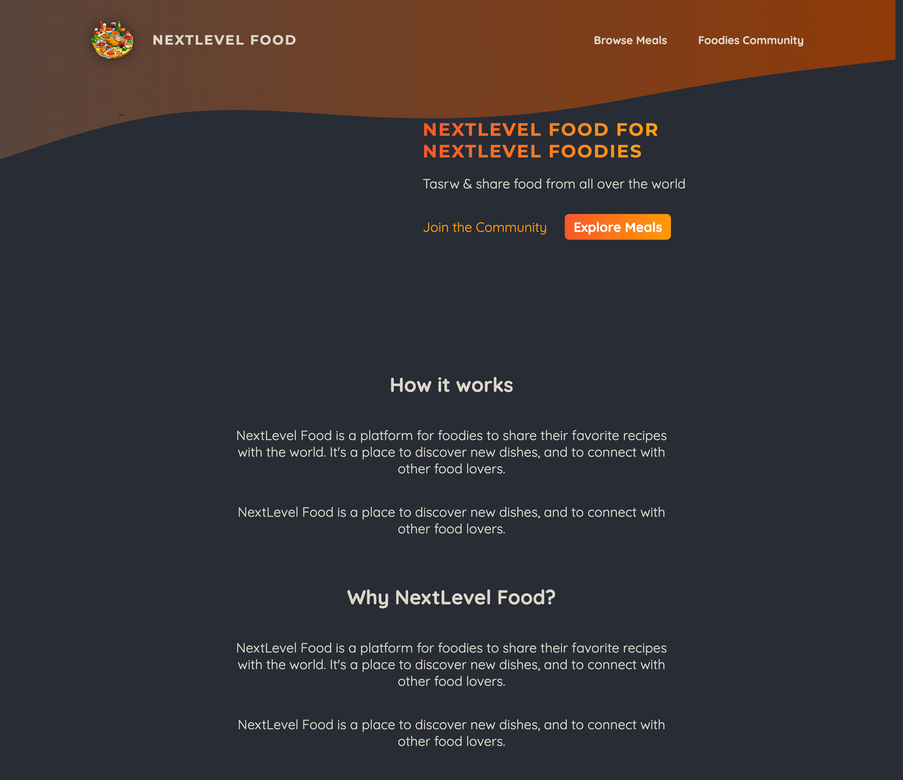

### 🧱 103.3 Pending Fixes (TODO)

- [x] Correct the typo "Tasrw" to "Taste" in `app/page.js` (line 12).
- [ ] Remove redundant paragraphs in the descriptive sections of `app/page.js`.
- [ ] Implement an `ImageSlideshow` component to replace the placeholder `....` in `app/page.js`.
- [ ] Add `aria-label` to the slideshow container for improved accessibility.
- [ ] Extract the landing page text into a configuration file or constants to facilitate future updates.
- [ ] Address **Typo in Hero Description**: In `app/page.js`, the word "Taste" is misspelled as "Tasrw".
- [ ] Address **Placeholder Slideshow**: The slideshow container in `app/page.js` contains a `....` placeholder instead of actual content or a component.
- [ ] Address **Redundant Paragraphs**: Both sections in `main` contain duplicate sentences ("NextLevel Food is a place to discover..."), making the content feel repetitive and unpolished.
- [ ] Address **Hardcoded Text**: All landing page content is hardcoded in the component, which may make future internationalization (i18n) or updates more difficult.


<br>

## 🔧 104. Lesson 104 — *Preparing an Image Slideshow*
- [Lecture 104: Preparing an Image Slideshow](#-104-lesson-104--preparing-an-image-slideshow)
    - [104.1 Context](#1041-context)
    - [104.2 Updating code according the context](#1042-updating-code-according-the-context)
        - [104.2.1 Create `components/images/image-slideshow.js` file](#10421-create-componentsimagesimage-slideshowjs-file)
        - [104.2.2 create its `module.css` file](#10422-create-its-modulecss-file)
        - [104.2.3 Import `image-slideshow.js` file in `page.js`](#10423-import-image-slideshowjs-file-in-pagejs)
        - [104.2.4. App crashes](#10424-app-crashes)
    - [104.3 Pending Fixes (TODO)](#1043-pending-fixes-todo)

### 🧠 104.1 Context:

An **Image Slideshow** in Next.js is a dynamic UI component that cycles through a set of images. It is commonly used in landing pages or hero sections to showcase multiple visual assets without taking up excessive vertical space. Implementing a slideshow often involves state management (to track the current image) and side effects (to handle the automatic rotation).

**When to use:**
- **Hero Sections**: To create an engaging and visually rich entry point for the application.
- **Product Showcases**: To display multiple views of a product or a gallery of items.
- **Dynamic Portfolios**: To highlight various projects or features.

**Advantages:**
- **Visual Engagement**: Movement catches the eye and keeps users interested.
- **Information Density**: Allows displaying multiple pieces of content in a single container.
- **Controlled Pacing**: Automatic transitions can guide the user's attention through important assets.

**Disadvantages:**
- **Performance Overhead**: Requires loading multiple images, which can impact LCP if not properly optimized with `next/image`.
- **User Control**: Automatic slideshows can sometimes be annoying if transitions are too fast or if no manual controls are provided.
- **Complexity**: Managing transitions, timers, and cleanups requires careful implementation of React hooks.

**When to consider alternatives:**
- **Static Hero Image**: If the application's core message can be conveyed with a single powerful image, a static hero is often better for performance and user focus.
- **Interactive Carousel**: If users need to browse at their own pace, a carousel with manual navigation (arrows, dots) is preferred over a purely automatic slideshow.

**Implementation with `setInterval`**:
In React, an automatic slideshow is typically implemented using `setInterval` within a `useEffect` hook. This ensures the timer starts when the component mounts and is cleaned up when it unmounts, preventing memory leaks and unexpected behavior.

### ⚙️ 104.2 Updating code according the context:

**Summary**
This section documents the implementation of an automated `ImageSlideshow` component. It covers the creation of the React component using `useEffect` and `useState` for image rotation, the application of sophisticated CSS transitions for smooth visual effects, and the integration of the slideshow into the application's landing page. Finally, it addresses the common "use client" error that occurs when using browser-only hooks in Server Components.

#### 104.2.1 Create `components/images/image-slideshow.js` file:

[image-slideshow.js](https://github.com/mschwarzmueller/nextjs-complete-guide-course-resources/blob/main/attachments/02-nextjs-essentials/lecture-specific/components/images/image-slideshow.js)

**Subsection Summary**
Defines the `ImageSlideshow` component logic. It manages an internal state `currentImageIndex` and uses a `useEffect` hook to set up a 5-second interval timer that cycles through a predefined array of imported images. Each image is rendered using the Next.js `Image` component.
```tsx
/* app/components/images/image-slideshow.js */
import { useEffect, useState } from 'react';
import Image from 'next/image';

import burgerImg from '@/assets/burger.jpg';
import curryImg from '@/assets/curry.jpg';
import dumplingsImg from '@/assets/dumplings.jpg';
import macncheeseImg from '@/assets/macncheese.jpg';
import pizzaImg from '@/assets/pizza.jpg';
import schnitzelImg from '@/assets/schnitzel.jpg';
import tomatoSaladImg from '@/assets/tomato-salad.jpg';
import classes from './image-slideshow.module.css';

const images = [
  { image: burgerImg, alt: 'A delicious, juicy burger' },
  { image: curryImg, alt: 'A delicious, spicy curry' },
  { image: dumplingsImg, alt: 'Steamed dumplings' },
  { image: macncheeseImg, alt: 'Mac and cheese' },
  { image: pizzaImg, alt: 'A delicious pizza' },
  { image: schnitzelImg, alt: 'A delicious schnitzel' },
  { image: tomatoSaladImg, alt: 'A delicious tomato salad' },
];

export default function ImageSlideshow() {
  const [currentImageIndex, setCurrentImageIndex] = useState(0);

  useEffect(() => {
    const interval = setInterval(() => {
      setCurrentImageIndex((prevIndex) =>
        prevIndex < images.length - 1 ? prevIndex + 1 : 0
      );
    }, 5000);

    return () => clearInterval(interval);
  }, []);

  return (
    <div className={classes.slideshow}>
      {images.map((image, index) => (
        <Image
          key={index}
          src={image.image}
          className={index === currentImageIndex ? classes.active : ''}
          alt={image.alt}
        />
      ))}
    </div>
  );
}
```

#### 104.2.2 create its `module.css` file:

[image-slideshow.module.css](https://github.com/mschwarzmueller/nextjs-complete-guide-course-resources/blob/main/attachments/02-nextjs-essentials/lecture-specific/components/images/image-slideshow.module.css)

**Subsection Summary**
Implements the visual styling and animation logic for the slideshow. It uses `position: absolute` to stack images and combines `opacity` with `transform` (scale and rotation) to create a smooth, sophisticated transition effect when the `.active` class is applied.
```tsx
/* app/components/images/image-slideshow.module.css */
.slideshow {
  position: relative;
  width: 100%;
  height: 100%;
  border-radius: 8px;
  overflow: hidden;
  box-shadow: 0 0 0.5rem rgba(0, 0, 0, 0.5);
}

.slideshow img {
  width: 100%;
  height: 100%;
  object-fit: cover;
  position: absolute;
  top: 0;
  left: 0;
  opacity: 0;
  transform: scale(1.1) translateX(-1rem) rotate(-5deg);
  transition: all 0.5s ease-in-out;
}

.slideshow .active {
  z-index: 1;
  opacity: 1;
  transform: scale(1) translateX(0) rotate(0);
}
```


#### 104.2.3 Import `image-slideshow.js` file in `page.js`

**Subsection Summary**
Integrates the `ImageSlideshow` component into the landing page's hero section. It replaces the previous placeholder with the dynamic slideshow, enhancing the visual appeal of the home page.
```tsx
/* app/page.js */
import Link from "next/link";
import classes from "./page.module.css";

import ImageSlideshow from "./components/images/image-slideshow"; // 👈🏽 ✅

export default function Home() {
  return (
    <>
      <header className={classes.header}>
        <div className={classes.slideshow}>
          <ImageSlideshow />    {/* 👈🏽 ✅ */}
        </div>

        <div>
          <div className={classes.hero}>
            <h1>NextLevel Food for NextLevel Foodies</h1>
            <p>Taste & share food from all over the world</p>
          </div>

          <div className={classes.cta}>
            <Link href="/community">Join the Community</Link>
            <Link href="/meals">Explore Meals</Link>
          </div>
        </div>
      </header>

      <main>
        <section className={classes.section}>
          <h2>How it works</h2>
          <p>
            NextLevel Food is a platform for foodies to share their favorite recipes with the world. It&apos;s a place to
            discover new dishes, and to connect with other food lovers.
          </p>
          <p>NextLevel Food is a place to discover new dishes, and to connect with other food lovers.</p>
        </section>

        <section className={classes.section}>
          <h2>Why NextLevel Food?</h2>
          <p>
            NextLevel Food is a platform for foodies to share their favorite recipes with the world. It&apos;s a place to
            discover new dishes, and to connect with other food lovers.
          </p>
          <p>NextLevel Food is a place to discover new dishes, and to connect with other food lovers.</p>
        </section>
      </main>
    </>
  );
}
```

#### 104.2.4. App crashes:

**Subsection Summary**
Identifies a critical error where the application crashes because `ImageSlideshow` uses React hooks (`useState`, `useEffect`) but is rendered as a Server Component. This serves as a practical example of when the `"use client"` directive is required.

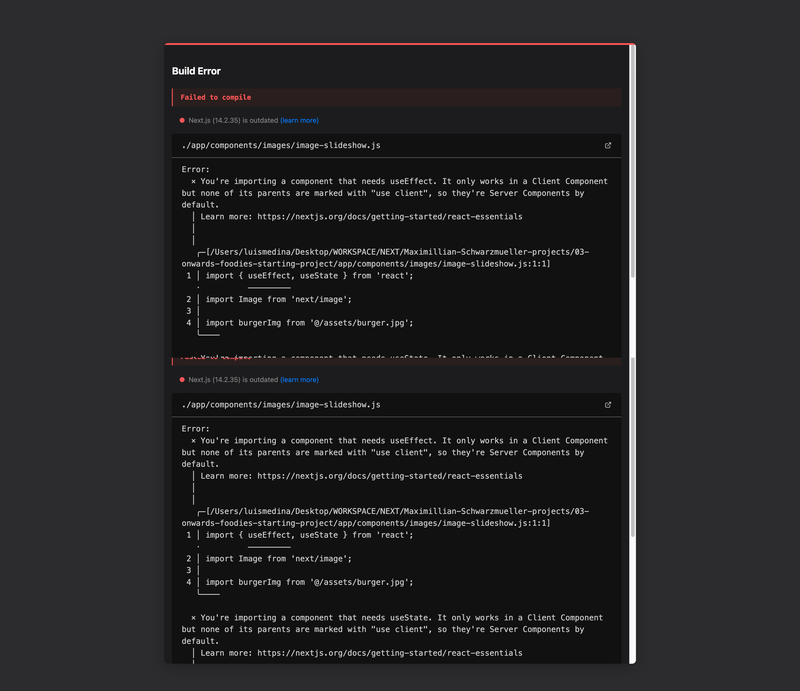


### 🧱 104.3 Pending Fixes (TODO)

- [ ] Add the `"use client"` directive at the top of `app/components/images/image-slideshow.js` to resolve the runtime crash.
- [ ] Implement manual navigation (Previous/Next buttons or indicator dots) to improve user control.
- [ ] Add `aria-live="polite"` or similar accessibility attributes to the slideshow container.
- [ ] Consider adding a "Pause on Hover" feature to the slideshow interval logic.
- [ ] Address **Missing "use client" Directive**: The `ImageSlideshow` component uses `useState` and `useEffect`, which are Client-only features. Without the `"use client"` directive at the top of the file, Next.js throws an error when trying to render the component.
- [ ] Address **Potential Memory Leaks**: The `useEffect` hook in `ImageSlideshow` correctly returns a cleanup function that calls `clearInterval(interval)`, preventing multiple timers from running if the component re-renders or unmounts.
- [ ] Address **Lack of Manual Controls**: The slideshow is purely automatic. Users cannot manually skip images or pause the rotation, which can be an accessibility and UX issue.
- [ ] Address **Inaccessible Images in Map**: While `alt` text is provided, the slideshow doesn't use `aria-live` or other roles to inform screen readers when the image changes automatically.


<br>

## 🔧 105. Lesson 105 — *React Server Components vs Client Components - When To Use What*

- [Lecture 105: React Server Components vs Client Components - When To Use What](#-105-lesson-105--react-server-components-vs-client-components---when-to-use-what)
    - [105.1 Context](#1051-context)
    - [105.2 Updating code according the context](#1052-updating-code-according-the-context)
        - [105.2.1 Comment `Imageslideshow` component and add a `console.log()` in `main-header.js` file](#10521-comment-imageslideshow-component-and-add-a-consolelog-in-main-headerjs-file)
        - [105.2.2 add `'use client'` at the beginning of the file `image-slideshow.js`](#10522-add-use-client-at-the-beginning-of-the-file-image-slideshowjs)
        - [105.2.3 and add a `console.log()` in `image-slideshow.js`](#10523-and-add-a-consolelog-in-image-slideshowjs)
        - [105.2.4 Uncomment `Imageslideshow` component in `app/page.js` file](#10524-uncomment-imageslideshow-component-in-apppagejs-file)
    - [105.3 Pending Fixes (TODO)](#1053-pending-fixes-todo)

### 🧠 105.1 Context:

**React Server Components (RSC)** are a new type of component in Next.js that render exclusively on the server. By default, all components in the Next.js App Router are Server Components. **Client Components**, on the other hand, are opted into using the `'use client'` directive and are rendered on the client (browser), although they are also pre-rendered on the server for initial load.

#### When and Why to use:
- **Server Components (Default)**: Used for the majority of the application. They are ideal for data fetching directly from the database or file system, keeping sensitive information (like API keys) secure on the server, and reducing the bundle size sent to the client.
- **Client Components**: Used only when interactivity is required. This includes using React hooks (`useState`, `useEffect`), browser-only APIs (like `localStorage` or `geolocation`), or event listeners (like `onClick`).

#### Examples from the project:
- `app/page.js`: A Server Component that renders the landing page structure.
- `app/components/images/image-slideshow.js`: A Client Component (marked with `'use client'`) because it uses `useState` and `useEffect` to manage the automatic image rotation.

#### Advantages & Disadvantages:
| Component Type | Advantages | Disadvantages |
| :--- | :--- | :--- |
| **Server** | Zero bundle size impact, direct backend access, better SEO/LCP. | No interactivity, no hooks, no browser APIs. |
| **Client** | Full interactivity, access to browser APIs, state management. | Larger bundle size, potentially slower initial TTI (Time to Interactive). |

#### Alternatives:
- If a component needs minimal interactivity, consider moving that interactivity to a smaller, nested Client Component while keeping the parent as a Server Component. This "leaf component" strategy minimizes the amount of JavaScript sent to the client.


### ⚙️ 105.2 Updating code according the context:

**Summary**
This section explores the practical differences between Server and Client Components by experimenting with `console.log` behavior and fixing runtime errors. It demonstrates that Server Components execute on the server (logs appear in the terminal), while Client Components execute in the browser (logs appear in the DevTools console). The lesson also reinforces when to use the `'use client'` directive to enable React hooks.

#### 105.2.1 Comment `Imageslideshow` component and add a `console.log()` in `main-header.js` file:

**Subsection Summary**
Demonstrates the execution environment of Server Components. By adding a `console.log` to `MainHeader` (a Server Component), we observe that the output appears in the server terminal, not the browser console. This confirms that the code is executing on the server side during the rendering process.
```tsx
/* app/page.js */
import Link from "next/link";
import classes from "./page.module.css";
//import ImageSlideshow from "./components/images/image-slideshow";   // 👈🏽 ✅
export default function Home() {
  return (
    <>
      <header className={classes.header}>
        <div className={classes.slideshow}>
          {/* <ImageSlideshow /> */}    {/* 👈🏽 ✅ */}
        </div>

        <div>
          <div className={classes.hero}>
            <h1>NextLevel Food for NextLevel Foodies</h1>
            <p>Taste & share food from all over the world</p>
          </div>

          <div className={classes.cta}>
            <Link href="/community">Join the Community</Link>
            <Link href="/meals">Explore Meals</Link>
          </div>
        </div>
      </header>

      <main>
        <section className={classes.section}>
          <h2>How it works</h2>
          <p>
            NextLevel Food is a platform for foodies to share their favorite recipes with the world. It&apos;s a place to
            discover new dishes, and to connect with other food lovers.
          </p>
          <p>NextLevel Food is a place to discover new dishes, and to connect with other food lovers.</p>
        </section>

        <section className={classes.section}>
          <h2>Why NextLevel Food?</h2>
          <p>
            NextLevel Food is a platform for foodies to share their favorite recipes with the world. It&apos;s a place to
            discover new dishes, and to connect with other food lovers.
          </p>
          <p>NextLevel Food is a place to discover new dishes, and to connect with other food lovers.</p>
        </section>
      </main>
    </>
  );
}

```

Meanwhile:
```tsx
/* app/components/main-header/main-header.js */
import Link from "next/link";
import Image from "next/image";
import MainHeaderBackground from "./main-header-background";
import logoImg from "@/assets/logo.png";
import classes from "./main-header.module.css";
export default function MainHeader() {
  console.log("🛞  Executing MainHeader component...");    // 👈🏽 ✅
  return (
    <>
      <MainHeaderBackground />
      <header className={classes.header}>
        <Link className={classes.logo} href="/">
          <Image src={logoImg} alt="A plate with food on it" priority />
          NextLevel Food
        </Link>
        <nav className={classes.nav}>
          <ul>
            <li>
              <Link href="/meals">Browse Meals</Link>
            </li>
            <li>
              <Link href="/community">Foodies Community</Link>
            </li>
          </ul>
        </nav>
      </header>
    </>
  );
}
```

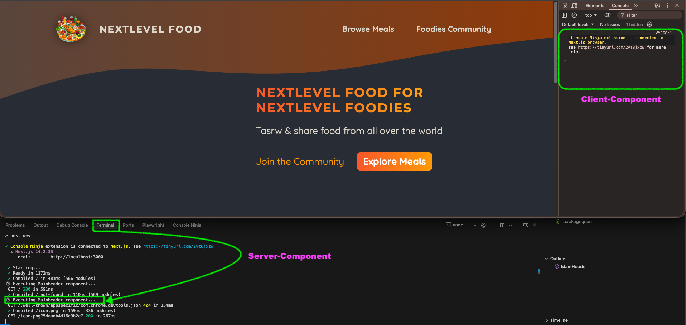

> Note:

* Add a console.log("Meals page") in `Meals` component
* This console.log will be visible from the terminal.


#### 105.2.2 Add to `image-slideshow.js` component the `"use client"`:

**Subsection Summary**
Resolves the runtime crash in the slideshow by explicitly marking it as a Client Component. This allows the component to use the `useState` and `useEffect` hooks, which are essential for its dynamic behavior but unavailable in Server Components.
```tsx
/* app/components/images/image-slideshow.js */
"use client";   // 👈🏽 ✅
import { useEffect, useState } from 'react';
import Image from 'next/image';

import burgerImg from '@/assets/burger.jpg';
import curryImg from '@/assets/curry.jpg';
import dumplingsImg from '@/assets/dumplings.jpg';
import macncheeseImg from '@/assets/macncheese.jpg';
import pizzaImg from '@/assets/pizza.jpg';
import schnitzelImg from '@/assets/schnitzel.jpg';
import tomatoSaladImg from '@/assets/tomato-salad.jpg';
import classes from './image-slideshow.module.css';

const images = [
  { image: burgerImg, alt: 'A delicious, juicy burger' },
  { image: curryImg, alt: 'A delicious, spicy curry' },
  { image: dumplingsImg, alt: 'Steamed dumplings' },
  { image: macncheeseImg, alt: 'Mac and cheese' },
  { image: pizzaImg, alt: 'A delicious pizza' },
  { image: schnitzelImg, alt: 'A delicious schnitzel' },
  { image: tomatoSaladImg, alt: 'A delicious tomato salad' },
];

export default function ImageSlideshow() {
  const [currentImageIndex, setCurrentImageIndex] = useState(0);

  useEffect(() => {
    const interval = setInterval(() => {
      setCurrentImageIndex((prevIndex) =>
        prevIndex < images.length - 1 ? prevIndex + 1 : 0
      );
    }, 5000);

    return () => clearInterval(interval);
  }, []);

  return (
    <div className={classes.slideshow}>
      {images.map((image, index) => (
        <Image
          key={index}
          src={image.image}
          className={index === currentImageIndex ? classes.active : ''}
          alt={image.alt}
        />
      ))}
    </div>
  );
}
```


### 🧱 105.3 Pending Fixes (TODO)

- [ ] Audit all components in `app/components` to ensure they are Server Components unless interactivity is strictly required.
- [ ] Refactor navigation links to use a small Client Component wrapper if active states (like `usePathname`) are needed, rather than making the entire header a Client Component.
- [ ] Remove troubleshooting `console.log` statements from `MainHeader` and other components.
- [ ] Address **Confusion over execution environment**: Initially unclear where `console.log` outputs appear; clarified as terminal for Server Components.
- [ ] Address **Unnecessary Client Components**: Risk of making parent components "Client" when only a small child needs interactivity.
- [ ] Address **Performance Overhead**: Excessive use of Client Components can increase the JavaScript bundle unnecessarily.


<br>

## 🔧 106. Lesson 106 — *Using Client Components Efficiently*

- [Lecture 106: Using Client Components Efficiently](#-106-lesson-106--using-client-components-efficiently)
    - [106.1 Context](#1061-context)
    - [106.2 Updating code according the context](#1062-updating-code-according-the-context)
        - [106.2.1 Adding `Community` page content](#10621-adding-community-page-content)
        - [106.2.2 creating `page.module.css` for `community` component](#10622-creating-pagemodulecss-for-community-component)
        - [106.2.2 Fixing the issue for `<Link>` as active](#10622-fixing-the-issue-for-link-as-active)
        - [106.2.3 Create `nav-link.js` & `nav-link.module.css` files](#10623-create-nav-linkjs--nav-linkmodulecss-files)
        - [106.2.4 Update `main-header.js` code and `main-header.module.css` file](#10624-update-main-headerjs-code-and-main-headermodulecss-file)
    - [106.3 Pending Fixes (TODO)](#1063-pending-fixes-todo)

### 🧠 106.1 Context:

Using Client Components efficiently involves keeping them as small as possible and pushing them down the component tree. This "Leaf Component" strategy ensures that the majority of your application remains as **Server Components**, which offers significant advantages for performance and data management.

**When and Why to use:**
- **Interactivity Scope**: Only use Client Components for the specific UI elements that need browser-side features (hooks, event listeners, browser APIs).
- **Server Component Benefits**: By keeping parent components as Server Components, you maintain direct access to server-side resources (like databases), keep sensitive logic off the client, and reduce the JavaScript bundle size.

**Examples from the project:**
- `app/components/main-header/main-header.js`: Refactored to remain a Server Component even though it needs to highlight the active link.
- `app/components/main-header/nav-link.js`: A new Client Component created specifically to handle the "active link" logic using `usePathname`.

**Advantages:**
- **Optimized Bundle Size**: Less JavaScript is sent to the client.
- **Improved Performance**: Faster initial TTI (Time to Interactive) and better SEO.
- **Maintainability**: Clear separation between static structure and interactive behavior.

**Disadvantages:**
- **File Fragmentation**: Can lead to a larger number of small component files.
- **Prop Passing**: Requires careful management of props when passing data from Server to Client Components.

**When to consider alternatives:**
- If a large part of a component's subtree is highly interactive, it might be more practical and cleaner to make the entire parent a Client Component, rather than creating dozens of tiny "leaf" components.

### ⚙️ 106.2 Updating code according the context:

**Summary**
This section demonstrates how to optimize the use of Client Components by refactoring the global header. We transition from a less efficient approach where the entire `MainHeader` was a Client Component to a more surgical approach. By extracting the interactive navigation logic into a dedicated `NavLink` component, we allow `MainHeader` to revert to a Server Component, thus regaining its server-side benefits while still providing dynamic breadcrumbs/highlighting.

#### 106.2.1 Adding `Community` page content:

[page.js](https://github.com/mschwarzmueller/nextjs-complete-guide-course-resources/blob/main/attachments/02-nextjs-essentials/lecture-specific/app/community/page.js)

**Subsection Summary**
Populates the `CommunityPage` with static content (text and icons) using the Next.js `Image` component. This remains a Server Component as it requires no client-side interactivity.
```tsx
/* app/community/page.js */
import Image from 'next/image';

import mealIcon from '@/assets/icons/meal.png';
import communityIcon from '@/assets/icons/community.png';
import eventsIcon from '@/assets/icons/events.png';
import classes from './page.module.css';

export default function CommunityPage() {
  return (
    <>
      <header className={classes.header}>
        <h1>
          One shared passion: <span className={classes.highlight}>Food</span>
        </h1>
        <p>Join our community and share your favorite recipes!</p>
      </header>
      <main className={classes.main}>
        <h2>Community Perks</h2>

        <ul className={classes.perks}>
          <li>
            <Image src={mealIcon} alt="A delicious meal" />
            <p>Share & discover recipes</p>
          </li>
          <li>
            <Image src={communityIcon} alt="A crowd of people, cooking" />
            <p>Find new friends & like-minded people</p>
          </li>
          <li>
            <Image
              src={eventsIcon}
              alt="A crowd of people at a cooking event"
            />
            <p>Participate in exclusive events</p>
          </li>
        </ul>
      </main>
    </>
  );
}
```

#### 106.2.2 creating `page.module.css` for `community` component:

[page.module.css](https://github.com/mschwarzmueller/nextjs-complete-guide-course-resources/blob/main/attachments/02-nextjs-essentials/lecture-specific/app/community/page.module.css)

**Subsection Summary**
Defines the visual styles for the Community page, including responsive layouts, typography, and specific styling for the list of perks.
```tsx
/* app/community/page.module.css */
.header {
  gap: 3rem;
  margin: 3rem auto 5rem auto;
  width: 90%;
  max-width: 75rem;
  color: #ddd6cb;
  font-size: 1.5rem;
  text-align: center;
}

.header h1 {
  font-family: 'Montserrat', sans-serif;
}

.highlight {
  background: linear-gradient(90deg, #f9572a, #ff8a05);
  background-clip: text;
  -webkit-background-clip: text;
  -webkit-text-fill-color: transparent;
}

.main {
  width: 90%;
  max-width: 40rem;
  margin: 0 auto;
  text-align: center;
}

.main h2 {
  font-family: 'Montserrat', sans-serif;
  font-size: 2rem;
  margin-bottom: 3rem;
  color: #ddd6cb;
}

.perks {
  list-style: none;
  margin: 3rem 0;
  padding: 0;
}

.perks li {
  display: flex;
  flex-direction: column;
  align-items: center;
  gap: 2rem;
}

.perks img {
  width: 8rem;
  height: 8rem;
  object-fit: contain;
}

.perks p {
  font-family: 'Montserrat', sans-serif;
  font-size: 1.5rem;
  font-weight: bold;
  margin: 0;
  color: #ddd6cb;
}
```

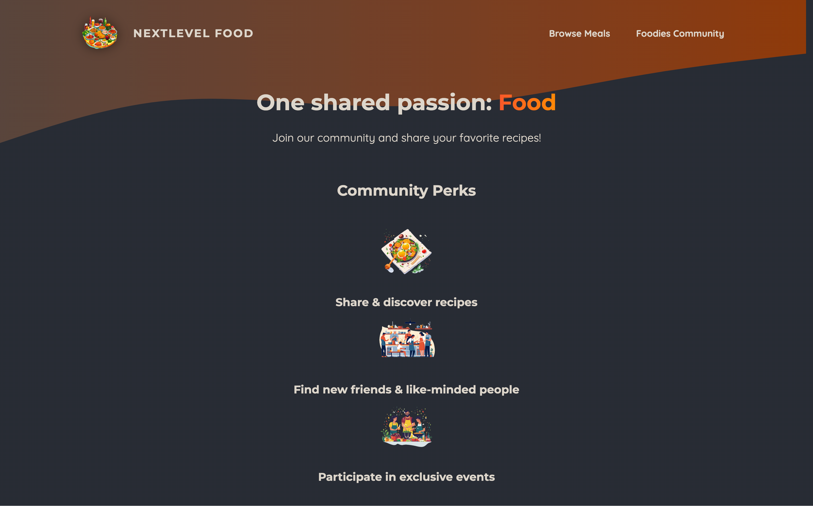

#### 106.2.2 Fixing the issue for `<Link>` as active:

**Subsection Summary**
Demonstrates an initial (but inefficient) fix for highlighting the active link. It uses the `usePathname` hook within `MainHeader`, which necessitates marking the entire header as a Client Component with the `"use client"` directive.
```tsx
/* app/components/main-header/main-header.js */
"use client"    // 👈🏽 ✅
import Link from "next/link";
import Image from "next/image";
import MainHeaderBackground from "./main-header-background";
import { usePathname } from "next/navigation";    // 👈🏽 ✅

import logoImg from "@/assets/logo.png";
import classes from "./main-header.module.css";

export default function MainHeader() {
  const path = usePathname();    // 👈🏽 ✅
  return (
    <>
      <MainHeaderBackground />
      <header className={classes.header}>
        <Link className={classes.logo} href="/">
          <Image src={logoImg} alt="A plate with food on it" priority />
          NextLevel Food
        </Link>
        <nav className={classes.nav}>
          <ul>
            <li>
              <Link href="/meals" className={path.startsWith('/meals') ? classes.active : undefined}>Browse Meals</Link>    {/* 👈🏽 ✅ */}
            </li>
            <li>
              <Link href="/community" className={path.startsWith('/community') ? classes.active : undefined}>Foodies Community</Link>   {/* 👈🏽 ✅ */}
            </li>
          </ul>
        </nav>
      </header>
    </>
  );
}
```

> Without adding `"use client"`, it will occur this error:

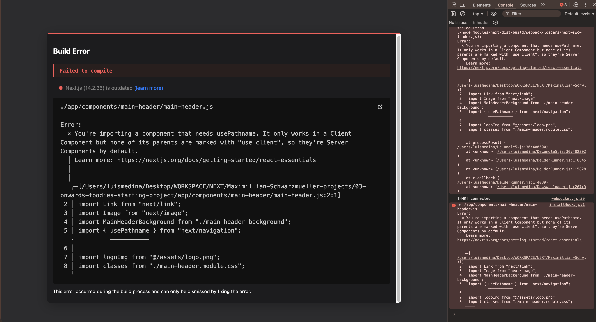

> Issue fixed:


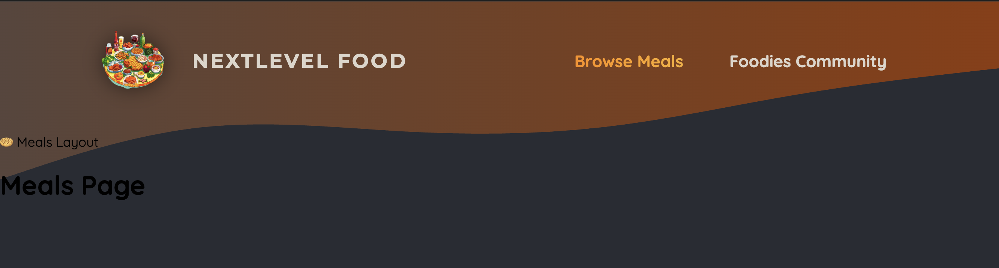


> New Issue:

- `main-header.js` is not `React Server Component (RSC)` anymore.
- `main-header.js` loses its server component advantages.

#### 106.2.3 Create `nav-link.js` & `nav-link.module.css` files:

**Subsection Summary**
Implements the optimized "leaf component" solution. The `NavLink` component is marked with `"use client"` and isolates the `usePathname` hook, allowing it to manage its own active state styling independently of its parent.
```tsx
/* app/components/main-header/nav-link.js */
"use client";
import Link from "next/link";
import { usePathname } from "next/navigation";
import classes from "./nav-link.module.css";

export default function NavLink({ href, children }) {
  const path = usePathname();
  return (
    <Link 
      href={href} 
      className={ path.startsWith(href) 
        ? `${classes.link} ${classes.active}` 
        : classes.link }
    >
      {children}
    </Link>
  );
}

```

And 

```css
/* app/components/main-header/nav-link.module.css */
.link {
  text-decoration: none;
  color: #ddd6cb;
  font-weight: bold;
  padding: 0.5rem 1rem;
  border-radius: 0.5rem;
}

.link:hover,
.link:active {
  background: linear-gradient(90deg, #ff8a05, #f9b331);
  background-clip: text;
  -webkit-background-clip: text;
  -webkit-text-fill-color: transparent;
  text-shadow: 0 0 18px rgba(248, 190, 42, 0.8);
}

.active {
  background: linear-gradient(90deg, #ff8a05, #f9b331);
  background-clip: text;
  -webkit-background-clip: text;
  -webkit-text-fill-color: transparent;
}
```

#### 106.2.4 Update `main-header.js` code and `main-header.module.css` file:

**Subsection Summary**
Refactors the `MainHeader` to use the new `NavLink` component. This allows for the removal of the `"use client"` directive from `MainHeader`, restoring it as a Server Component. It also involves cleaning up or commenting out styles that were moved to the `NavLink` module.
```jsx
/* app/components/main-header/main-header.js */
//"use client";   // 👈🏽 ✅
import Link from "next/link";
import Image from "next/image";
import MainHeaderBackground from "./main-header-background";
// import { usePathname } from "next/navigation";   // 👈🏽 ✅
import NavLink from "./nav-link";   // 👈🏽 ✅

import logoImg from "@/assets/logo.png";
import classes from "./main-header.module.css";

export default function MainHeader() {
  // const path = usePathname();    // 👈🏽 ✅
  return (
    <>
      <MainHeaderBackground />
      <header className={classes.header}>
        <Link className={classes.logo} href="/">
          <Image src={logoImg} alt="A plate with food on it" priority />
          NextLevel Food
        </Link>
        <nav className={classes.nav}>
          <ul>
            <li>
              <NavLink href="/meals">Browse Meals</NavLink>   {/* 👈🏽 ✅ */}
            </li>
            <li>
              <NavLink href="/community">Foodies Community</NavLink>    {/* 👈🏽 ✅ */}
            </li>
          </ul>
        </nav>
      </header>
    </>
  );
}

```

and 

```css
/*  */
.header {
  display: flex;
  justify-content: space-between;
  align-items: center;
  padding: 2rem 1rem;
}

@media (min-width: 768px) {
  .header {
    padding: 2rem 10%;
  }
}

.nav ul {
  list-style: none;
  margin: 0;
  padding: 0;
  display: flex;
  gap: 1.5rem;
  /* font-family: 'Montserrat', sans-serif; */
  font-size: 1.25rem;
}

/* .nav a {   // 👈🏽 ✅ (.nav a => .link)
  text-decoration: none;
  color: #ddd6cb;
  font-weight: bold;
  padding: 0.5rem 1rem;
  border-radius: 0.5rem;
}

.nav a:hover,
.nav a:active {   // 👈🏽 ✅ (.nav a => .link)
  background: linear-gradient(90deg, #ff8a05, #f9b331);
  background-clip: text;
  -webkit-background-clip: text;
  -webkit-text-fill-color: transparent;
  text-shadow: 0 0 18px rgba(248, 190, 42, 0.8);
} */

/* .active {    // 👈🏽 ✅
  background: linear-gradient(90deg, #ff8a05, #f9b331);
  background-clip: text;
  -webkit-background-clip: text;
  -webkit-text-fill-color: transparent;
} */

.logo {
  display: flex;
  align-items: center;
  justify-content: center;
  gap: 2rem;
  text-decoration: none;
  color: #ddd6cb;
  font-weight: bold;
  font-family: 'Montserrat', sans-serif;
  letter-spacing: 0.15rem;
  text-transform: uppercase;
  font-size: 1.5rem;
}

.logo img {
  width: 5rem;
  height: 5rem;
  object-fit: contain;
  filter: drop-shadow(0 0 0.75rem rgba(0, 0, 0, 0.5));
}
```

### 🧱 106.3 Pending Fixes (TODO)

- [ ] Extract interactive navigation logic into the `NavLink` component.
- [ ] Restore `MainHeader` as a Server Component by removing `"use client"`.
- [ ] Clean up `app/components/main-header/main-header.module.css` by removing the commented-out CSS blocks.
- [ ] Implement an exact match check in `NavLink` (e.g., `path === href`) if the root path `/` is added to the main navigation menu.
- [ ] Address **Inefficient Client Component usage**: Initially, `MainHeader` was converted to a Client Component just to access the `usePathname` hook, which is an anti-pattern for large layout components.
- [ ] Address **Commented-out dead code**: Removed the commented-out CSS blocks in `main-header.module.css` that were moved to `nav-link.module.css`.
- [ ] Address **Broad URL matching in `NavLink`**: `path.startsWith(href)` might cause multiple links to appear active if one path is a subset of another (e.g., `/` vs `/meals`). This isn't currently an issue but worth noting for future routes.


<br>

## 🔧 107. Lesson 107 — *Outputting Meals Data & Images With Unknown Dimensions*

- [Lecture 107: Outputting Meals Data & Images With Unknown Dimensions](#-107-lesson-107--outputting-meals-data--images-with-unknown-dimensions)
  - [107.1 Context](#1071-context)
  - [107.2 Updating code/theory according the context](#1072-updating-code-according-the-context)
    - [107.2.1 create `page.module.css` file](#10721-create-pagemodulecss-file)
    - [107.2.2 Update `meals/page.js` file](#10722-update-mealspagejs-file)
    - [107.2.3 Create `meals/meals-grid.module.css` file](#10723-create-mealsmeals-gridmodulecss-file)
    - [107.2.4 Create and update the `meals/meals-grid.js` file](#10724-create-and-update-the-mealsmeals-gridjs-file)
    - [107.2.5 create `meals/meal-item.module.css` file](#10725-create-mealsmeal-itemmodulecss-file)
    - [107.2.6 create and update `meals/meal-item.js` file](#10726-create-and-update-mealsmeal-itemjs-file)
    - [107.2.7 Update the `meals/meal-grid.js` file](#10727-update-the-mealsmeal-gridjs-file)
    - [107.2.8 Update `meals/page.js` file and import `MealsGrid` component](#10728-update-mealspagejs-file-and-import-mealsgrid-component)
  - [107.3 Issues](#1073-issues)
  - [107.4 Pending Fixes (TODO)](#1074-pending-fixes-todo)

### 🧠 107.1 Context:

In many web applications, you need to display lists of items that include images where you don't know the dimensions in advance. Next.js provides tools to handle this performantly while maintaining layout stability.

- **Dynamic Image Sizing**: When dimensions are unknown, the `fill` prop in the Next.js `Image` component allows the image to fill its parent container.
- **Parent Container Requirements**: When using `fill`, the parent element must have `position: relative`, `position: absolute`, or `position: fixed`.
- **Image Cropping and Scaling**: Use `object-fit: cover` to ensure the image fills the container without being distorted.
- **Grid Layouts**: `display: grid` with `auto-fill` and `minmax` is an excellent pattern for creating responsive lists of items.

**Key Concepts:**
1. **`fill` Prop**: Allows images to size themselves relative to their parent rather than requiring hardcoded width and height.
2. **Container-Driven Sizing**: Layout shifts are prevented by the container having a defined size, even if the image content is dynamic.
3. **`object-fit` Integration**: Crucial for maintaining aspect ratio of dynamic images within static containers.

**Advantages:**
- **Flexibility**: Handles images from external sources or user uploads easily.
- **Layout Stability**: Prevents Cumulative Layout Shift (CLS) by giving the parent container a fixed size.
- **Responsive Design**: Works seamlessly with grid and flexbox layouts.

**Gotchas:**
- Forgetting `position: relative` on the parent container when using `fill` will cause the image to fill the nearest positioned ancestor (often the whole page).
- If `object-fit` is not used, the image might look stretched or squashed.

**When to consider alternatives:**
- If you *do* know the aspect ratio or exact dimensions, specifying `width` and `height` is generally more efficient for the browser.

### ⚙️ 107.2 Updating code/theory according the context:

#### **Summary**
This section documents the transition of the meals listing page from a placeholder to a functional grid-based layout. It covers the creation of scoped styles for the meals page, the implementation of a reusable `MealsGrid` component for managing item lists, and a `MealItem` component for individual meal presentations. A key technical focus is the use of the `fill` prop in the `Image` component to handle dynamic images within fixed-size containers.

Repos:
- [page.module.css](https://github.com/mschwarzmueller/nextjs-complete-guide-course-resources/blob/main/attachments/02-nextjs-essentials/lecture-specific/app/meals/page.module.css)
- [meals-grid.module.css](https://github.com/mschwarzmueller/nextjs-complete-guide-course-resources/blob/main/attachments/02-nextjs-essentials/lecture-specific/components/meals/meals-grid.module.css)
- [meal-item.module.css](https://github.com/mschwarzmueller/nextjs-complete-guide-course-resources/blob/main/attachments/02-nextjs-essentials/lecture-specific/components/meals/meal-item.module.css)
- [meal-item.js](https://github.com/mschwarzmueller/nextjs-complete-guide-course-resources/blob/main/attachments/02-nextjs-essentials/lecture-specific/components/meals/meal-item.js)

#### 107.2.1 create `page.module.css` file:

**Subsection Summary**
Defines the visual structure for the meals listing page. Includes high-level styles for the header (margins, fonts, gradients) and a sophisticated loading animation for future use during data fetching.
```css
/* app/meals/page.module.css */
.header {
  gap: 3rem;
  margin: 3rem auto 5rem auto;
  width: 90%;
  max-width: 75rem;
  color: #ddd6cb;
  font-size: 1.5rem;
}

.header h1 {
  font-family: 'Montserrat', sans-serif;
}

.highlight {
  background: linear-gradient(90deg, #f9572a, #ff8a05);
  background-clip: text;
  -webkit-background-clip: text;
  -webkit-text-fill-color: transparent;
}

.header p {
  margin: 0;
}

.cta a {
  display: inline-block;
  margin-top: 1rem;
  padding: 0.5rem 1rem;
  border-radius: 0.5rem;
  background: linear-gradient(90deg, #f9572a, #ff9b05);
  color: #ffffff;
  font-weight: bold;
  text-decoration: none;
}

.loading {
  text-align: center;
  animation: loading 1.2s ease-in-out infinite;
}

@keyframes loading {
  0% {
    color: #e9e9e9;
  }
  50% {
    color: #b89b84;
  }
  100% {
    color: #e9e9e9;
  }
}
```

#### 107.2.2 Update `meals/page.js` file:

**Subsection Summary**
Populates the main meals page with a header and a call-to-action link. It sets up the basic layout using the newly created CSS module and prepares the `main` section to receive the meals grid. Note: Current link has a typo (`/meal/share` instead of `/meals/share`).
```jsx
/* app/meals/page.js */
import Link from 'next/link'
import classes from './page.module.css'

export default function MealsPage(){
  return (
    <>
      <header className={classes.header}>
        <h1>
          Delicious meals, created <span className={classes.highlight}>by you</span>.
        </h1>
        <p>Choose your favorite recipe and cook it yourself. It is easy and fun!</p>
        <p className={classes.cta}>
          <Link href="/meal/share">Share Your Favorite Recipe</Link>
        </p>
      </header>
      <main className={classes.main}></main>
    </>
  )
}
```

#### 107.2.3 Create `meals/meals-grid.module.css` file

**Subsection Summary**
Implements a responsive grid layout for the meals list. It uses `grid-template-columns: repeat(auto-fill, minmax(20rem, 1fr))` to ensure the layout adapts to different screen sizes while maintaining a minimum item width.
```css
/* app/components/meals/meals-grid.module.css */
.meals {
  width: 90%;
  max-width: 90rem;
  display: grid;
  grid-template-columns: repeat(auto-fill, minmax(20rem, 1fr));
  grid-gap: 5rem;
  margin: 2rem auto;
  list-style: none;
  padding: 0;
}
```

#### 107.2.4 Create and update the `meals/meals-grid.js` file:

**Subsection Summary**
Creates the `MealsGrid` component that maps through an array of meals. It currently uses a placeholder `<li>` for each meal. Note: This implementation currently contains a bug where the `map` callback does not return any JSX.
```jsx
/* app/components/meals/meals-grid.js */
import classes from './meals-grid.module.css'

export default function MealsGrid({meals}){
  return (
    <ul className={classes.meals}>
      {meals.map( (meal) => {
        <li key={meal.id}>{meal.title}</li>
      })}
    </ul>
  )
}
```

#### 107.2.5 create `meals/meal-item.module.css` file:

**Subsection Summary**
Provides detailed styling for individual meal cards. Key features include a fixed-height image container with `position: relative` (to support the `Image` component's `fill` prop), `object-fit: cover` for images, and gradient backgrounds for a premium look.
```css
/* app/components/meals/meal-item.module.css */
.meal {
  display: flex;
  flex-direction: column;
  justify-content: space-between;
  height: 100%;
  border-radius: 4px;
  box-shadow: 0 0 12px rgba(0, 0, 0, 0.3);
  overflow: hidden;
  transition: all 0.3s ease-in-out;
  color: #ddd6cb;
  background: linear-gradient(90deg, #2c1e19, #25200f);
}

.headerText {
  padding: 0.5rem 1rem 0 1rem;
}

.headerText h2 {
  margin: 0;
  font-size: 1.5rem;
  font-family: 'Montserrat', sans-serif;
}

.headerText p {
  font-size: 0.75rem;
  color: #cfa69b;
  font-style: italic;
}

.meal h2,
.meal p {
  margin: 0;
}

.image {
  position: relative;
  height: 15rem;
}

.meal img {
  object-fit: cover;
}

.content {
  display: flex;
  flex-direction: column;
  justify-content: space-between;
  height: 100%;
}

.summary {
  padding: 1rem 1rem 0 1rem;
}

.actions {
  padding: 1rem;
  text-align: right;
}

.actions a {
  display: inline-block;
  margin-top: 1rem;
  padding: 0.5rem 1rem;
  border-radius: 0.5rem;
  background: linear-gradient(90deg, #f9572a, #ff9b05);
  color: #ffffff;
  font-weight: bold;
  text-decoration: none;
}

.actions a:hover,
.actions a:active {
  background: linear-gradient(90deg, #fd4715, #f9b241);
  box-shadow: 0 0 12px rgba(242, 100, 18, 0.8);
}
```

#### 107.2.6 create and update `meals/meal-item.js` file:

**Subsection Summary**
Implements the `MealItem` component using the Next.js `Image` component with the `fill` prop. This allows the component to display images of varying aspect ratios consistently within its card-like structure. It also includes links to dynamic meal detail pages.
```jsx
/* app/components/meals/meal-item.js */
import Link from 'next/link';
import Image from 'next/image';

import classes from './meal-item.module.css';

export default function MealItem({ title, slug, image, summary, creator }) {
  return (
    <article className={classes.meal}>
      <header>
        <div className={classes.image}>
          <Image src={image} alt={title} fill />
        </div>
        <div className={classes.headerText}>
          <h2>{title}</h2>
          <p>by {creator}</p>
        </div>
      </header>
      <div className={classes.content}>
        <p className={classes.summary}>{summary}</p>
        <div className={classes.actions}>
          <Link href={`/meals/${slug}`}>View Details</Link>
        </div>
      </div>
    </article>
  );
}
```

![meals/[mealSlug] link](../img/section03-lecture107-001.png)

> Note:

* You can use the "`fill`" prop instead of setting a "`width`" and "`height`" whenever you have an image where you don't know the dimensions in advance.

#### 107.2.7 Update the `meals/meal-grid.js` file importing and using the `<MealItem />` component:

**Subsection Summary**
Integrates the `MealItem` component into the `MealsGrid` list. It uses the spread operator (`{...meal}`) to pass all meal properties as props to the item component. Note: The return bug in the `map` persists here.
```jsx
/* app/components/meals/meals-grid.js */
import classes from './meals-grid.module.css'
import MealItem from './meal-item';   // 👈🏽 ✅

export default function MealsGrid({meals}){
  return (
    <ul className={classes.meals}>
      {meals.map( (meal) => {
        <li key={meal.id}>
          <MealItem {...meal} />    {/* 👈🏽 ✅ */}
        </li>
      })}
    </ul>
  )
}
```

#### 107.2.8 Update `meals/page.js` file and import `MealsGrid` component:

**Subsection Summary**
Completes the initial meals page implementation by importing and rendering the `MealsGrid`. It currently passes an empty array as a placeholder for data that will be fetched in future lessons.
```jsx
/* app/meals/page.js */
import Link from 'next/link'
import classes from './page.module.css'
import MealsGrid from '../components/meals/meals-grid'    // 👈🏽 ✅ 

export default function MealsPage(){
  return (
    <>
      <header className={classes.header}>
        <h1>
          Delicious meals, created <span className={classes.highlight}>by you</span>.
        </h1>
        <p>Choose your favorite recipe and cook it yourself. It is easy and fun!</p>
        <p className={classes.cta}>
          <Link href="/meal/share">Share Your Favorite Recipe</Link>
        </p>
      </header>
      <main className={classes.main}>
        <MealsGrid meals={[]} />    {/* 👈🏽 ✅ */}
      </main>
    </>
  )
}
```

### 🐞 107.3 Issues:

- **Missing return in `MealsGrid` map**: In `app/components/meals/meals-grid.js` (lines 7-11), the `map` function uses curly braces `{}` but does not include a `return` statement, resulting in an empty list being rendered even if meals were provided.
- **Incorrect CTA Link**: In `app/meals/page.js` (line 14), the link `href="/meal/share"` is incorrect; it should be `href="/meals/share"` to match the defined route.
- **Empty Meals Data**: The `MealsPage` is currently passing an empty array `[]` to `MealsGrid`, making the page appear empty by default.

| Issue | Status | Log/Error |
|---|---|---|
| Missing return in `map` | ⚠️ Identified | `app/components/meals/meals-grid.js:7-11` |
| Typo in Share Meal Link | ⚠️ Identified | `app/meals/page.js:14` |
| Empty Data Placeholder | ℹ️ Informational | `app/meals/page.js:18` |

### 🧱 107.4 Pending Fixes (TODO)

- [ ] Add `return` statement to the `map` function in `app/components/meals/meals-grid.js` (line 8).
- [ ] Fix the `href` attribute in `app/meals/page.js` from `/meal/share` to `/meals/share`.
- [ ] Implement data fetching logic in `app/meals/page.js` to replace the empty array with real meal data.
- [ ] Add `placeholder="blur"` to images in `MealItem` for better perceived performance once local images are available.


<br>

## 🔧 108. Lesson 108 — *Setting Up A SQLite Database*

- [108. Lesson 108 — *Setting Up A SQLite Database*](#-108-lesson-108--setting-up-a-sqlite-database)
- [108.1 Context](#1081-context)
- [108.2 Updating code/theory according the context](#1082-updating-code-according-the-context)
  - [108.2.1 Install better-sqlite3](#10821-install-better-sqlite3)
  - [108.2.2 Create initdb.js](#10822-create-initdbjs)
  - [108.2.3 Execute initdb.js](#10823-execute-initdbjs)
  - [108.2.4 Database File Creation](#10824-database-file-creation)
- [108.3 Issues](#1083-issues)
- [108.4 Pending Fixes (TODO)](#1084-pending-fixes-todo)

### 🧠 108.1 Context:

**SQLite** is a lightweight, serverless, zero-configuration, transactional SQL database engine. Unlike most other SQL databases, SQLite does not have a separate server process. It reads and writes directly to ordinary disk files. In the context of a Next.js application, particularly during development, it provides a simple and efficient way to persist data without the overhead of setting up a full-blown database server like PostgreSQL or MySQL.

**When to use:**
- **Local Development**: Perfect for prototyping and early-stage development due to its simplicity.
- **Embedded Applications**: Ideal for applications that need a self-contained database.
- **Small-Scale Production**: Can be used for applications with low-to-medium traffic and simple data needs.

**Examples from the project:**
- `initdb.js`: A script used to initialize the database schema and populate it with initial dummy data.
- `meals.db`: The resulting SQLite database file that stores all meal-related information.
- `better-sqlite3`: The Node.js library used to interact with the SQLite database synchronously, which simplifies the integration in Server Components.

**Key Concepts:**
1. **Serverless Architecture**: No separate database process; the database is a file.
2. **Synchronous Execution**: `better-sqlite3` executes queries synchronously, which is often preferred in server-side logic for its simplicity.
3. **Seeding**: The process of populating the database with initial data using a script like `initdb.js`.

**Advantages:**
- Zero configuration and easy setup.
- Highly portable (the whole database is one file).
- Excellent performance for read-heavy workloads common in landing pages and listings.

**Disadvantages/Gotchas:**
- **Concurrency**: SQLite can struggle with many simultaneous write operations compared to client-server databases.
- **Limited Scaling**: Not designed for massive datasets or highly distributed systems.
- **File Management**: You must ensure the database file is properly backed up and not accidentally deleted.

**When to consider alternatives:**
- If your application expects a very high volume of concurrent writes.
- If you need advanced features like full-text search or complex GIS capabilities provided by databases like PostgreSQL.
- If your data needs to be shared across multiple distributed server instances.

### ⚙️ 108.2 Updating code/theory according the context:

#### **Summary**
This section documents the setup and initialization of a persistent SQLite database for the meals application. It covers the installation of the `better-sqlite3` driver, the creation of a seeding script (`initdb.js`) to define the schema and insert mock data, and the execution process that results in the creation of the `meals.db` file. This establishes the data layer that will power the meals listing and detail pages.

Repo:

* [initdb.js](https://github.com/mschwarzmueller/nextjs-complete-guide-course-resources/blob/main/attachments/02-nextjs-essentials/lecture-specific/initdb.js)

#### 108.2.1 Install `better-sqlite3` dependency:

**Subsection Summary**
Installs the necessary library to interact with SQLite. `better-sqlite3` is chosen for its performance and synchronous API, which integrates well with Node.js and Next.js.

```bash
npm install better-sqlite3
```

#### 108.2.2 Create `initdb.js`:

**Subsection Summary**
Defines the database initialization script. This file creates the `meals` table with the required schema (slug, title, image, summary, instructions, etc.) and populates it with an array of dummy meal objects. It uses prepared statements for efficient data insertion.

```jsx
/* initdb.js */
const sql = require('better-sqlite3');
const db = sql('meals.db');

const dummyMeals = [
  {
    title: 'Juicy Cheese Burger',
    slug: 'juicy-cheese-burger',
    image: '/images/burger.jpg',
    summary:
      'A mouth-watering burger with a juicy beef patty and melted cheese, served in a soft bun.',
    instructions: `
      1. Prepare the patty:
         Mix 200g of ground beef with salt and pepper. Form into a patty.

      2. Cook the patty:
         Heat a pan with a bit of oil. Cook the patty for 2-3 minutes each side, until browned.

      3. Assemble the burger:
         Toast the burger bun halves. Place lettuce and tomato on the bottom half. Add the cooked patty and top with a slice of cheese.

      4. Serve:
         Complete the assembly with the top bun and serve hot.
    `,
    creator: 'John Doe',
    creator_email: 'johndoe@example.com',
  },
  {
    title: 'Spicy Curry',
    slug: 'spicy-curry',
    image: '/images/curry.jpg',
    summary:
      'A rich and spicy curry, infused with exotic spices and creamy coconut milk.',
    instructions: `
      1. Chop vegetables:
         Cut your choice of vegetables into bite-sized pieces.

      2. Sauté vegetables:
         In a pan with oil, sauté the vegetables until they start to soften.

      3. Add curry paste:
         Stir in 2 tablespoons of curry paste and cook for another minute.

      4. Simmer with coconut milk:
         Pour in 500ml of coconut milk and bring to a simmer. Let it cook for about 15 minutes.

      5. Serve:
         Enjoy this creamy curry with rice or bread.
    `,
    creator: 'Max Schwarz',
    creator_email: 'max@example.com',
  },
  {
    title: 'Homemade Dumplings',
    slug: 'homemade-dumplings',
    image: '/images/dumplings.jpg',
    summary:
      'Tender dumplings filled with savory meat and vegetables, steamed to perfection.',
    instructions: `
      1. Prepare the filling:
         Mix minced meat, shredded vegetables, and spices.

      2. Fill the dumplings:
         Place a spoonful of filling in the center of each dumpling wrapper. Wet the edges and fold to seal.

      3. Steam the dumplings:
         Arrange dumplings in a steamer. Steam for about 10 minutes.

      4. Serve:
         Enjoy these dumplings hot, with a dipping sauce of your choice.
    `,
    creator: 'Emily Chen',
    creator_email: 'emilychen@example.com',
  },
  {
    title: 'Classic Mac n Cheese',
    slug: 'classic-mac-n-cheese',
    image: '/images/macncheese.jpg',
    summary:
      "Creamy and cheesy macaroni, a comforting classic that's always a crowd-pleaser.",
    instructions: `
      1. Cook the macaroni:
         Boil macaroni according to package instructions until al dente.

      2. Prepare cheese sauce:
         In a saucepan, melt butter, add flour, and gradually whisk in milk until thickened. Stir in grated cheese until melted.

      3. Combine:
         Mix the cheese sauce with the drained macaroni.

      4. Bake:
         Transfer to a baking dish, top with breadcrumbs, and bake until golden.

      5. Serve:
         Serve hot, garnished with parsley if desired.
    `,
    creator: 'Laura Smith',
    creator_email: 'laurasmith@example.com',
  },
  {
    title: 'Authentic Pizza',
    slug: 'authentic-pizza',
    image: '/images/pizza.jpg',
    summary:
      'Hand-tossed pizza with a tangy tomato sauce, fresh toppings, and melted cheese.',
    instructions: `
      1. Prepare the dough:
         Knead pizza dough and let it rise until doubled in size.

      2. Shape and add toppings:
         Roll out the dough, spread tomato sauce, and add your favorite toppings and cheese.

      3. Bake the pizza:
         Bake in a preheated oven at 220°C for about 15-20 minutes.

      4. Serve:
         Slice hot and enjoy with a sprinkle of basil leaves.
    `,
    creator: 'Mario Rossi',
    creator_email: 'mariorossi@example.com',
  },
  {
    title: 'Wiener Schnitzel',
    slug: 'wiener-schnitzel',
    image: '/images/schnitzel.jpg',
    summary:
      'Crispy, golden-brown breaded veal cutlet, a classic Austrian dish.',
    instructions: `
      1. Prepare the veal:
         Pound veal cutlets to an even thickness.

      2. Bread the veal:
         Coat each cutlet in flour, dip in beaten eggs, and then in breadcrumbs.

      3. Fry the schnitzel:
      Heat oil in a pan and fry each schnitzel until golden brown on both sides.

      4. Serve:
      Serve hot with a slice of lemon and a side of potato salad or greens.
 `,
    creator: 'Franz Huber',
    creator_email: 'franzhuber@example.com',
  },
  {
    title: 'Fresh Tomato Salad',
    slug: 'fresh-tomato-salad',
    image: '/images/tomato-salad.jpg',
    summary:
      'A light and refreshing salad with ripe tomatoes, fresh basil, and a tangy vinaigrette.',
    instructions: `
      1. Prepare the tomatoes:
        Slice fresh tomatoes and arrange them on a plate.
    
      2. Add herbs and seasoning:
         Sprinkle chopped basil, salt, and pepper over the tomatoes.
    
      3. Dress the salad:
         Drizzle with olive oil and balsamic vinegar.
    
      4. Serve:
         Enjoy this simple, flavorful salad as a side dish or light meal.
    `,
    creator: 'Sophia Green',
    creator_email: 'sophiagreen@example.com',
  },
];

db.prepare(`
   CREATE TABLE IF NOT EXISTS meals (
       id INTEGER PRIMARY KEY AUTOINCREMENT,
       slug TEXT NOT NULL UNIQUE,
       title TEXT NOT NULL,
       image TEXT NOT NULL,
       summary TEXT NOT NULL,
       instructions TEXT NOT NULL,
       creator TEXT NOT NULL,
       creator_email TEXT NOT NULL
    )
`).run();

async function initData() {
  const stmt = db.prepare(`
      INSERT INTO meals VALUES (
         null,
         @slug,
         @title,
         @image,
         @summary,
         @instructions,
         @creator,
         @creator_email
      )
   `);

  for (const meal of dummyMeals) {
    stmt.run(meal);
  }
}

initData();
```

#### 108.2.3 execute from terminal:

**Subsection Summary**
Triggers the database creation and seeding process. Running this command in the project root executes the logic in `initdb.js`.

```bash
node initdb.js
```

#### 108.2.4 new `meals.db` file appears:

**Subsection Summary**
Visual verification of the database creation. The `meals.db` file is generated in the root directory, containing the schema and initial data specified in `initdb.js`.

```
03-onwards-foodies-starting-project/
├── app/
│   ├── community/
│   │   ├── page.js                     # 📄 Community page displaying social features
│   │   └── page.module.css             # 📄 Scoped styles for the community page
│   ├── components/
│   │   ├── images/
│   │   │   ├── image-slideshow.js      # 📄 Animated slideshow component
│   │   │   └── image-slideshow.module.css
│   │   ├── meals/
│   │   │   ├── meal-item.js            # 📄 meal item component
│   │   │   ├── meal-item.module.css    # 📄 Scoped styles for meal item component
│   │   │   ├── meals-grid.js           # 📄 meals grid component
│   │   │   ├── meals-grid.module.css   # 📄 Scoped styles for meals grid component
│   │   └── main-header/
│   │       ├── main-header.js          # 📄 Global navigation header
│   │       ├── main-header.module.css
│   │       ├── main-header-background.js
│   │       ├── main-header-background.module.css
│   │       ├── nav-link.js             # 📄 Individual navigation link component
│   │       └── nav-link.module.css
│   ├── meals/
│   │   ├── [mealSlug]/
│   │   │   └── page.js                 # 📄 Dynamic route for meal details
│   │   ├── share/
│   │   │   └── page.js                 # 📄 Page for sharing new meals
│   │   ├── layout.js                   # 📄 Layout for meals section
│   │   ├── page.js                     # 📄 Main meals listing page
│   │   └── page.module.css             # 📄 Scoped styles for Main meals page
│   ├── globals.css                     # 📄 Global application styles
│   ├── icon.png                        # 📄 App icon
│   ├── layout.js                       # 📄 Root application layout
│   ├── page.js                         # 📄 Landing/Home page
│   └── page.module.css                 # 📄 Styles for the landing page
├── assets/                             # 📁 Static assets (images, icons)
├── docs/
│   └── LECTURE_STEPS.md                # 📄 This educational documentation
├── img/                                # 📁 Screenshots for documentation
├── public/                             # 📁 Static assets served directly
├── jsconfig.json                       # 📄 Path aliases configuration
├── initdb.js                           # 📄 👈🏽 ✅ initdb.js for generate a db
├── meals.db                            # 📄 👈🏽 ✅ sqlite database
├── next.config.js                      # 📄 Next.js configuration
├── package.json                        # 📄 Project dependencies
└── README.md                           # 📄 General project information
```

### 🐞 108.3 Issues:

- **Missing Error Handling**: The `initdb.js` script does not include error handling (e.g., `try-catch` blocks) for database operations, which could lead to ungraceful failures if the file system is read-only or the disk is full.
- **Manual Execution Requirement**: The database must be seeded manually using `node initdb.js`. There is no automated process (like a post-install script) to ensure the database exists before the application starts.
- **Idempotency Concerns**: While `CREATE TABLE IF NOT EXISTS` is idempotent, running the script multiple times without a `DELETE` or `TRUNCATE` before insertion would lead to duplicate entries if the unique `slug` constraint wasn't present, or errors because of it.

| Issue | Status | Log/Error |
|---|---|---|
| Lack of `try-catch` in `initdb.js` | ⚠️ Identified | `initdb.js:167-199` |
| Manual database seeding | ℹ️ Informational | `initdb.js` |
| Image Path Dependency | ℹ️ Identified | `initdb.js:8,30,...` (Images must exist in `/public/images`) |

### 🧱 108.4 Pending Fixes (TODO)

- [ ] Implement data fetching logic in `lib/meals.js` (to be created) to load meals from `meals.db`.
- [ ] Add basic error handling to `initdb.js` to provide better feedback during seeding.
- [ ] Consider adding a `db:setup` script to `package.json` to automate database initialization.
- [ ] Verify that all images referenced in `dummyMeals` exist in the `public/images` directory.
- [ ] Address **Data Persistence**: Ensure the `meals.db` file is not tracked by Git if it contains environment-specific data, but in this case, it's used for shared developmental state.


<br>

## 🔧 109. Lesson 109 — *Fetching Data By Leveraging NextJS & Fullstack Capabilities*

- [109. Lesson 109 — Fetching Data By Leveraging NextJS & Fullstack Capabilities](#-109-lesson-109--fetching-data-by-leveraging-nextjs--fullstack-capabilities)
- [109.1 Context](#1091-context)
- [109.2 Updating code/theory according the context](#1092-updating-code-theory-according-the-context)
  - [109.2.1 In any vanilla React application, reading from the db](#10921-in-any-vanilla-react-application-reading-from-the-db)
  - [109.2.2 Do not use Hooks in server components](#10922-do-not-use-hooks-in-server-components)
  - [109.2.3 Create lib/meals.js file](#10923-create-libmealsjs-file)
  - [109.2.4 Importing meals from lib/meals.js file into meals/page.js component](#10924-importing-meals-from-libmealsjs-file-into-mealspagejs-component)
- [109.3 Issues](#1093-issues)
- [109.4 Pending Fixes (TODO)](#1094-pending-fixes-todo)

### 🧠 109.1 Context:

In Next.js (with the App Router), components are **Server Components** by default. This fundamental shift allows components to directly perform server-side tasks, such as fetching data from a database, without needing an intermediate API layer or the traditional `useEffect`/`fetch` pattern used in "Vanilla React" (client-side) applications.

**Key Concepts:**
1.  **Server Components**: Components that execute on the server. They can be `async` functions, allowing them to `await` data fetching directly.
2.  **Direct DB Access**: Because the code runs on the server, you can import and use server-side libraries (like `better-sqlite3`) directly inside your component files to query databases.
3.  **No Client-Side Hooks**: Since Server Components don't run in the browser, you cannot use hooks like `useState` or `useEffect` inside them.
4.  **Zero-Bundle Size**: The logic for data fetching and the DB drivers themselves are not sent to the client, reducing the JavaScript bundle size.

**Advantages:**
- **Simplified Architecture**: No need to create and maintain separate API routes for simple internal data fetching.
- **Improved Performance**: Reduced client-side JavaScript and fewer network round-trips (the server fetches data before sending the HTML).
- **Better SEO**: Content is rendered on the server and available in the initial HTML response.
- **Enhanced Security**: Sensitive logic and DB credentials stay on the server.

**Disadvantages/Gotchas:**
- **No Client Interactivity**: Server Components cannot handle browser events (like clicks) or use browser APIs directly. Any interactive part must be moved to a Client Component.
- **Console Logs**: `console.log` statements in Server Components appear in the server terminal, not the browser's developer tools.
- **Waterfall Requests**: Nesting async components can lead to serial data fetching (waterfalls) if not handled carefully (though Next.js provides optimizations for this).

**When to consider alternatives:**
- If you need real-time updates without page reloads, consider using **Client Components** with SWR or React Query, or using **WebSockets**.
- For data that needs to be accessed by external consumers (not just your app), traditional **API Routes** are still necessary.

### ⚙️ 109.2 Updating code/theory according the context:

#### **Summary**
This section walks through the transition from the traditional client-side data fetching model to the Next.js Server Component model. It starts by demonstrating the "wrong" way (using `useEffect` in a server component), explains why it's unnecessary, and then shows how to implement a dedicated library for database access. Finally, it integrates this library into an `async` Page component to fetch and display real data.

#### 109.2.1 In any `vanilla React` application, reading from the db:

**Subsection Summary**
- Demonstrates the traditional approach to data fetching using `useEffect` and `fetch`.
- Highlights that this pattern assumes a separate backend API exists.
- In Next.js, this code would fail or be inefficient if used inside a default Server Component because of hook rules and redundant network overhead.

* Need to use `useEffect()` hook.
* Use the `fetch()`to send the request to the backend.

```jsx
/* app/meals/page.js */
import Link from 'next/link'
import classes from './page.module.css'
import MealsGrid from '../components/meals/meals-grid'

export default function MealsPage(){
  useEffect( () => {    // 👈🏽 ✅
    fetch("")
  }, []);   // ⚠️ 🔥

  return (
    <>
      <header className={classes.header}>
        <h1>
          Delicious meals, created <span className={classes.highlight}>by you</span>.
        </h1>
        <p>Choose your favorite recipe and cook it yourself. It is easy and fun!</p>
        <p className={classes.cta}>
          <Link href="/meals/share">Share Your Favorite Recipe</Link>
        </p>
      </header>
      <main className={classes.main}>
        <MealsGrid meals={[]} />
      </main>
    </>
  )
}
```

#### 109.2.2 Do not use `Hooks` in server components:

**Subsection Summary**
- Explains that `useEffect` is not allowed and not needed in Server Components.
- Emphasizes that Next.js components can reach out directly to the database.
- Shows the removal of the client-side fetching logic in favor of a cleaner server-side approach.

* In `Next.js`, it has a backend and frontend combined.
* In `Next.js`, all component are by default a server component. Unless it is a `client` component.
* Due to this `meals/page.js` server component, do not need `useEffect()`.
* we can reach out directly to the database from `meals/page.js` server component.

```jsx
/* app/meals/page.js */
import Link from 'next/link'
import classes from './page.module.css'
import MealsGrid from '../components/meals/meals-grid'

export default function MealsPage(){
  // useEffect( () => {
  //   fetch("")
  // }, []);

  return (
    <>
      <header className={classes.header}>
        <h1>
          Delicious meals, created <span className={classes.highlight}>by you</span>.
        </h1>
        <p>Choose your favorite recipe and cook it yourself. It is easy and fun!</p>
        <p className={classes.cta}>
          <Link href="/meals/share">Share Your Favorite Recipe</Link>
        </p>
      </header>
      <main className={classes.main}>
        <MealsGrid meals={[]} />
      </main>
    </>
  )
}
```

#### 109.2.3 Create `lib/meals.js` file:

**Subsection Summary**
- Sets up a utility file for database interactions using `better-sqlite3`.
- Implements `getMeals` as an `async` function to simulate real-world network latency with a `Promise`.
- Explains the different methods for executing SQL queries (`all()`, `run()`, `get()`).

```jsx
/* lib/meals.js */
import sql from 'better-sqlite3';

const db = sql('meals.db');

export async function getMeals() {
  // adding an artificial delay to simulate a network request
  await new Promise((resolve) => setTimeout(resolve, 2000));
  return db.prepare('SELECT * FROM meals').all();
}

/*
- db.prepare('SELECT * FROM meals').all() => when fetching data from the database.
- db.prepare('SELECT * FROM meals').run() => when inserting, updating or deleting data from the database.
- db.prepare('SELECT * FROM meals').get() => when fetching a single row from the database.
*/
```

#### 109.2.4 Importing `meals` from `lib/meals.js` file into `meals/page.js` component:

**Subsection Summary**
- Converts the `MealsPage` component into an `async` function.
- Uses `await` to fetch the data directly from the `lib/meals.js` utility.
- Pass the fetched `meals` data to the `MealsGrid` component for rendering.
- Notes that restarting the development server might be required for changes to take effect.

```jsx
/* app/meals/page.js */
import Link from 'next/link'
import classes from './page.module.css'
import MealsGrid from '../components/meals/meals-grid'
import { getMeals } from '@/lib/meals';   // 👈🏽 ✅ (2)

//export default function MealsPage(){
  // useEffect( () => {
    //   fetch("")
    // }, []);
    
export default async function MealsPage(){    // 👈🏽 ✅ (1) "async"
  const meals = await getMeals();   // 👈🏽 ✅ (2)
  return (
    <>
      <header className={classes.header}>
        <h1>
          Delicious meals, created <span className={classes.highlight}>by you</span>.
        </h1>
        <p>Choose your favorite recipe and cook it yourself. It is easy and fun!</p>
        <p className={classes.cta}>
          <Link href="/meals/share">Share Your Favorite Recipe</Link>
        </p>
      </header>
      <main className={classes.main}>
        <MealsGrid meals={meals} />   {/* 👈🏽 ✅ (3) */}
      </main>
    </>
  )
}
```

* Re-start the app.


### 🐞 109.3 Issues:

- **Missing Loading UI**: Because `getMeals()` is awaited, the page will remain blank for 2 seconds while fetching data. This creates a poor user experience.
- **No Error Handling**: If the database query fails or the file is missing, the application will crash with a runtime error instead of showing a friendly error page.
- **Waterfall Fetching**: If other components on this page also needed data, they would wait for `getMeals()` to finish before starting their own work.
- **Hardcoded Delay**: The 2-second delay in `lib/meals.js` is artificial and should be removed once loading states are implemented.

| Issue | Status | Log/Error |
|---|---|---|
| Persistent Blank Screen during Fetch | ⚠️ Identified | The user sees a blank page while `await getMeals()` is executing. |
| Potential Database Crashes | ℹ️ Low Priority | Missing `try/catch` blocks around DB operations. |

### 🧱 109.4 Pending Fixes (TODO)

- [ ] **Implement Loading State**: Use a `loading.js` file in the `app/meals` directory to provide instant feedback while data is being fetched.
- [ ] **Add Error Boundaries**: Create an `error.js` file to handle potential database failures gracefully.
- [ ] **Use Suspense for Granular Loading**: Wrap `MealsGrid` in `<Suspense>` to allow the page header to render instantly while the grid waits for data.
- [ ] **Remove Artificial Delay**: Delete `await new Promise(...)` from `lib/meals.js` (line 7) after verifying loading states work.
- [ ] **Add SQL Sanitization**: Ensure all future queries (especially for specific meal details) use prepared statements correctly to prevent SQL injection.

<br>

## 🔧 110. Lesson 110 — *Adding A Loading Page*

- [Lecture 110: Adding A Loading Page](#-110-lesson-110--adding-a-loading-page)
    - [110.1 Context](#1101-context)
    - [110.2 Updating code according the context](#1102-updating-code-according-the-context)
        - [110.2.1 Change the `setTimeout` time in `lib/meals.js`](#11021-change-the-settimeout-time-in-libmealsjs)
        - [110.2.2 Creating `loading.js` file](#11022-creating-loadingjs-file)
        - [110.2.3 Adding `loading.module.css` file](#11023-adding-loadingmodulecss-file)
    - [110.3 Issues](#1103-issues)
    - [110.4 Pending Fixes (TODO)](#1104-pending-fixes-todo)

### 🧠 110.1 Context:

In Next.js, **Loading UI** is a specialized UI that is automatically shown while a route segment's content is loading. This is achieved by creating a `loading.js` file in a route folder. Next.js wraps the `page.js` component (and its children) in a React `Suspense` boundary, with the `loading.js` component as the fallback.

**When to use:**
- Use `loading.js` to provide instant feedback to the user while data is being fetched asynchronously.
- Essential for Server Components that perform database queries or API calls that might take time.

**Advantages:**
- **Improved UX**: Users see immediate feedback (like a spinner or skeleton) instead of a blank screen or unresponsive interface.
- **Automatic Handling**: Next.js automatically handles the Suspense boundaries, so you don't need to manually wrap components.
- **Streaming**: The server can send the initial loading state immediately while the heavy data fetching happens in the background.

**Disadvantages:**
- **Generic Feedback**: A single `loading.js` applies to the entire route segment. If you need more granular loading states (e.g., just for a specific list), you might need to use `Suspense` manually.

**Examples from the project:**
- `app/meals/loading.js`: Displays a "Fetching meals..." message with a CSS animation while the `MealsPage` is awaiting the database query.

### ⚙️ 110.2 Updating code according the context:

#### **Summary**
This section implements a loading state for the `/meals` route. First, we intentionally increase the delay in our data fetching simulation to make the loading state clearly visible. Then, we create a specialized `loading.js` file that Next.js automatically uses as a fallback UI while the page data is loading. Finally, we add CSS animations to make the loading state visually engaging.

#### 110.2.1 Change the `setTimeout` time in `lib/meals.js`:

**Subsection Summary**
- Increases the artificial delay in the data fetching function from 2 seconds to 5 seconds.
- This modification is solely for demonstration purposes to ensure the loading state is visible for a sufficient duration during development and testing.

```javascript
/* lib/meals.js */
import sql from 'better-sqlite3';

const db = sql('meals.db');

export async function getMeals() {
  // adding an artificial delay to simulate a network request
  await new Promise((resolve) => setTimeout(resolve, 5000));    // 👈🏽 ✅
  return db.prepare('SELECT * FROM meals').all();
}
```

**Testing missing loading page:**
> Steps:
* Re-start the server
* enter to Foodies Community first
* then enter to Browse Meals.

> Expected Result:
* Wait for 5seg to reload this `Browse Meals` page.

> Issue:
* no loading page created; the user sees a stagnant interface or blank content until the data arrives.


#### 110.2.2 Creating `loading.js` file:

**Subsection Summary**
- Creates the `app/meals/loading.js` file, which is a reserved filename in Next.js App Router for defining loading UI.
- Defines a simple React component that renders a loading message.
- Uses CSS Modules to style the loading text.
- Next.js automatically wraps `page.js` in a Suspense boundary and shows this component while `getMeals()` is pending.

```jsx
/* app/meals/loading.js */
import classes from './loading.module.css';     // 👈🏽 ✅

export default function MealsLoadingPage(){
  return <p className={classes.loading}>Fetching meals...</p>
}
```

#### 110.2.3 Adding `loading.module.css` file:

[Repo link](https://github.com/mschwarzmueller/nextjs-complete-guide-course-resources/blob/main/attachments/02-nextjs-essentials/lecture-specific/app/meals/loading.module.css)

**Subsection Summary**
- Defines the styles for the loading message.
- Implements a keyframe animation (`loading`) that pulses the text color, providing a dynamic visual cue that the application is working.
- Centers the text for better presentation.

```css
/* app/meals/loading.module.css */
.loading {
  text-align: center;
  animation: loading 1.2s ease-in-out infinite;
}

@keyframes loading {
  0% {
    color: #e9e9e9;
  }
  50% {
    color: #b89b84;
  }
  100% {
    color: #e9e9e9;
  }
}
```

> Steps to verify:
* Refresh the `/meals` page.

> Expected Result:
* You should now see the "Fetching meals..." text pulsing in the center of the screen for 5 seconds before the meals grid appears.

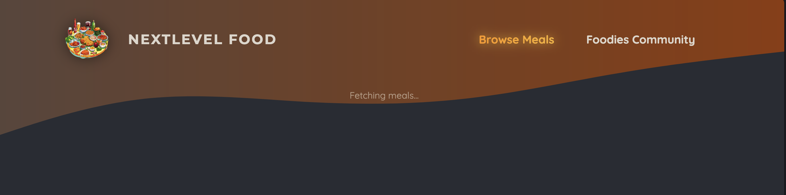

### 🐞 110.3 Issues:

- **Artificial Delay**: The 5-second delay is hardcoded and blocks the database query, making the app intentionally slow.
- **Global Blocking**: While `loading.js` improves UX, the entire page content is blocked until the data fetch is complete (waterfall).

| Issue | Status | Log/Error |
|---|---|---|
| Unnecessary Delay | ⚠️ Identified | `setTimeout` in `lib/meals.js` slows down the app. |

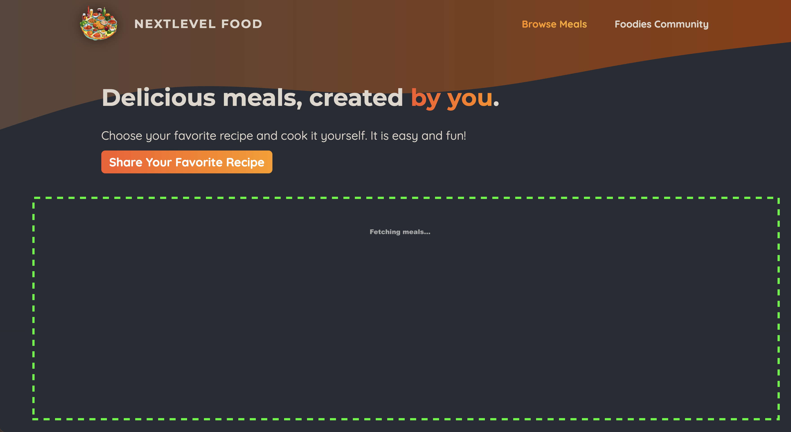

### 🧱 110.4 Pending Fixes (TODO)

- [ ] **Remove Artificial Delay**: Delete the `await new Promise(...)` line in `lib/meals.js` once testing of the loading state is complete.
- [ ] **Granular Loading**: Consider using `Suspense` directly inside `page.js` to show parts of the UI (like the header) immediately while only the grid loads.


<br>

## 🔧 111. Lesson 111 — *Using Suspense & Streamed Responses For Granular Loading State Management*

- [Lecture 111: Using Suspense & Streamed Responses For Granular Loading State Management](#-111-lesson-111--using-suspense--streamed-responses-for-granular-loading-state-management)
    - [111.1 Context](#1111-context)
    - [111.2 Updating code according the context](#1112-updating-code-according-the-context)
        - [111.2.1 Refactoring `MealsPage` to use `Suspense`](#11121-refactoring-mealspage-to-use-suspense)
        - [111.2.2 Moving Loading Styles](#11122-moving-loading-styles)
    - [111.3 Issues](#1113-issues)
    - [111.4 Pending Fixes (TODO)](#1114-pending-fixes-todo)

### 🧠 111.1 Context:

**Granular Loading State Management** is a technique to improve user experience by showing loading indicators only for the specific parts of the page that are fetching data, rather than blocking the entire page.

**The Problem with `loading.js`:**
- The `loading.js` file creates a Suspense boundary around the **entire page content**.
- When active, the user sees *only* the loading indicator. The header, sidebar, or other static content is hidden until the data fetch completes.
- This creates a "blocked" feeling where the application seems unresponsive or less interactive.

**The Solution: React Suspense & Streamed Responses:**
- **Suspense**: A React component that lets you declaratively "wait" for some code to load (like a data fetch) while rendering a fallback UI in its place.
- **Streamed Responses**: Next.js (App Router) supports streaming. The server can send the static parts of the HTML (like the header) immediately, and then "stream" the dynamic content (like the meals list) as it becomes available.
- By manually wrapping the data-fetching component in `<Suspense>`, we can show the static UI immediately and show a loading spinner *only* where the data will appear.

**Key Concepts:**
1.  **Granular Boundaries**: Defining exactly which part of the UI should wait for data.
2.  **Fallback Prop**: The UI element (spinner, skeleton) to show while waiting.
3.  **Refactoring for Suspension**: Splitting the page into a "Page" component (synchronous, static structure) and a "Content" component (asynchronous, data fetching).

**Advantages:**
- **Improved UX**: Users see the app shell (header, nav) instantly.
- **Perceived Performance**: The app feels faster and more responsive.
- **Interactivity**: Users can navigate away (e.g., click specific links) even while content is loading.

**Disadvantages/Gotchas:**
- **Refactoring Required**: Requires splitting logic into separate components.
- **Complexity**: More code than a simple `loading.js` file.

### ⚙️ 111.2 Updating code according the context:

#### **Summary**
This section documents the refactoring of the `MealsPage` to support granular loading. We move the asynchronous data fetching into a separate component (`Meals`) and use React's `Suspense` boundary in the main page component to wrap it. This allows the page title and header to render immediately while the meals data fetches in the background. We also handle the CSS migration to ensure the loading spinner is styled correctly within the page module.

#### 111.2.1 Refactoring `MealsPage` to use `Suspense`:

**Subsection Summary**
- Splits the `MealsPage` into two components:
    - `Meals`: An `async` component responsible for fetching data (`getMeals`).
    - `MealsPage`: The main default export, which renders the static structure (header, links) and wraps `<Meals />` in a `<Suspense>` boundary.
- Defines a fallback UI (`<p className={classes.loading}>Fetching meals...</p>`) that appears specifically in the content area while data loads.
- This implementation enables **Streamed Responses**, sending the header HTML first and the meals data later.

```jsx
/* app/meals/page.js */
import { Suspense } from 'react';
import Link from 'next/link'
import classes from './page.module.css'
import MealsGrid from '../components/meals/meals-grid'
import { getMeals } from '@/lib/meals';

async function Meals(){
  const meals = await getMeals();
  return <MealsGrid meals={meals} />
}

export default function MealsPage(){
  return (
    <>
      <header className={classes.header}>
        <h1>
          Delicious meals, created <span className={classes.highlight}>by you</span>.
        </h1>
        <p>Choose your favorite recipe and cook it yourself. It is easy and fun!</p>
        <p className={classes.cta}>
          <Link href="/meals/share">Share Your Favorite Recipe</Link>
        </p>
      </header>
      <main className={classes.main}>
        <Suspense fallback={<p className={classes.loading}>Fetching meals...</p>}>
          <Meals />
        </Suspense>
      </main>
    </>
  )
}
```

#### 111.2.2 Moving Loading Styles:

**Subsection Summary**
- Ensures the component-level loading styles are available in `page.module.css`.
- Since we are no longer using the global `loading.js` (and its potential `loading.module.css` dependency for the whole page), we move or duplicate the `.loading` class into the page's specific CSS module to style the fallback text/spinner locally.

```css
/* app/meals/page.module.css */
/* ... existing header styles ... */

.loading {
  text-align: center;
  animation: loading 1.2s ease-in-out infinite;
}

@keyframes loading {
  0% {
    color: #e9e9e9;
  }
  50% {
    color: #b89b84;
  }
  100% {
    color: #e9e9e9;
  }
}
```

### 🐞 111.3 Issues:

- **Deprecated file**: The `app/meals/loading.js` file is no longer needed for this route as we are handling loading states explicitly with `Suspense`. If left, it might still wrap the page or conflict. (Note: It currently exists as `loading-out.js` which is effectively disabled).

| Issue | Status | Log/Error |
|---|---|---|
| `loading.js` creates global blocking | ⚠️ Identified | N/A |

### 🧱 111.4 Pending Fixes (TODO)

- [ ] Delete or rename `app/meals/loading.js` if it still exists to ensure only the granular `Suspense` boundary is active.
- [ ] Confirm that `page.module.css` contains the `.loading` class definition.

[↑ top - Using Suspense & Streamed Responses](#-111-lesson-111--using-suspense--streamed-responses-for-granular-loading-state-management)

<br>

## 🔧 112. Lesson 112 — *Handling Errors*

- [112. Lesson 112 — Handling Errors](#-112-lesson-112--handling-errors)
    - [112.1 Context](#1121-context)
    - [112.2 Updating code according the context](#1122-updating-code-according-the-context)
        - [112.2.1 Add a new line code inside `lib/meals.js`](#11221-add-a-new-line-code-inside-libmealsjs)
        - [112.2.2 Need to add another special file `error.js`](#11222-need-to-add-another-special-file-errorjs)
        - [112.2.3 Add an `error.js` inside `meals` component](#11223-add-an-errorjs-inside-meals-component)
        - [112.2.4 Adding `"use client"` in `meals/error.js` file](#11224-adding-use-client-in-mealserrorjs-file)
        - [112.2.5 update the `lib/meals.js` file](#11225-update-the-libmealsjs-file)
    - [112.3 Issues](#1123-issues)
    - [112.4 Pending Fixes (TODO)](#1124-pending-fixes-todo)

### 🧠 112.1 Context:

In Next.js, the `error.js` file convention allows you to gracefully handle runtime errors in your application. It automatically wraps a route segment and its nested children in a **React Error Boundary**.

**Key Concepts:**
1.  **Client Component**: `error.js` must always be a Client Component (`'use client'`).
2.  **Granularity**: You can define `error.js` files at different levels of the file system hierarchy to provide granular error UI (e.g., a specific error page for `/meals` vs. a global one for the `app`).
3.  **Hierarchy**: An `error.js` boundary catches errors thrown from **nested** components (pages, layouts) but **not** from the layout at the same level (a layout sits "above" the error boundary of its own segment).

**When to use:**
- To show a custom error UI instead of the default crash screen when an exception occurs.
- To allow users to recover from errors (e.g., by retrying a failed request).

**Advantages:**
- **Resilience**: Prevents the entire app from crashing; only the affected segment renders the error state.
- **UX**: Provides meaningful feedback to the user.
- **Flexibility**: Different parts of the app can have different error handling strategies.

### ⚙️ 112.2 Updating code/theory according the context:

#### **Summary**
This section demonstrates how to implement a custom error page for the meals section. We simulate an error in the data fetching logic to trigger the error boundary. Initially, we create a standard server component which fails, then we correct it by marking it as a Client Component. Finally, we establish the error file structure and clean up the simulation code.

#### 112.2.1 Add a new line code inside `lib/meals.js`:

**Subsection Summary**
Updates the data fetching logic to simulate a runtime error. This artificial error allows us to verify that our error handling UI works as expected before we encounter real failures.

```js
import sql from 'better-sqlite3';

const db = sql('meals.db');

export async function getMeals() {
  // adding an artificial delay to simulate a network request
  await new Promise((resolve) => setTimeout(resolve, 5000));

  throw new Error('Loading meals failed!');   // 👈🏽 ✅

  return db.prepare('SELECT * FROM meals').all();
}
```

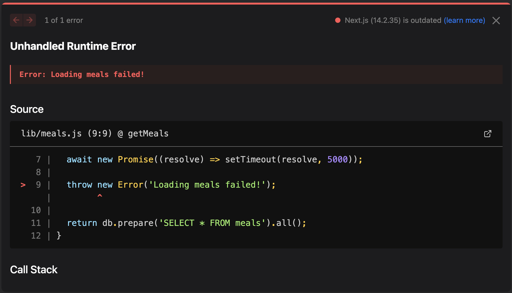


#### 112.2.2 Need to add another special file `error.js`:

**Subsection Summary**
Illustrates the file structure options for placing `error.js`. Showing that error files can be placed at various levels (root, `/meals`, `/community`) to handle errors with different scopes.

This `error.js` file could be in any level as you can see.
```
03-onwards-foodies-starting-project/
├── app/
│   ├── community/
│   │   ├── error.js                    # 📄 👈🏽 ✅ Error Community page features
│   │   ├── page.js                     # 📄 Community page displaying social features
│   │   └── page.module.css             # 📄 Scoped styles for the community page
│   ├── components/
│   │   ├── images/
│   │   │   ├── image-slideshow.js      # 📄 Animated slideshow component
│   │   │   └── image-slideshow.module.css
│   │   ├── meals/
│   │   │   ├── meal-item.js            # 📄 meal item component
│   │   │   ├── meal-item.module.css    # 📄 Scoped styles for meal item component
│   │   │   ├── meals-grid.js           # 📄 meals grid component
│   │   │   ├── meals-grid.module.css   # 📄 Scoped styles for meals grid component
│   │   └── main-header/
│   │       ├── main-header.js          # 📄 Global navigation header
│   │       ├── main-header.module.css
│   │       ├── main-header-background.js
│   │       ├── main-header-background.module.css
│   │       ├── nav-link.js             # 📄 Individual navigation link component
│   │       └── nav-link.module.css
│   ├── meals/
│   │   ├── [mealSlug]/
│   │   │   ├── error.js                # 📄 👈🏽 ✅ error dynamic route for meal details
│   │   │   └── page.js                 # 📄 Dynamic route for meal details
│   │   ├── share/
│   │   │   └── page.js                 # 📄 Page for sharing new meals
│   │   ├── layout.js                   # 📄 Layout for meals section
│   │   ├── error.js                    # 📄 👈🏽 ✅ Main meals Error page
│   │   ├── page.js                     # 📄 Main meals listing page
│   │   └── page.module.css             # 📄 Scoped styles for Main meals page
│   ├── globals.css                     # 📄 Global application styles
│   ├── icon.png                        # 📄 App icon
│   ├── layout.js                       # 📄 Root application layout
│   ├── error.js                        # 📄 👈🏽 ✅ Landing/Home Error page
│   ├── page.js                         # 📄 Landing/Home page
│   └── page.module.css                 # 📄 Styles for the landing page
├── assets/                             # 📁 Static assets (images, icons)
├── docs/
│   └── LECTURE_STEPS.md                # 📄 This educational documentation
├── img/                                # 📁 Screenshots for documentation
├── public/                             # 📁 Static assets served directly
├── jsconfig.json                       # 📄 Path aliases configuration
├── initdb.js                           # 📄 initdb.js for generate a db
├── meals.db                            # 📄 sqlite database
├── next.config.js                      # 📄 Next.js configuration
├── package.json                        # 📄 Project dependencies
└── README.md                           # 📄 General project information
```

#### 112.2.3 Add an `error.js` inside `meals` component:

**Subsection Summary**
Creates the initial implementation of the `error.js` component for the meals section. This attempt serves as a learning moment because it omits the necessary client-side directive, helping to understand why error boundaries must be client components.

```jsx
/* app/meals/error.js */
export default function Error() {
  return <main className="error">
    <h1>An error occured!</h1>
    <p>Failed to fetch meals, please try again later.</p>
  </main>
}
```

Still getting this error page:
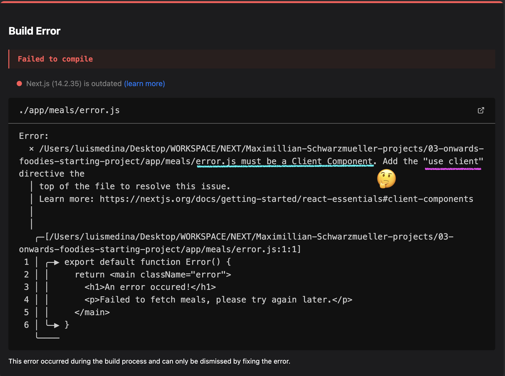

#### 112.2.4 Adding `"use client"` in `meals/error.js` file:

**Subsection Summary**
Corrects the error component by adding the `"use client"` directive. This step enforces the requirement that Next.js error boundaries must be Client Components to function correctly within the React accessibility tree.

```jsx
/* app/meals/error.js */
"use client"     // 👈🏽 ✅ 
export default function Error() {
  return <main className="error">
    <h1>An error occured!</h1>
    <p>Failed to fetch meals, please try again later.</p>
  </main>
}
```

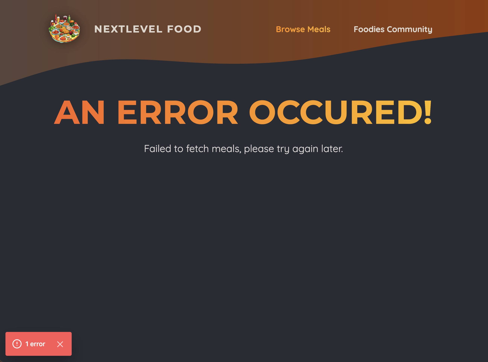

* catch any error with that component.
* including errors that happen on the client side.


#### 112.2.5 update the `lib/meals.js` file:

**Subsection Summary**
Reverts the artificial error simulation by commenting out the `throw` statement. This restores the application's normal functionality while keeping the test code available for future reference or testing.

```js
/* lib/meals.js */
import sql from 'better-sqlite3';

const db = sql('meals.db');

export async function getMeals() {
  // adding an artificial delay to simulate a network request
  await new Promise((resolve) => setTimeout(resolve, 5000));

  //throw new Error('Loading meals failed!');    // 👈🏽 ✅ in order to know how to handle errors

  return db.prepare('SELECT * FROM meals').all();
}
```


### 🐞 112.3 Issues:

| Issue                        | Status          | Log/Error                                                                 |
|------------------------------|-----------------|---------------------------------------------------------------------------|
| Basic Error UI               | ⚠️ Needs Improvement | The current error page effectively catches the error but lacks styling and interactivity (e.g., a "Retry" button). |
| Scope                        | ℹ️ Informational | This specific `error.js` only handles errors within the `/meals` route segment. |

### 🧱 112.4 Pending Fixes (TODO)

- [ ] Add `reset` prop to the Error component to allow users to try recovering from the error.
- [ ] Improve styling of the error message to match the overall design system.
- [ ] Pass the `error` prop to the component to display more specific error messages (if safe/appropriate).
- [ ] Address **Hardcoded Error Message**: The error UI displays a generic "Failed to fetch meals" message. It should ideally display relevant information from the actual error caught, or at least be more descriptive.

[↑ top - Lesson 112 — Handling Errors](#-112-lesson-112--handling-errors)

<br>

## 🔧 113. Lesson 113 — *Handling `"Not Found"` States*

- [Lecture 113: Handling `"Not Found"` States](#-113-lesson-113--handling-not-found-states)
    - [113.1 Context](#1131-context)
    - [113.2 Updating code according the context](#1132-updating-code-according-the-context)
        - [113.2.1 Go to the following URL: `http://localhost:3000/my-meals`](#11321-go-to-the-following-url-httplocalhost3000my-meals)
        - [113.2.2 Add a customize `not-found.js` file](#11322-add-a-customize-not-foundjs-file)
    - [113.3 Issues](#1133-issues)
    - [113.4 Pending Fixes (TODO)](#1134-pending-fixes-todo)

### 🧠 113.1 Context:

In Next.js, the **Not Found** state is a specific error state triggered when a user requests a route that does not exist. Next.js provides a file convention, `not-found.js`, to customize the UI for this state. This file is used to render a React component when the `notFound()` function is thrown within a route, or when a URL doesn't match any registered route.

**When `not-found.js` is used:**
- **Automatic Matching**: When a user visits a URL that clearly doesn't map to any file-system route (e.g., `/random-page`), Next.js automatically renders the nearest `not-found.js`.
- **Programmatic Trigger**: You can trigger this state manually by calling the `notFound()` function from `next/navigation` within a page, layout, or Server Component (e.g., when fetching a specific meal ID that doesn't exist in the database).

**Examples from the project:**
- `app/not-found.js`: A specialized component created to handle global 404 errors. It displays a user-friendly message ("Not Found") instead of the default Next.js 404 page. It is wrapped by the root layout, preserving the main header and background.

**Advantages:**
- **User Experience**: Provides a branded, consistent look and feel even when users get lost.
- **Improved SEO**: Automatically returns a 404 HTTP status code, helping search engines understand the page status.
- **Separation of Concerns**: Keeps error handling UI logic separate from successful page rendering logic.
- **Inheritance**: Nested `not-found.js` files can provide specific 404 pages for different sections of the app (though this project uses a global one).

**Disadvantages:**
- **Static vs Dynamic**: By default, `not-found.js` is a Server Component and doesn't accept props like `error`.

**Alternatives:**
- **Default 404**: If no `not-found.js` is created, Next.js provides a basic, unstyled default 404 page.

### ⚙️ 113.2 Updating code/theory according the context:

#### **Summary**
This section demonstrates how to handle non-existent routes by replacing the default Next.js 404 page with a custom implementation. It first shows the generic default behavior when accessing an invalid URL, and then walks through creating a `not-found.js` file to provide a styled, consistent "Not Found" message that integrates seamlessly with the application's layout.

#### 113.2.1 Go to the following URL: `http://localhost:3000/my-meals`

**Subsection Summary**
Demonstrates the default behavior of Next.js when navigating to an undefined route. Without a custom `not-found.js` file, Next.js renders a generic, plain "404 | This page could not be found" screen. This serves as the baseline to compare against the custom implementation.

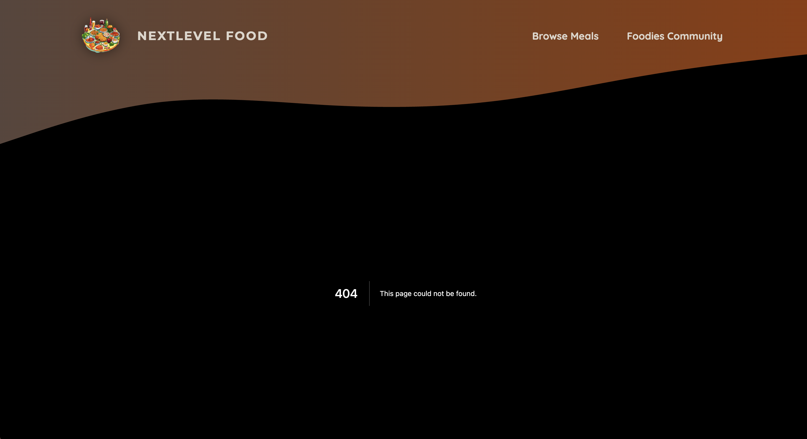

> Generic `"No found"` page.

#### 113.2.2 Add a customize `not-found.js` file:

**Subsection Summary**
Implements a custom `NotFound` component to handle 404 errors globally. The component returns a semantic `<main>` element with a header and message, styled with the `not-found` class. This file is automatically detected by Next.js and used whenever a route is not found, ensuring the error page matches the application's branding and layout (since it's wrapped by the root layout).

* it covers any sibling and nested pages as `error.js` file.

```jsx
/* app/not-found.js */
export default function NotFound(){
  return(
    <main className="not-found">
      <h1>Not Found</h1>
      <p>Unforntunatly, we could not find the requested page or resource.</p>
    </main>
  )
}
```

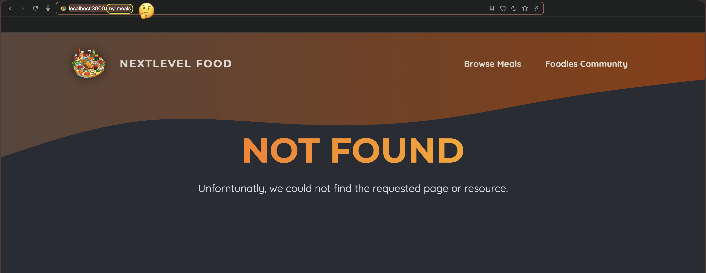

### 🐞 113.3 Issues:
- **Typo in text**: The word "Unforntunatly" is misspelled in the `not-found.js` file.

| Issue | Status | Log/Error |
|---|---|---|
| Typo | ⚠️ Identified | `app/not-found.js:5` - "Unforntunatly" should be "Unfortunately" |
| Missed Styles | ℹ️ Informational | Ensure `globals.css` applies styles to query selector `.not-found` |

### 🧱 113.4 Pending Fixes (TODO)

- [ ] Fix typo in `app/not-found.js`: Change "Unforntunatly" to "Unfortunately".
- [ ] Verify mobile responsiveness of the "Not Found" page.
- [ ] Address **Typos**: The `NotFound` component contains a visible typo ("Unforntunatly") in the user-facing message.
- [ ] Address **Styling**: Verify that the `.not-found` class is properly defined in `globals.css` to ensure the component is centered and readable.

[↑ top - [Lesson 113 — Handling `"Not Found"` States]](#-113-lesson-113--handling-not-found-states)

<br>

## 🔧 114. Lesson 114 — *Loading and Rendering Meal Details via Dynamic Routes & Route Parameters*

- [Lecture 114: Loading and Rendering Meal Details via Dynamic Routes & Route Parameters](#-114-lesson-114---loading-and-rendering-meal-details-via-dynamic-routes--route-parameters)
    - [114.1 Context](#1141-context)
    - [114.2 Updating code according the context](#1142-updating-code-according-the-context)
        - [114.2.1 Create `page.module.css` for meal details](#11421-create-pagemodulecss-for-meal-details)
        - [114.2.2 Modify/Update the `/meals/[mealSlug]/page.js` file](#11422-modifyupdate-the-mealsmealslugpagejs-file)
        - [114.2.3 Add the `getMeal(slug)` function inside `lib/meals.js` file](#11423-add-the-getmealslug-function-inside-libmealsjs-file)
        - [114.2.4 Import `getMeal()` from `lib/meals.js` inside `/[mealSlug]/page.js`](#11424-import-getmeal-from-libmealsjs-inside-mealslugpagejs)
        - [114.2.5 Completing all `meal` properties](#11425-completing-all-meal-properties)
    - [114.3 Issues](#1143-issues)
    - [114.4 Pending Fixes (TODO)](#1144-pending-fixes-todo)

### 🧠 114.1 Context:

To display the details of a specific meal, we need to leverage Next.js **Dynamic Routes**. When a user clicks a meal on the grid, they navigate to a URL like `/meals/burger`, where `burger` is the dynamic segment (`slug`).

**Key Concepts:**
1.  **Dynamic Segments & Params**: In the App Router, folder names in brackets (e.g., `[mealSlug]`) create dynamic routes. The value of this segment is passed to the `page.js` component via the `params` prop.
2.  **Server-Side Data Fetching**: Since `page.js` is a Server Component, we can directly fetch the specific meal data from the database using its slug.
3.  **Rendering HTML Content**: Meal instructions are stored as HTML/text with line breaks. We use React's `dangerouslySetInnerHTML` to render this content, converting newlines to `<br />` tags.

**Security Logic:**
-   **SQL Injection Prevention**: We use `better-sqlite3`'s prepared statements (`?`) to safely insert the slug into the query.
-   **XSS Protection**: `dangerouslySetInnerHTML` is used with trusted content from our database.

### ⚙️ 114.2 Updating code according the context:

#### **Summary**
This section focuses on implementing the dynamic meal details page. By leveraging dynamic route segments (`[mealSlug]`), we enable the application to fetch and render content specific to each meal.
-   **Purpose**: To display detailed information for a selected meal, including its image, summary, creator, and instructions.
-   **Process**: It covers creating scoped styles, updating the page component to read route parameters, implementing secure data fetching logic with prepared statements, and rendering HTML content safely.
-   **Key Outcome**: A fully functional details page that dynamically updates based on the URL.

#### 114.2.1 Create `page.module.css` for meal details:

**Subsection Summary**
-   Establishes a responsive design for the meal details page using CSS Modules (`page.module.css`).
-   Implements a flexbox-based header layout to align the meal image and summary text.
-   Adds custom keyframe animations (`fade-slide-in`) to introduce elements smoothly from different directions.

[page.module.css code](https://github.com/mschwarzmueller/nextjs-complete-guide-course-resources/blob/main/attachments/02-nextjs-essentials/lecture-specific/app/meals/%5BmealSlug%5D/page.module.css)

```css
/* app/meals/[mealSlug]/page.module.css */
.header {
  display: flex;
  padding: 2rem 1rem;
  gap: 3rem;
  margin: auto;
  max-width: 80rem;
}

.image {
  position: relative;
  width: 30rem;
  height: 20rem;
}

.header img {
  object-fit: cover;
  border-radius: 8px;
  box-shadow: 0 0 0.5rem rgba(0, 0, 0, 0.5);
  animation: fade-slide-in-from-left 1s ease-out forwards;
}

.headerText {
  padding: 0.5rem 1rem 0 1rem;
  color: #ddd6cb;
  max-width: 40rem;
  animation: fade-slide-in-from-right 1s ease-out forwards;
}

.headerText h1 {
  margin: 0;
  font-size: 3.5rem;
  text-transform: uppercase;
  font-family: 'Montserrat', sans-serif;
  text-shadow: 0 0 0.5rem rgba(0, 0, 0, 0.5);
}

.creator {
  font-size: 1.5rem;
  color: #cfa69b;
  font-style: italic;
}

.creator a {
  background: linear-gradient(90deg, #f9572a, #ff8a05);
  background-clip: text;
  -webkit-background-clip: text;
  -webkit-text-fill-color: transparent;
}

.creator a:hover,
.creator a:active {
  background: linear-gradient(90deg, #f9572a, #ff8a05);
  background-clip: text;
  -webkit-background-clip: text;
  -webkit-text-fill-color: transparent;
  text-shadow: 0 0 18px rgba(248, 190, 42, 0.8);
}

.summary {
  font-size: 1.5rem;
}

.instructions {
  font-size: 1.25rem;
  line-height: 1.5;
  background-color: #6e6464;
  color: #13120f;
  border-radius: 8px;
  box-shadow: 0 0 0.5rem rgba(0, 0, 0, 0.5);
  padding: 2rem;
  max-width: 60rem;
  margin: 2rem auto;
  animation: fade-slide-in-from-bottom 1s ease-out forwards;
}

@keyframes fade-slide-in-from-left {
  0% {
    opacity: 0;
    transform: translateX(-1rem);
  }
  100% {
    opacity: 1;
    transform: translateX(0);
  }
}

@keyframes fade-slide-in-from-right {
  0% {
    opacity: 0;
    transform: translateX(1rem);
  }
  100% {
    opacity: 1;
    transform: translateX(0);
  }
}

@keyframes fade-slide-in-from-bottom {
  0% {
    opacity: 0;
    transform: translateY(1rem);
  }
  100% {
    opacity: 1;
    transform: translateY(0);
  }
}
```

#### 114.2.2 Modify/Update the `/meals/[mealSlug]/page.js` file:

**Subsection Summary**
-   Initializes the `MealDetailsPage` component as a Server Component.
-   Demonstrates accessing the dynamic route parameter (`mealSlug`) via the `params` prop.
-   Sets up a structural skeleton with placeholder text to verify the routing and layout before integrating the backend data.

```javascript
/* app/meals/[mealSlug]/page.js */
import classes from './page.module.css'
import Image from 'next/image'

export default function MealDetailsPage({ params }) {
  return (
    <>
      <header className={classes.header}>
        <div className={classes.image}>
          <Image fill />
        </div>
        <div className={classes.headerText}>
          <h1>TITLE</h1>
          <p className={classes.creator}>
            by <a href={`mailto: ${'EMAIL'}`}>NAME</a>
          </p>
          <p className={classes.summary}>SUMMARY</p>
        </div>
      </header>
      <main>
        <p
          className={classes.instructions}
          dangerouslySetInnerHTML={{
          __html: `...`
        }}>
        </p>
      </main>
    </>
  )
}
```

#### 114.2.3 Add the `getMeal(slug)` function inside `lib/meals.js` file:

**Subsection Summary**
-   Extends the `lib/meals.js` utility with a `getMeal` function for fetching single records.
-   Uses the strict `.get()` method from `better-sqlite3` to ensure only one row is returned.
-   Implements a prepared statement (`?`) to securely handle the slug input, preventing SQL injection vulnerabilities.

```javascript
/* lib/meals.js */
import sql from 'better-sqlite3';

const db = sql('meals.db');

export async function getMeals() {
  // adding an artificial delay to simulate a network request
  await new Promise((resolve) => setTimeout(resolve, 5000));

  //throw new Error('Loading meals failed!');    // 👈🏽 ✅ in order to know how to handle errors

  return db.prepare('SELECT * FROM meals').all();
}

export function getMeal(slug){    // 👈🏽 ✅
  //return db.prepare('SELECT * FROM meals WHERE slug = ' + slug) // this is not safe, it is vulnerable to SQL injection
  return db.prepare('SELECT * FROM meals WHERE slug = ?').get(slug)
}
```

#### 114.2.4 Import `getMeal()` from `lib/meals.js` inside `/[mealSlug]/page.js`:

**Subsection Summary**
-   Imports the `getMeal` function to fetch data directly within the Server Component.
-   Retrieves the specific meal data using the `params.mealSlug` value.
-   Validates the data connection by rendering the meal's title dynamically.

```javascript
/* app/meals/[mealSlug]/page.js */
import classes from './page.module.css'
import Image from 'next/image'
import { getMeal } from '@/lib/meals'

export default function MealDetailsPage({ params }) {
  const meal = getMeal(params.mealSlug) // Fetch meal using the slug from params

  return (
    <>
      <header className={classes.header}>
        <div className={classes.image}>
          <Image fill />
        </div>
        <div className={classes.headerText}>
          <h1>{meal.title}</h1>
          <p className={classes.creator}>
            by <a href={`mailto: ${'EMAIL'}`}>NAME</a>
          </p>
          <p className={classes.summary}>SUMMARY</p>
        </div>
      </header>
      <main>
        <p
          className={classes.instructions}
          dangerouslySetInnerHTML={{
            __html: `...`,
        }}>
        </p>
      </main>
    </>
  )
}
```

> note:

`params` is important in Next.js App Router dynamic routes because it is the **ONLY** official way to receive the dynamic parts of the URL.

> Correct modern patterns (App Router):
```jsx
// 1. Most common & recommended
export default function MealDetailsPage({ params }) {
  const slug = params.mealSlug;
  const meal = getMeal(slug);
  // ...
}
```

```jsx
// 2. You can also destructure directly (very clean)
export default function MealDetailsPage({ params: { mealSlug } }) {
  const meal = getMeal(mealSlug);
  // ...
}
```

```jsx
// 3. If you have multiple dynamic segments
// app/blog/[category]/[slug]/page.js
export default function BlogPostPage({ params }) {
  // params = { category: "...", slug: "..." }
}
```

Besides:
| URL visited by user       | Folder structure              | What Next.js gives you                     | How you access the value |
|---------------------------|-------------------------------|--------------------------------------------|---------------------------|
| `/meals/pasta-carbonara`  | `app/meals/[mealSlug]/page.js`| `{ mealSlug: "pasta-carbonara" }`          | `params.mealSlug`         |
| `/meals/ceviche-peruano`  | same                          | `{ mealSlug: "ceviche-peruano" }`          | `params.mealSlug`         |
| `/meals/asado-argentino`  | same                          | `{ mealSlug: "asado-argentino" }`          | `params.mealSlug`         |


⚠️ In order to avoid an error, between this `<p></p>` HTML code must nothing.

#### 114.2.5 Completing all `meal` properties:

**Subsection Summary**
-   Completes the UI by rendering the meal image, creator details, and summary.
-   Uses `dangerouslySetInnerHTML` to render the HTML-formatted instructions stored in the database.
-   Applies a regex replacement (`.replace(/\n/g, '<br />')`) to ensure proper line breaking in the rendered HTML.

```javascript
/* app/meals/[mealSlug]/page.js */
import classes from './page.module.css'
import Image from 'next/image'
import { getMeal } from '@/lib/meals'

export default function MealDetailsPage({ params }) {
  const meal = getMeal(params.mealSlug)
  return (
    <>
      <header className={classes.header}>
        <div className={classes.image}>
          <Image src={meal.image} alt={meal.title} fill />
        </div>
        <div className={classes.headerText}>
          <h1>{meal.title}</h1>
          <p className={classes.creator}>
            by <a href={`mailto: ${meal.creator_email}`}>{meal.creator}</a>
          </p>
          <p className={classes.summary}>{meal.summary}</p>
        </div>
      </header>
      <main>
        <p
          className={classes.instructions}
          dangerouslySetInnerHTML={{
            __html: meal.instructions.replace(/\n/g, '<br />'),
        }}>
        </p>
      </main>
    </>
  )
}
```

> Suggestion:

Actually, in Next.js App Router with React Server Components, data fetching functions should be async even if the database library is synchronous, because:

```ts
// lib/meals.ts
export async function getMeal(slug: string) {
  // Even if db is synchronous, make the function async
  // for consistency with other data fetching
  return db.prepare('SELECT * FROM meals WHERE slug = ?').get(slug);
}

// page.tsx
export default async function MealDetailsPage({ params }: { params: { mealSlug: string } }) {
  const meal = await getMeal(params.mealSlug);
  // ... rest of component
}
```


This pattern allows Next.js to properly handle:
* Streaming
* Suspense boundaries
* Error boundaries
* Loading states


### 🐞 114.3 Issues:

| Issue | Status | Log/Error |
|---|---|---|
| Use of `dangerouslySetInnerHTML` | ℹ️ Informational | Potential XSS risk if data is unchecked. Here it's safe because the DB is our own trusted source. |
| Missing `"Not Found"` handling | ⚠️ Identified | Crashes if slug is invalid because `getMeal` returns `undefined` and we try to access `meal.title`. |
| Blocking Data Fetch | ℹ️ Informational | The synchronous DB call blocks the main thread, potentially affecting performance if the DB is slow. |

### 🧱 114.4 Pending Fixes (TODO)

- [ ] Implement `not-found.js` to handle invalid IDs/slugs gracefully.
- [ ] Add loading state (`loading.js`) to handle data fetch delays.
- [ ] Implement `generateMetadata` for dynamic SEO titles.

[↑ top - Lesson 114 — Loading and Rendering Meal Details via Dynamic Routes & Route Parameters](#-114-lesson-114--loading-and-rendering-meal-details-via-dynamic-routes--route-parameters)


<br>

## 🔧 115. Lesson 115 — *Throwing Not Found Errors For Individual Meals*

- [Lecture 115: Throwing Not Found Errors For Individual Meals](#-115-lesson-115---throwing-not-found-errors-for-individual-meals)
    - [115.1 Context](#1151-context)
    - [115.2 Updating code according the context](#1152-updating-code-according-the-context)
        - [115.2.1 When a non-existent meal url happen](#11521-when-a-non-existent-meal-url-happen)
        - [115.2.2 Adding a validation by unexistent meal](#11522-adding-a-validation-by-unexistent-meal)
        - [115.2.3 Customize the `not-found.js` file](#11523-customize-the-not-foundjs-file)
        - [115.2.4 Comparative aspects between `notFound()` method and `not-found.js` file/component](#11524-comparative-aspects-between-notfound-method-and-not-foundjs-filecomponent)
    - [115.3 Issues](#1153-issues)
    - [115.4 Pending Fixes (TODO)](#1154-pending-fixes-todo)

### 🧠 115.1 Context:

When users navigate to a dynamic route like `/meals/ceviche-peruano` (a meal that does not exist in the database), the application crashes because the code tries to access properties such as `meal.title` on an `undefined` value returned by `getMeal()`. To handle this gracefully, Next.js provides the **`notFound()`** function from `next/navigation` along with the **`not-found.js`** special file convention.

**Key Concepts:**
1. **`notFound()` function**: A Next.js utility imported from `next/navigation`. When called, it throws a special internal error that immediately stops rendering the current route segment and triggers the nearest `not-found.js` boundary.
2. **`not-found.js` file**: A file-system convention in the App Router. It defines the fallback UI that renders when `notFound()` is called or when a route does not match any segment. It can be placed at the root `app/` level (global) or inside specific route segments for scoped behavior.
3. **Guard clause pattern**: The typical pattern is to fetch data first, then check if the result is falsy (`null` or `undefined`), and call `notFound()` as an early return before attempting to render.
4. **HTTP 404 status**: When `notFound()` is triggered on a non-streamed response, Next.js sends a `404` HTTP status code and includes a `<meta name="robots" content="noindex" />` tag for SEO.

**Advantages:**
- Prevents runtime crashes when accessing properties on `undefined` data.
- Provides a clean, user-friendly error page instead of an application error.
- Automatically sets the correct HTTP 404 status for search engines.
- Supports segment-level customization — each route can have its own `not-found.js`.
- Works seamlessly with layouts — parent layouts remain mounted when the not-found boundary renders.

**Disadvantages / Gotchas:**
- A single root-level `not-found.js` handles **all** 404s globally, which may not provide specific enough messaging per route unless segment-level files are added.
- In streamed responses (RSC payload), the HTTP status may be `200` instead of `404` because headers are already sent before the not-found condition is detected.
- Calling `notFound()` inside `try/catch` blocks can accidentally catch the thrown internal error — always call it **outside** of try/catch.

**When to Consider Alternatives:**
- If you need to show a contextual inline message (e.g. "No results found") rather than replacing the entire page, use conditional rendering instead of `notFound()`.
- For API routes / Route Handlers, returning a `NextResponse` with status 404 is more appropriate than calling `notFound()`.
- If the data fetch is async and might be slow, consider wrapping the page in a `<Suspense>` boundary with a `loading.js` to handle the loading state before checking for not-found.

### ⚙️ 115.2 Updating code/theory according the context:

#### **Summary**
- This section addresses the crash that occurs when navigating to a non-existent meal slug (e.g. `/meals/ceviche-peruano`) by importing and calling the `notFound()` function from `next/navigation`.
- A guard clause is added in `app/meals/[mealSlug]/page.js` right after the `getMeal()` call: if the result is falsy, `notFound()` is invoked to stop rendering.
- The root `app/not-found.js` file is customized with a styled message so users see a friendly 404 page instead of a raw error.
- A comparison table clarifies the relationship between the `notFound()` runtime function and the `not-found.js` file convention.

#### 115.2.1 When a non-existent meal url happen:

**Subsection Summary**
- Demonstrates the problem: navigating to a URL like `http://localhost:3000/meals/ceviche-peruano` causes a runtime crash because `getMeal()` returns `undefined` and the component tries to access `meal.title`.
- The screenshot shows the unhandled error screen that Next.js displays in development mode.

* url: `http://localhost:3000/meals/ceviche-peruano`

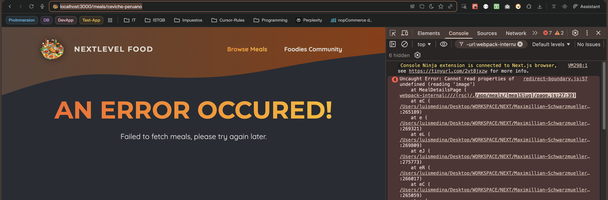

#### 115.2.2 Adding a validation by unexistent meal:

**Subsection Summary**
- Adds a guard clause to `app/meals/[mealSlug]/page.js` that checks if `meal` is falsy immediately after calling `getMeal(params.mealSlug)`.
- If no meal is found, `notFound()` from `next/navigation` is called, which throws an internal error and renders the nearest `not-found.js` boundary.
- This prevents the crash by short-circuiting the component before it tries to access properties on `undefined`.
- The screenshot confirms the not-found UI now renders instead of the crash.

```jsx
/* app/meals/[mealSlug]/page.js */
import { notFound } from 'next/navigation'
import classes from './page.module.css'
import Image from 'next/image'
import { getMeal } from '@/lib/meals'
export default function MealDetailsPage({ params }) {
  //const meal = getMeal(slug)
  const meal = getMeal(params.mealSlug)

  if(!meal) {   // 👈🏽 ✅
    return notFound();
  }
  return (
    <>
      <header className={classes.header}>
        <div className={classes.image}>
          <Image src={meal.image} alt={meal.title} fill />
        </div>
        <div className={classes.headerText}>
          <h1>{meal.title}</h1>
          <p className={classes.creator}>
            by <a href={`mailto: ${meal.creator_email}`}>{meal.creator}</a>
          </p>
          <p className={classes.summary}>{meal.summary}</p>
        </div>
      </header>
      <main>
        <p
          className={classes.instructions}
          dangerouslySetInnerHTML={{
            __html: meal.instructions.replace(/\n/g, '<br />'),
        }}>
        </p>
      </main>
    </>
  )
}
```

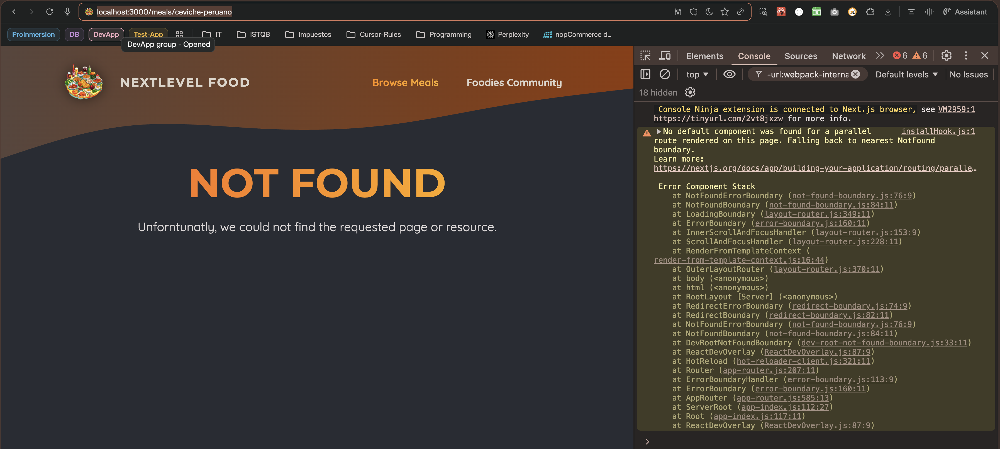

#### 115.2.3 Customize the `not-found.js` file:

**Subsection Summary**
- Customizes the root-level `app/not-found.js` file to display a user-friendly "Meal not found" message.
- Uses the `.not-found` CSS class already defined in `app/globals.css` (which applies centered layout, gradient heading, and styled paragraph text).
- This component replaces the default Next.js 404 page whenever `notFound()` is triggered from any route.
- The screenshot shows the styled not-found page rendering correctly.

```jsx
/* app/not-found.js */
export default function NotFound(){
  return(
    <main className="not-found">
      <h1>Meal not found</h1>
      <p>Unforntunatly, we could not find the requested page or resource.</p>
    </main>
  )
}
```

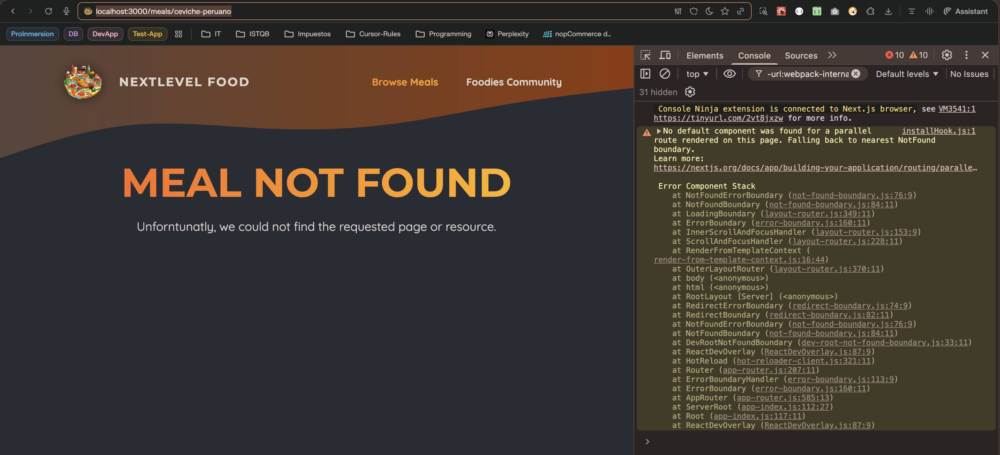

#### 115.2.4 Comparative aspects between `notFound()` method and `not-found.js` file/component:

**Subsection Summary**
- Provides a side-by-side comparison table between the `notFound()` runtime function and the `not-found.js` file convention.
- Clarifies that `notFound()` is the **trigger** (called programmatically to signal a 404) while `not-found.js` is the **UI** (the component that renders when triggered).
- Covers aspects like HTTP status behavior, SEO implications, typical usage patterns, and how they work together in the App Router.

| Aspect                        | `notFound()` function                                      | `not-found.js` / `not-found.tsx` file                              |
|-------------------------------|------------------------------------------------------------|--------------------------------------------------------------------|
| **What it is**                | Runtime function you call manually                         | File-system convention (special file)                              |
| **Purpose**                   | Actively signal "this resource doesn't exist"              | Defines what UI to show when not-found is triggered                |
| **Where you write it**        | Inside `page.tsx`, `layout.tsx`, Server Components, Route Handlers | Usually `app/not-found.tsx` (global) or `app/blog/not-found.tsx` (segment-specific) |
| **How it works**              | Throws special internal error → stops rendering current segment | Renders **instead of** the failing segment (keeps parent layouts) |
| **When it triggers**          | You call it explicitly (e.g. item not found in DB)         | • When `notFound()` is called<br>• When route doesn't exist at all (root level only) |
| **HTTP status**               | 404 (non-streamed responses)<br>200 (streamed / RSC payload) | Same behavior (depends on streaming)                               |
| **SEO behavior**              | Adds `<meta name="robots" content="noindex" />`            | Same (inherited from `notFound()`)                                 |
| **Typical usage**             | Dynamic routes, data fetching checks                       | Custom "Page not found" design                                     |
| **Can exist without the other?** | Yes — but ugly default Vercel/Next 404                  | Yes — but only shows for unmatched routes (not when you call `notFound()`) in older versions; now works together |


#### 115.2.5 Difference between `return noFound()` or  `noFound()` code:

> 1. ✅ Version 1 (recommended)
```ts
if (!meal) {
  return notFound();
}
```

Why this is better:
* Clearly communicates: “we stop rendering here”
* Reads like normal control flow
* Matches official Next.js docs
* Helps TypeScript and humans understand intent


> 2. ⚠️ Version 2 (works, but misleading)
```ts
if (!meal) {
  notFound();
}
```

This:
* Still works ✅
* But looks like execution might continue
* Is semantically confusing
* Can mislead readers into thinking it’s just a function call

Example illusion:
```ts
if (!meal) {
  notFound();
}
return <div>{meal.title}</div>; // looks reachable, but isn't
```

> 3. Mental model 🧠

Think of notFound() as:
> 💣 “Abort rendering and show 404 page”

So writing:
```ts
return notFound();
```
means:
> “Stop here and trigger the 404”

which is exactly what you want to express.

| Version             | Works | Clear | Idiomatic |
| ------------------- | ----- | ----- | --------- |
| `return notFound()` | ✅     | ✅     | ✅ (best) |
| `notFound()`        | ✅     | ❌     | ⚠️        |


### 🐞 115.3 Issues:

| Issue | Status | Log/Error |
|---|---|---|
| Typo "Unforntunatly" in not-found message | ⚠️ Identified | `app/not-found.js:5` — should be "Unfortunately" |
| Root `not-found.js` has meal-specific text | ℹ️ Informational | `app/not-found.js:4` — "Meal not found" is too specific for a global 404 page. Consider a generic message like "Page not found" or create a segment-level `not-found.js` for meals. |
| No segment-level `not-found.js` for meals | ℹ️ Low Priority | A `app/meals/[mealSlug]/not-found.js` would allow a meal-specific 404 message while keeping the global `not-found.js` generic. |

### 🧱 115.4 Pending Fixes (TODO)

- [ ] Fix typo in `app/not-found.js:5` — change `"Unforntunatly"` to `"Unfortunately"`.
- [ ] Consider making the root `app/not-found.js` generic (e.g. "Page not found") and creating a segment-level `app/meals/[mealSlug]/not-found.js` with meal-specific messaging.
- [ ] Add `generateMetadata` to `app/meals/[mealSlug]/page.js` to provide dynamic `<title>` and handle the not-found case in metadata as well.
- [ ] Consider converting `getMeal()` in `lib/meals.js:16-19` to an `async` function for consistency with `getMeals()` and to support Suspense / streaming patterns.

[↑ top - Throwing Not Found Errors For Individual Meals](#-115-lesson-115---throwing-not-found-errors-for-individual-meals)


<br>

## 🔧 116. Lesson 116 — *Getting Started with the **"Share Meal"** Form*

[🧳 Section 03: *NextJS Essential (App Router)*](#-section-03-nextjs-essential-app-router)

### 📑 Table of Contents:
- [116. Lesson 116 — *Getting Started with the "Share Meal" Form*](#-116-lesson-116---getting-started-with-the-share-meal-form)
- [116.1 Context](#1161-context)
- [116.2 Updating code according the context](#1162-updating-code-according-the-context)
  - [116.2.1 Create `page.module.css` file](#11621-create-pagemodulecss-file)
  - [116.2.2 Update the `meals/share/page.js` file](#11622-update-the-mealssharepagejs-file)
- [116.3 Issues](#1163-issues)
- [116.4 Pending Fixes (TODO)](#1164-pending-fixes-todo)

### 🧠 116.1 Context:

This lesson introduces the **"Share Meal"** form — the first user-facing data-entry feature of the Foodies application. The form allows users to submit a new meal by providing their name, email, a meal title, a short summary, cooking instructions, and (eventually) an image. At this stage, the form is **purely presentational**: it renders the HTML structure and applies CSS Module styles, but no submission logic, validation, or server action is wired up yet.

**Key Concepts:**
1. **CSS Modules in Next.js**: Styles are scoped to the component by importing a `*.module.css` file. Class names are accessed as properties of the imported object (e.g. `classes.header`), which prevents naming collisions across the application.
2. **Semantic HTML forms**: The form uses native HTML elements (`<form>`, `<label>`, `<input>`, `<textarea>`) with `htmlFor`/`id` associations and the `required` attribute for built-in browser validation.
3. **Layout with CSS Flexbox**: The `.row` class uses `display: flex` with `gap` to place the "Your name" and "Your email" fields side by side in a responsive row.
4. **Gradient text effect**: The `.highlight` class applies a `linear-gradient` background clipped to the text, creating the signature orange gradient text used throughout the app.
5. **Placeholder for future component**: The literal text `IMAGE PICKER` in the JSX serves as a placeholder that will be replaced by a custom image upload component in a later lesson.

**Advantages:**
- CSS Modules provide automatic scoping — no risk of style leaks between pages or components.
- Native HTML form elements give free browser validation (required fields, email format) without any JavaScript.
- The form structure is clean and semantic, making it easy to layer on server actions or client-side logic later.
- Consistent use of the project's design language (dark theme, orange gradients, Montserrat font) keeps the UI cohesive.

**Disadvantages / Gotchas:**
- The form currently has **no submit handler** — pressing "Share Meal" triggers a full-page GET request (default form behavior), which simply reloads the page.
- The `IMAGE PICKER` text is rendered as visible content in the DOM, which is not ideal for production — it should be a component or at least wrapped in a comment.
- No `aria-describedby` or custom error messages are provided — relying solely on the browser's native validation tooltips, which vary in style and wording across browsers.
- The `.actions button` rule declares `border` twice (`border: 0` and then `border: none`), which is redundant.
- No `<meta>` or page title is set for the `/meals/share` route — it will inherit the root layout title.

**When to Consider Alternatives:**
- If the form grows significantly in complexity (many conditional fields, multi-step wizard), consider a form library like `react-hook-form` or `formik` instead of managing raw HTML form state.
- For real-time inline validation feedback, you would need client-side JavaScript — making this a Client Component (`'use client'`) or extracting the form into a separate Client Component.
- If you need to support file uploads with preview, drag-and-drop, and progress indicators, a dedicated upload component (or library like `react-dropzone`) is more appropriate than a plain `<input type="file">`.

### ⚙️ 116.2 Updating code/theory according the context:

- [page.module.css](https://github.com/mschwarzmueller/nextjs-complete-guide-course-resources/blob/main/attachments/02-nextjs-essentials/lecture-specific/app/meals/share/page.module.css)
- [page.js](https://github.com/mschwarzmueller/nextjs-complete-guide-course-resources/blob/main/attachments/02-nextjs-essentials/lecture-specific/app/meals/share/page.js)

#### **Summary**
- This section sets up the visual foundation of the "Share Meal" page by creating a CSS Module file and updating the page component.
- A new `page.module.css` file is created with styles for the header, form layout, inputs, textarea, gradient highlight text, row layout, and submit button — matching the dark theme used across the application.
- The `meals/share/page.js` component is updated to import these CSS Module classes and render a complete HTML form with fields for name, email, title, summary, and instructions, plus a placeholder for a future image picker component.
- The two subsections are sequential: first the styles are defined (116.2.1), then the component consumes them (116.2.2).

#### 116.2.1 Create `page.module.css` file:

**Subsection Summary**
- Creates the `app/meals/share/page.module.css` file with all the scoped styles needed for the share meal page.
- Defines `.header` for page-level spacing and text color, `.highlight` for the gradient text effect on "favorite meal", and `.main` for the content container.
- The `.form` block limits form width to `50rem` and styles all `label`, `input`, and `textarea` elements with the dark theme palette (`#1c2027` background, `#ddd6cb` text, `#b3aea5` label color).
- The `.row` class uses Flexbox to lay out the name and email fields side by side.
- The `.actions` class right-aligns the submit button, which has an orange gradient background, hover/focus states, and disabled styles for future use.

```css
/* app/meals/share/page.module.css */
.header {
  gap: 3rem;
  margin: 3rem auto 5rem auto;
  width: 90%;
  max-width: 75rem;
  color: #ddd6cb;
  font-size: 1.5rem;
}

.header h1 {
  font-family: 'Montserrat', sans-serif;
}

.highlight {
  background: linear-gradient(90deg, #f9572a, #ff8a05);
  background-clip: text;
  -webkit-background-clip: text;
  -webkit-text-fill-color: transparent;
}

.main {
  width: 90%;
  max-width: 75rem;
  margin: 3rem auto;
  color: white;
}

.form {
  max-width: 50rem;
}

.form label {
  display: block;
  margin-bottom: 0.5rem;
  font-size: 1rem;
  font-family: 'Montserrat', sans-serif;
  text-transform: uppercase;
  color: #b3aea5;
  font-weight: bold;
}

.form input,
.form textarea {
  display: block;
  width: 100%;
  padding: 0.5rem 1rem;
  border-radius: 4px;
  border: 1px solid #454952;
  background: #1c2027;
  font-size: 1.25rem;
  font-family: 'Montserrat', sans-serif;
  color: #ddd6cb;
}

.form input:focus,
.form textarea:focus {
  outline-color: #f99f2a;
  background-color: #1f252d;
}

.row {
  display: flex;
  gap: 1rem;
}

.row p {
  width: 100%;
}

.actions {
  text-align: right;
}

.actions button {
  border: 0;
  padding: 0.75rem 2rem;
  background: linear-gradient(90deg, #f9572a, #ff9b05);
  border: none;
  color: #ffffff;
  border-radius: 2px;
  cursor: pointer;
  font: inherit;
  font-size: 1.25rem;
  box-shadow: 0 2px 5px rgba(0, 0, 0, 0.3);
}

.actions button:hover,
.actions button:focus {
  background: linear-gradient(90deg, #fd4715, #f9b241);
}

.actions button:disabled,
.actions button:hover:disabled,
.actions button:focus:disabled {
  background: #ccc;
  color: #979797;
  cursor: not-allowed;
}
```

#### 116.2.2 Update the `meals/share/page.js` file:

**Subsection Summary**
- Updates the `app/meals/share/page.js` component to import and use the CSS Module classes defined in the previous step.
- Renders a `<header>` with the page title ("Share your favorite meal") featuring the gradient highlight, followed by a `<main>` section containing the full form.
- The form includes: a flex row with name and email inputs, then title, short summary, instructions (textarea), an `IMAGE PICKER` placeholder, and a "Share Meal" submit button.
- All inputs use `htmlFor`/`id` associations and the `required` attribute for native browser validation.
- The screenshot confirms the rendered form matches the dark-themed design with orange accents.

```jsx
/* app/meals/share/page.js */
import classes from './page.module.css';

export default function ShareMealPage() {
  return (
    <>
      <header className={classes.header}>
        <h1>
          Share your <span className={classes.highlight}>favorite meal</span>
        </h1>
        <p>Or any other meal you feel needs sharing!</p>
      </header>
      <main className={classes.main}>
        <form className={classes.form}>
          <div className={classes.row}>
            <p>
              <label htmlFor="name">Your name</label>
              <input type="text" id="name" name="name" required />
            </p>
            <p>
              <label htmlFor="email">Your email</label>
              <input type="email" id="email" name="email" required />
            </p>
          </div>
          <p>
            <label htmlFor="title">Title</label>
            <input type="text" id="title" name="title" required />
          </p>
          <p>
            <label htmlFor="summary">Short Summary</label>
            <input type="text" id="summary" name="summary" required />
          </p>
          <p>
            <label htmlFor="instructions">Instructions</label>
            <textarea
              id="instructions"
              name="instructions"
              rows="10"
              required
            ></textarea>
          </p>
          IMAGE PICKER
          <p className={classes.actions}>
            <button type="submit">Share Meal</button>
          </p>
        </form>
      </main>
    </>
  );
}
```

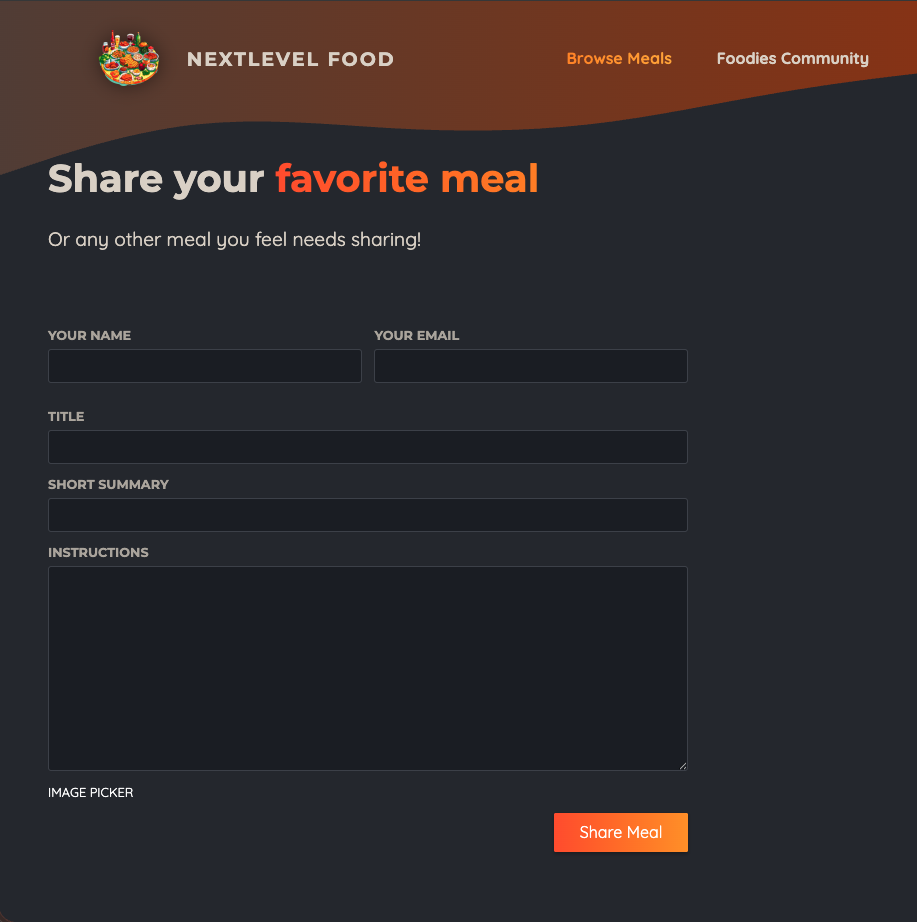


### 🐞 116.3 Issues:

- **Duplicate `border` declaration**: The `.actions button` rule sets `border: 0` and then `border: none` — the second declaration overrides the first, making it redundant.
- **Bare text placeholder in JSX**: The `IMAGE PICKER` text is rendered as visible DOM content instead of being a component or an HTML comment — it appears on the page as literal text.
- **No form submission handler**: The form has no `action` attribute or `onSubmit` handler — submitting it triggers a default GET request that reloads the page.
- **Missing accessibility enhancements**: No `aria-describedby`, `aria-required`, or custom error messages are provided for form fields.
- **No page metadata**: The `/meals/share` route does not export a `metadata` object or `generateMetadata` function, so the page title defaults to the root layout title.

| Issue | Status | Log/Error |
|---|---|---|
| Duplicate `border` property in `.actions button` | ℹ️ Low Priority | `app/meals/share/page.module.css:74-77` — `border: 0` on line 74 is overridden by `border: none` on line 77. Remove one of them. |
| `IMAGE PICKER` rendered as visible text | ⚠️ Identified | `app/meals/share/page.js:41` — The literal text `IMAGE PICKER` appears in the rendered page. Should be replaced by a component or removed. |
| No form `action` or submit handler | ℹ️ Informational | `app/meals/share/page.js:13` — The `<form>` element has no `action` or `onSubmit`. Submitting the form triggers a full-page GET reload. Will be addressed in a future lesson. |
| Missing `metadata` export for the share page | ℹ️ Low Priority | `app/meals/share/page.js` — No `metadata` or `generateMetadata` export. The page relies on the root layout title. |
| No `aria-describedby` on form inputs | ℹ️ Low Priority | `app/meals/share/page.js:17-39` — Form fields only use `required` for validation; no descriptive error hints are provided for screen readers. |

### 🧱 116.4 Pending Fixes (TODO)

- [ ] Remove the duplicate `border` declaration in `app/meals/share/page.module.css:74` — keep only `border: none` on line 77.
- [ ] Replace the `IMAGE PICKER` placeholder text in `app/meals/share/page.js:41` with the actual image picker component (upcoming lesson) or wrap it in `{/* IMAGE PICKER */}` as a JSX comment.
- [ ] Add a `metadata` export to `app/meals/share/page.js` for proper page title and description:
  ```jsx
  export const metadata = {
    title: 'Share a Meal',
    description: 'Share your favorite meal with the Foodies community!',
  };
  ```
- [ ] Add `aria-describedby` attributes to form fields and provide corresponding `<span>` elements for error/help text to improve accessibility.
- [ ] Wire up a form submission handler (server action or client-side `onSubmit`) — will be addressed in subsequent lessons.

[↑ top - Getting Started with the "Share Meal" Form](#-116-lesson-116---getting-started-with-the-share-meal-form)


<br>

## 🔧 117. Lesson 117 — *Getting Started with a Custom Image Picker Input Component*

[🧳 Section 03: *NextJS Essential (App Router)*](#-section-03-nextjs-essential-app-router)

### 📑 Table of Contents:
- [117. Lesson 117 — *Getting Started with a Custom Image Picker Input Component*](#-117-lesson-117--getting-started-with-a-custom-image-picker-input-component)
- [117.1 Context](#-1171-context)
- [117.2 Updating code according the context](#️-1172-updating-codetheory-according-the-context)
  - [117.2.1 Create `image-picker.module.css` file](#1721-create-image-pickermodulecss-file)
  - [117.2.2 Create `image-picker.js` file](#1722-create-image-pickerjs-file)
  - [117.2.3 Import `image-picker.js` into `meals/share/page.js`](#1723-import-image-pickerjs-into-mealssharepagejs)
  - [117.2.4 Style the `image-picker` input](#1724-style-the-image-picker-input)
  - [117.2.5 Add `handlePickClick` function](#1725-add-handlepickclick-function)
  - [117.2.6 Turn to `client` component and use `useRef` for `input`](#1726-turn-to-client-component-and-use-useref-for-input)
- [117.3 Issues](#-1173-issues)
- [117.4 Pending Fixes (TODO)](#-1174-pending-fixes-todo)

### 🧠 117.1 Context:

This lesson introduces a **custom Image Picker component** — a reusable UI element that wraps the native `<input type="file">` with a styled button and preview area. In web applications, the default file input is notoriously difficult to style and offers a poor user experience, so it is a standard practice to hide it and trigger it programmatically through a custom button.

#### Key Concepts

1. **Hidden native file input** — The native `<input type="file">` is hidden with `display: none` via CSS Modules and triggered programmatically using a React `ref`, giving full control over the visual appearance.
2. **`useRef` for imperative DOM access** — React's `useRef` hook provides a stable reference to the underlying DOM node so we can call `.click()` on the hidden input from a custom button handler.
3. **Client Components (`"use client"`)** — Because the component registers an event handler (`onClick`) and uses hooks (`useRef`), it must be marked as a Client Component. Next.js App Router components are Server Components by default.
4. **CSS Modules scoping** — Styles are co-located in `image-picker.module.css` and imported as a `classes` object. This prevents class name collisions across the project.
5. **Prop-driven configuration** — The component accepts `label` and `name` props so the same picker can be reused in different forms with different field identifiers.

#### Advantages
- **Full styling freedom** — By hiding the native input you can design any button, icon, or preview layout without browser-specific constraints.
- **Reusability** — The `label` and `name` props make the component generic; it can be dropped into any form.
- **Minimal footprint** — Only the picker component becomes a Client Component; the parent page (`ShareMealPage`) remains a Server Component, preserving server-side rendering benefits.
- **Accessibility preserved** — The `<label htmlFor={name}>` is still linked to the hidden input by `id`, and the custom button is a native `<button>` element that receives keyboard focus.

#### Disadvantages / Gotchas
- **No image preview yet** — At the end of this lesson the user can open the file dialog but there is no visual feedback after selecting a file (preview is addressed in a later lesson).
- **No props passed to `<ImagePicker />`** — In the current `ShareMealPage`, the component is rendered without `label` or `name`, which results in `undefined` values.
- **`useRef()` without `null` initial value** — Calling `useRef()` without an argument initialises the ref as `undefined`; the idiomatic pattern is `useRef(null)` to clearly signal "no value yet."
- **Client boundary overhead** — Converting a component to `"use client"` means it (and its subtree) will be hydrated on the client; overuse can negate SSR advantages.

#### When to Consider Alternatives
- If the form is entirely server-rendered and you do not need a styled button, you can keep the native `<input type="file">` visible and avoid the Client Component boundary altogether.
- For complex upload flows (drag-and-drop, multi-file, progress bars) consider established libraries such as **react-dropzone** or **Uppy** instead of building from scratch.
- If the image needs processing before upload (resize, crop), a dedicated image-upload widget (e.g., **Cloudinary Upload Widget**) can offload that work.

### ⚙️ 117.2 Updating code/theory according the context:

#### **Summary**
- This section walks through the creation of a custom `ImagePicker` component in six incremental steps.
- The problem solved is replacing the ugly, hard-to-style native file input with a custom button that programmatically opens the file dialog.
- Steps 117.2.1–117.2.2 scaffold the CSS and initial component; 117.2.3 integrates it into the `ShareMealPage` form; 117.2.4 hides the native input and adds the styled button; 117.2.5 wires up the click handler (which fails because event handlers require a Client Component); 117.2.6 resolves the error by adding `"use client"` and using `useRef` to trigger the hidden input.

[image-pciker.module.css](https://github.com/mschwarzmueller/nextjs-complete-guide-course-resources/blob/main/attachments/02-nextjs-essentials/lecture-specific/components/meals/image-picker.module.css)

#### 117.2.1 Create `image-picker.module.css` file:

**Subsection Summary**
- Creates the CSS Module stylesheet that will style the entire `ImagePicker` component.
- Defines `.controls` (flex layout), `.picker .input` (hidden), `.picker .button` (custom styled button), and `.preview` (image preview placeholder).
- The `.preview` class and its children (`p`, `img`) are scaffolded here but not consumed by the component until a later lesson.

```css
/* app/components/meals/image-picker.module.css */
.controls {
  display: flex;
  align-items: flex-start;
  gap: 1.5rem;
  margin-bottom: 1rem;
}

.picker .input {
  display: none;
}

.picker .button {
  border: 0;
  padding: 0.5rem 1.5rem;
  background: #a4abb9;
  border-radius: 2px;
  cursor: pointer;
  font: inherit;
}

.picker .button:hover,
.picker .button:focus {
  background: #b3b9c6;
}

.preview {
  width: 10rem;
  height: 10rem;
  border: 2px solid #a4abb9;
  display: flex;
  justify-content: center;
  align-items: center;
  text-align: center;
  color: #a4abb9;
  position: relative;
}

.preview p {
  margin: 0;
  padding: 1rem;
}

.preview img {
  object-fit: cover;
}
```

#### 117.2.2 Create `image-picker.js` file:

**Subsection Summary**
- Creates the initial `ImagePicker` React component as a Server Component (no `"use client"` yet).
- Accepts `label` and `name` props; renders a `<label>` linked to a native `<input type="file">` restricted to PNG/JPEG via the `accept` attribute.
- At this stage the file input is fully visible and unstyled — that changes in later subsections.

```jsx
/* app/components/meals/image-picker.js */
import classes from './image-picker.module.css';

export default function ImagePicker({ label, name }){
  return (
    <div className={classes.picker}>
      <label htmlFor={name}>
        {label}
      </label>
      <div className={classes.controls}>
        <input type="file" id={name} accept="image/png, image/jpeg" name={name} />
      </div>
    </div>
  )
}
```

#### 117.2.3 Import `image-picker.js` into `meals/share/page.js`

**Subsection Summary**
- Integrates the `ImagePicker` component into the `ShareMealPage` form, replacing the previous `IMAGE PICKER` placeholder text.
- The import uses a relative path `../../components/meals/image-picker`.
- The screenshot (`section03-lecture117-001.png`) shows the native file input rendered inside the form before any styling is applied.
- Note: `<ImagePicker />` is rendered without props (`label` and `name` are both `undefined`).

```jsx
/* app/meals/share/page.js */
import classes from './page.module.css';
import ImagePicker from '../../components/meals/image-picker';    // 👈🏽 ✅ (2)

export default function ShareMealPage() {
  return (
    <>
      <header className={classes.header}>
        <h1>
          Share your <span className={classes.highlight}>favorite meal</span>
        </h1>
        <p>Or any other meal you feel needs sharing!</p>
      </header>
      <main className={classes.main}>
        <form className={classes.form}>
          <div className={classes.row}>
            <p>
              <label htmlFor="name">Your name</label>
              <input type="text" id="name" name="name" required />
            </p>
            <p>
              <label htmlFor="email">Your email</label>
              <input type="email" id="email" name="email" required />
            </p>
          </div>
          <p>
            <label htmlFor="title">Title</label>
            <input type="text" id="title" name="title" required />
          </p>
          <p>
            <label htmlFor="summary">Short Summary</label>
            <input type="text" id="summary" name="summary" required />
          </p>
          <p>
            <label htmlFor="instructions">Instructions</label>
            <textarea
              id="instructions"
              name="instructions"
              rows="10"
              required
            ></textarea>
          </p>
          <ImagePicker />   {/* 👈🏽 ✅ (1) */}
          <p className={classes.actions}>
            <button type="submit">Share Meal</button>
          </p>
        </form>
      </main>
    </>
  );
}
```

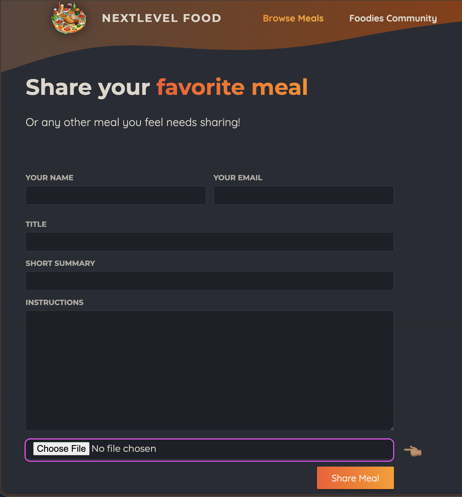

#### 117.2.4 Styling the `image-picker` input:

**Subsection Summary**
- Hides the native file input by applying `classes.input` (which maps to `display: none` in the CSS Module).
- Adds a visible `<button>` with `classes.button` and `type="button"` to prevent accidental form submission.
- The screenshot (`section03-lecture117-002.png`) shows the "Pick an Image" button rendered in the form.
- At this point the button is purely visual — clicking it does nothing because no handler is attached yet.

```jsx
/* app/components/meals/image-picker.js */
import classes from './image-picker.module.css';

export default function ImagePicker({ label, name }){
  return (
    <div className={classes.picker}>
      <label htmlFor={name}>
        {label}
      </label>
      <div className={classes.controls}>
        <input 
          className={classes.input}   {/* 👈🏽 ✅ (1) */}
          type="file"
          id={name}
          accept="image/png, image/jpeg"
          name={name} 
        />
        <button className={classes.button} type="button">Pick an Image</button>   {/* 👈🏽 ✅ (2) */}
      </div>
    </div>
  )
}
```

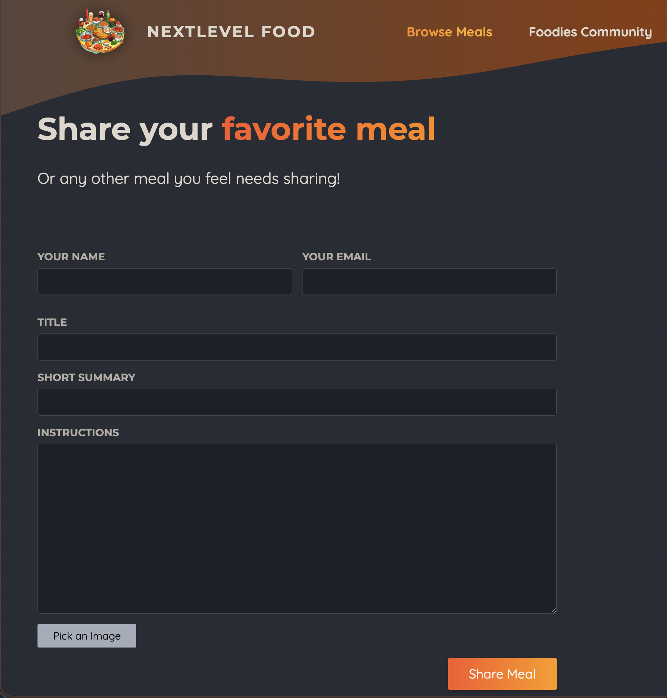

- This button does nothing at all.
- `<button></button>` without `type="button"` is by default `type="submit"`, which means `no prevent accidental form submission`.


#### 117.2.5 Add `handlePickClick` function

**Subsection Summary**
- Defines an empty `handlePickClick` arrow function and wires it to the button's `onClick` prop.
- This triggers a **Next.js runtime error** because event handlers (like `onClick`) are not allowed in Server Components — only Client Components can use interactive browser APIs.
- The screenshot (`section03-lecture117-003.png`) shows the error message: the component must be converted to a Client Component to use event handlers.

```jsx
/* app/components/meals/image-picker.js */
import classes from './image-picker.module.css';

export default function ImagePicker({ label, name }){

  const handlePickClick = () => {}    // 👈🏽 ✅

  return (
    <div className={classes.picker}>
      <label htmlFor={name}>
        {label}
      </label>
      <div className={classes.controls}>
        <input 
          className={classes.input}
          type="file"
          id={name}
          accept="image/png, image/jpeg"
          name={name} 
        />
        <button
          className={classes.button}
          type="button"
          onClick={handlePickClick} {/* 👈🏽 ✅ */}
        >
          Pick an Image
        </button>
      </div>
    </div>
  )
}
```

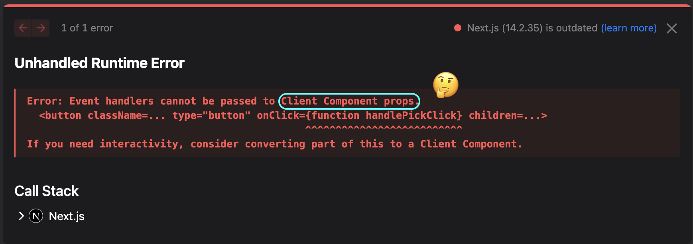

#### 117.2.6 Turn to `client` component and use `useRef` for `input`:

**Subsection Summary**
- Adds `"use client"` directive at the top of the file, converting `ImagePicker` into a Client Component so it can use hooks and event handlers.
- Imports `useRef` from React and creates an `imageInput` ref that is attached to the hidden `<input>` element.
- The `handlePickClick` handler now calls `imageInput.current.click()`, which programmatically opens the native file dialog when the custom "Pick an Image" button is clicked.
- This is the final state of the component for this lesson — a fully interactive custom image picker button that opens the file chooser.

```jsx
/* app/components/meals/image-picker.js */
"use client"    // 👈🏽 ✅ (1)
import { useRef } from 'react';    // 👈🏽 ✅ (2)
import classes from './image-picker.module.css';

export default function ImagePicker({ label, name }){
  const imageInput = useRef();    // 👈🏽 ✅ (2)
  const handlePickClick = () => {
    imageInput.current.click();    // 👈🏽 ✅ (4)
  }

  return (
    <div className={classes.picker}>
      <label htmlFor={name}>
        {label}
      </label>
      <div className={classes.controls}>
        <input 
          className={classes.input}
          type="file"
          id={name}
          accept="image/png, image/jpeg"
          name={name} 
          ref={imageInput}    {/* 👈🏽 ✅ (3) */}
        />
        <button
          className={classes.button}
          type="button"
          onClick={handlePickClick}
        >
          Pick an Image
        </button>
      </div>
    </div>
  )
}
```

### 🐞 117.3 Issues:

- **Missing props on `<ImagePicker />`**: The component is rendered in `ShareMealPage` without passing `label` or `name` props, so both resolve to `undefined` — the `<label>` renders empty text and the `<input>` has no `id` or `name` attribute.
- **`useRef()` initialised without `null`**: The idiomatic React pattern is `useRef(null)`. Omitting the argument sets the initial value to `undefined`, which can cause type-checking issues in TypeScript or unexpected behaviour if `.current` is accessed before the ref is attached.
- **No image preview feedback**: After a file is selected the user sees no visual feedback — the `.preview` styles exist in CSS but the component does not render a preview element yet.
- **Button lacks accessibility attributes**: The "Pick an Image" button has no `aria-label` and no keyboard shortcut hint. Screen-reader users get no indication of what the button does beyond its text.
- **`accept` attribute is narrow**: Only `image/png` and `image/jpeg` are accepted; other common web formats like `image/webp` and `image/gif` are excluded.

| Issue | Status | Log/Error |
|---|---|---|
| Missing `label` and `name` props on `<ImagePicker />` | ⚠️ Identified | `app/meals/share/page.js:42` — `<ImagePicker />` is rendered without props. Should be `<ImagePicker label="Your image" name="image" />`. |
| `useRef()` called without initial `null` | ℹ️ Low Priority | `app/components/meals/image-picker.js:6` — `useRef()` should be `useRef(null)` for explicit initialisation. |
| No image preview after file selection | ℹ️ Informational | `app/components/meals/image-picker.js` — CSS classes `.preview`, `.preview p`, and `.preview img` exist in `image-picker.module.css:26-45` but are not used in JSX. Will be addressed in a future lesson. |
| "Pick an Image" button missing `aria-label` | ℹ️ Low Priority | `app/components/meals/image-picker.js:25-31` — The `<button>` has no `aria-label` or `aria-describedby`. Recommended for screen-reader context. |
| `accept` attribute excludes WebP/GIF | ℹ️ Low Priority | `app/components/meals/image-picker.js:21` — `accept="image/png, image/jpeg"` — consider adding `image/webp` for broader format support. |

### 🧱 117.4 Pending Fixes (TODO)

- [ ] Pass `label` and `name` props to `<ImagePicker />` in `app/meals/share/page.js:42`:
  ```jsx
  <ImagePicker label="Your image" name="image" />
  ```
- [ ] Change `useRef()` to `useRef(null)` in `app/components/meals/image-picker.js:6` for explicit initialisation:
  ```jsx
  const imageInput = useRef(null);
  ```
- [ ] Add `aria-label` to the "Pick an Image" button in `app/components/meals/image-picker.js:25`:
  ```jsx
  <button
    className={classes.button}
    type="button"
    onClick={handlePickClick}
    aria-label="Pick an image to upload"
  >
    Pick an Image
  </button>
  ```
- [ ] Consider expanding the `accept` attribute in `app/components/meals/image-picker.js:21` to include WebP:
  ```jsx
  accept="image/png, image/jpeg, image/webp"
  ```
- [ ] Implement image preview functionality using the `.preview` CSS classes already defined in `app/components/meals/image-picker.module.css:26-45` (upcoming lesson).

[↑ top - Getting Started with a Custom Image Picker Input Component](#-117-lesson-117--getting-started-with-a-custom-image-picker-input-component)


<br>

## 🔧 118. Lesson 118 — *Adding an Image Preview to the Picker*

[🧳 Section 03: *NextJS Essential (App Router)*](#-section-03-nextjs-essential-app-router)

### 📑 Table of Contents:
- [118. Lesson 118 — *Adding an Image Preview to the Picker*](#-118-lesson-118--adding-an-image-preview-to-the-picker)
- [118.1 Context](#-1181-context)
- [118.2 Updating code according the context](#️-1182-updating-codetheory-according-the-context)
  - [118.2.1 Adding `useState` hook and the `handleImageChange` function](#11821-adding-usestate-hook-and-the-handleimagechange-function)
  - [118.2.2 Creating a helper in order to read the file from computer](#11822-creating-a-helper-in-order-to-read-the-file-from-computer)
  - [118.2.3 Image preview with no image yet](#11823-image-preview-with-no-image-yet)
  - [118.2.4 Image preview with an uploaded image](#11824-image-preview-with-an-uploaded-image)
- [118.3 Issues](#-1183-issues)
- [118.4 Pending Fixes (TODO)](#-1184-pending-fixes-todo)

### 🧠 118.1 Context:

This lesson builds on the custom Image Picker component created in Lesson 117 by adding **image preview functionality**. The goal is to let users see the image they selected before submitting the form. This is accomplished by reading the selected file with the browser's `FileReader` API, converting it to a **base64 data URL**, storing it in React state via `useState`, and conditionally rendering Next.js's `<Image>` component.

#### Key Concepts

1. **`useState` for image data** — A state variable (`pickedImage`) holds the base64-encoded string of the chosen image. This drives the conditional rendering of the preview area, showing either a placeholder message or the actual image.
2. **`FileReader` API** — The browser-native `FileReader` object reads the contents of a `File` selected through the `<input type="file">`. Calling `readAsDataURL(file)` converts the binary file into a `data:image/…;base64,…` string that can be used directly as an image `src`.
3. **`onload` callback pattern** — `FileReader` is asynchronous. The `onload` handler fires once the file has been fully read, at which point `filereader.result` contains the data URL. This is the safe moment to update React state.
4. **Conditional rendering** — Two complementary conditions (`!pickedImage` / `pickedImage`) ensure that the placeholder text and the preview image are mutually exclusive, preventing layout jumps.
5. **Next.js `<Image>` with `fill`** — Using `fill` instead of explicit `width`/`height` makes the image fill its closest positioned ancestor (`position: relative` on `.preview`). Combined with `object-fit: cover` in CSS, this produces a clean, cropped preview at any aspect ratio.

#### Advantages

- **Instant feedback** — Users see what they selected without waiting for a server round-trip.
- **No external dependencies** — `FileReader` is built into every modern browser; no library is needed.
- **Lightweight state** — Only the data URL string is stored in state; the original `File` object remains available through the `<input>` ref for later form submission.
- **Reusable pattern** — The same `FileReader` + `useState` pattern works for any file-preview scenario (PDFs, audio waveforms, etc.) with minor adjustments.

#### Disadvantages / Gotchas

- **Base64 size overhead** — A base64 string is ~33 % larger than the binary file. For very large images this increases memory usage and may slow down the UI.
- **No upload progress** — `readAsDataURL` provides no built-in progress indicator; for large files, consider `readAsArrayBuffer` with progress events.
- **Browser memory** — Storing large data URLs in React state keeps them in memory until the component unmounts or the state is cleared.
- **Single-file only** — The current implementation reads only `files[0]`. The `<input>` does not set the `multiple` attribute, so only one file at a time is supported.
- **No validation** — There is no file-size or dimension validation before reading. A user could pick a 50 MB photo and the preview would still try to render it.

#### When to Consider Alternatives

- **Large files / many files** — Use `URL.createObjectURL(file)` for previews instead of base64; it is more memory-efficient because the browser creates a temporary blob URL without copying the data.
- **Server-side preview generation** — If the image must be processed (resized, watermarked) before display, upload it first and use the server's response URL.
- **Progressive upload UX** — For drag-and-drop zones with progress bars, libraries like `react-dropzone` or `uppy` offer richer APIs.

### ⚙️ 118.2 Updating code/theory according the context:

#### **Summary**

- This section walks through the incremental process of adding an image preview to the `ImagePicker` component built in Lesson 117.
- The problem solved is that users need immediate visual feedback after selecting an image file, rather than just a file name or nothing at all.
- **118.2.1** introduces `useState` and the `handleImageChange` event handler that captures the selected file.
- **118.2.2** adds the `FileReader` helper inside the handler to convert the file to a base64 data URL and store it in state.
- **118.2.3** adds the preview container with a placeholder message when no image has been picked.
- **118.2.4** completes the feature by conditionally rendering the Next.js `<Image>` component when an image is available.

Goal:

* ➡ Take the image the user chose
* ➡ convert it to a special text string (base64) 
* ➡ save it in the component's state

So the app can show a preview of the image immediately (without sending it to the server yet).

#### 118.2.1 Adding `useState` hook and the `handleImageChange` function:

**Subsection Summary**
- Introduces `useState` to track the picked image data and adds the `handleImageChange` event handler wired to the `<input>`'s `onChange`.
- `useState` is imported alongside `useRef`; the component already requires `"use client"` from Lesson 117.
- The handler performs an early return if no file is selected (e.g., the user clicked "Cancel" in the file dialog), following defensive programming best practices.
- At this stage the handler does not yet read the file — that is deferred to 118.2.2.

- the user just picked a file! Start working.
- Get the first (and usually only) file the user selected.
- If no file was selected (user clicked cancel), just stop. Do nothing.

```jsx
/* app/components/meals/image-picker.js */
"use client"
import { useRef, useState } from 'react';                   // 👈🏽 ✅ (1)
import classes from './image-picker.module.css';
import Image from 'next/image';
export default function ImagePicker({ label, name }){
  const [pickedImage, setPickedImage] = useState();         // 👈🏽 ✅ (1) need to be "use client"
  const imageInput = useRef();
  const handlePickClick = () => {
    imageInput.current.click();
  }
  const handleImageChange = (e) => {                        // 👈🏽 ✅ (2)
    const file = e.target.files[0];
    // no file was selected.
    if(!file) return;
  }
  return (
    <div className={classes.picker}>
      <label htmlFor={name}>
        {label}
      </label>
      <div className={classes.controls}>
        <input                                                // "multiple" files to upload as property
          className={classes.input}
          type="file"
          id={name}
          accept="image/png, image/jpeg"
          name={name} 
          ref={imageInput}
          onChange={handleImageChange}                        {/* 👈🏽 ✅ (2) */}
        />
        <button
          className={classes.button}
          type="button"
          onClick={handlePickClick}
        >
          Pick an Image
        </button>
      </div>
    </div>
  )
}
```

#### 118.2.2 Creating a helper in order to read the file from computer.

**Subsection Summary**
- Completes the `handleImageChange` function by adding a `FileReader` instance that converts the selected file into a base64 data URL.
- The `filereader.onload` callback fires once reading is complete and calls `setPickedImage(filereader.result)` to store the data URL in state.
- `filereader.readAsDataURL(file)` initiates the asynchronous read, demonstrating the standard `FileReader` lifecycle: create → set callback → trigger read.
- This is the core logic that bridges "file on disk" to "renderable string in React state".

<br>

* 👉🏽 Create a little helper that knows how to read files from the computer.
* 👉🏽 When you finish reading the file, do this:
  * 👉🏽 Save the image (now as a very long text string) into the state variable `pickedImage`.
  * 👉🏽 This is usually used later to show ``.
* 👉🏽 Helper, please read this file and turn it into a data:url string (base64)

```jsx
/* app/components/meals/image-picker.js */
"use client"
import { useRef, useState } from 'react';
import classes from './image-picker.module.css';
import Image from 'next/image';

export default function ImagePicker({ label, name }){
  const [pickedImage, setPickedImage] = useState();
  const imageInput = useRef();
  const handlePickClick = () => {
    imageInput.current.click();
  }
  const handleImageChange = (e) => {
    const file = e.target.files[0];
    if(!file) return;
    const filereader = new FileReader();                    // 👈🏽 ✅ (1)
    filereader.onload = () => {
      setPickedImage(filereader.result);                    // 👈🏽 ✅ (2)
    };
    filereader.readAsDataURL(file);                         // 👈🏽 ✅ (3)
  }
  return (
    <div className={classes.picker}>
      <label htmlFor={name}>
        {label}
      </label>
      <div className={classes.controls}>
        <input 
          className={classes.input}
          type="file"
          id={name}
          accept="image/png, image/jpeg"
          name={name} 
          ref={imageInput}
          onChange={handleImageChange}
        />
        <button
          className={classes.button}
          type="button"
          onClick={handlePickClick}
        >
          Pick an Image
        </button>
      </div>
    </div>
  )
}
```

#### 118.2.3 Image preview with no image yet:

**Subsection Summary**
- Adds the `.preview` container `<div>` to the JSX, positioned before the `<input>` and button.
- Uses conditional rendering (`!pickedImage && <p>…</p>`) to display a "No image picked yet." placeholder when no image has been selected.
- The screenshot (`section03-lecture118-001.png`) shows the empty preview area with the placeholder text visible inside the bordered box.

```jsx
/* app/components/meals/image-picker.js */
"use client"
import { useRef, useState } from 'react';
import classes from './image-picker.module.css';
import Image from 'next/image';
export default function ImagePicker({ label, name }){
  const [pickedImage, setPickedImage] = useState();
  const imageInput = useRef();
  const handlePickClick = () => {
    imageInput.current.click();
  }
  const handleImageChange = (e) => {
    const file = e.target.files[0];
    if(!file) return;
    const filereader = new FileReader();
    filereader.onload = () => {
      setPickedImage(filereader.result);
    };
    filereader.readAsDataURL(file);
  }
  return (
    <div className={classes.picker}>
      <label htmlFor={name}>
        {label}
      </label>
      <div className={classes.controls}>
        <div className={classes.preview}>                        {/* 👈🏽 ✅ (1) using the preview image */}
          {!pickedImage && <p>No image picked yet.</p>}          {/* 👈🏽 ✅ (2) */}
        </div>
        <input 
          className={classes.input}
          type="file"
          id={name}
          accept="image/png, image/jpeg"
          name={name} 
          ref={imageInput}
          onChange={handleImageChange}
        />
        <button
          className={classes.button}
          type="button"
          onClick={handlePickClick}
        >
          Pick an Image
        </button>
      </div>
    </div>
  )
}
```

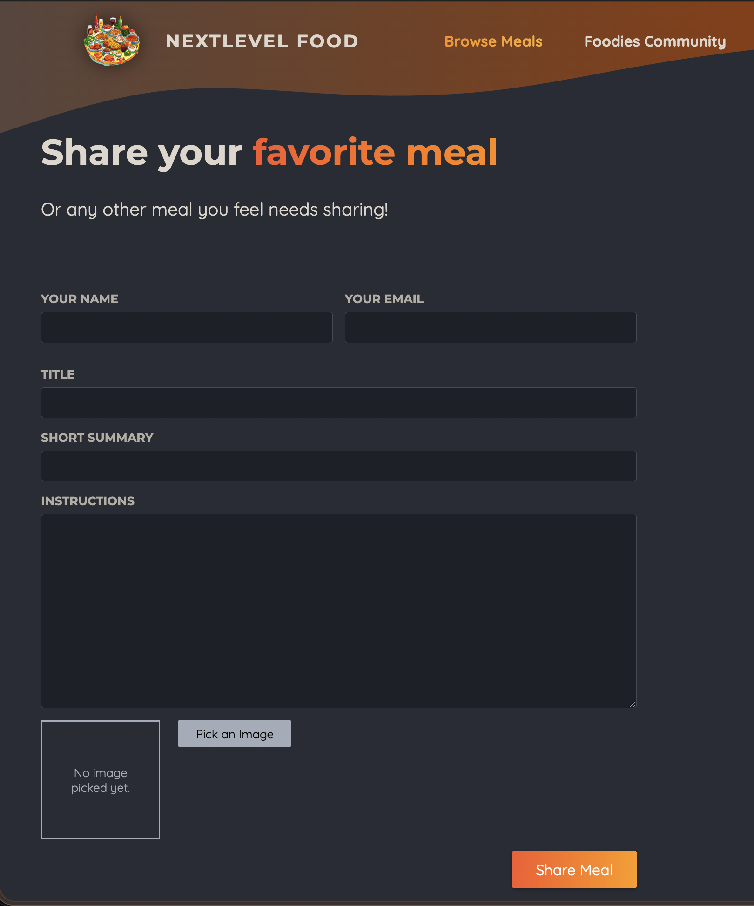

#### 118.2.4 Image preview with an uploaded image:

**Subsection Summary**
- Adds the second conditional branch (`pickedImage && <Image … />`) that renders the Next.js `<Image>` component when a file has been successfully read.
- The `fill` prop is used so the image fills the `.preview` container (which has `position: relative`), and `object-fit: cover` in CSS ensures proper cropping.
- This is the final version of the component for this lesson — it now supports: triggering the file dialog, reading the file, and displaying the preview.
- The screenshot (`section03-lecture118-002.png`) shows a picked image correctly displayed inside the preview box.

```jsx
/* app/components/meals/image-picker.js */
"use client"
import { useRef, useState } from 'react';
import classes from './image-picker.module.css';
import Image from 'next/image';

export default function ImagePicker({ label, name }){
  const [pickedImage, setPickedImage] = useState();   // need to be "use client"
  const imageInput = useRef();
  const handlePickClick = () => {
    imageInput.current.click();
  }
  const handleImageChange = (e) => {
    const file = e.target.files[0];
    if(!file) return;
    const filereader = new FileReader();
    filereader.onload = () => {
      setPickedImage(filereader.result);
    };
    filereader.readAsDataURL(file);
  }
  return (
    <div className={classes.picker}>
      <label htmlFor={name}>
        {label}
      </label>
      <div className={classes.controls}>
        <div className={classes.preview}>
          {!pickedImage && <p>No image picked yet.</p>}
          {pickedImage && (
            <Image                                      // 👈🏽 ✅
              src={pickedImage}
              alt="The image selected by the user."
              fill
            />)
          }
        </div>
        <input 
          className={classes.input}
          type="file"
          id={name}
          accept="image/png, image/jpeg"
          name={name} 
          ref={imageInput}
          onChange={handleImageChange}
        />
        <button
          className={classes.button}
          type="button"
          onClick={handlePickClick}
        >
          Pick an Image
        </button>
      </div>
    </div>
  )
}
```

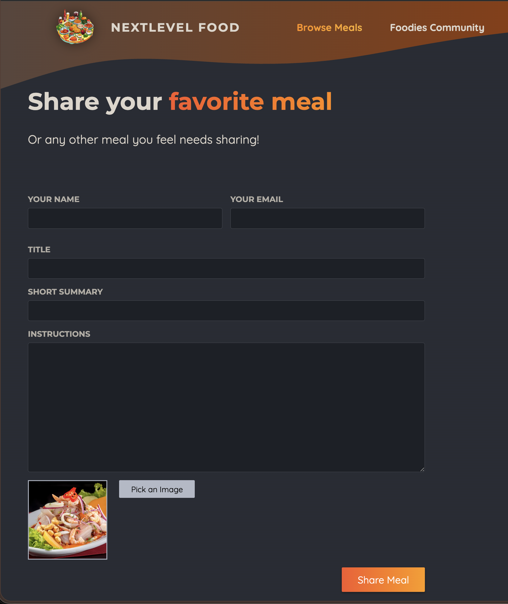

#### 118.2.5 Summary:

1. `new FileReader()` → make the helper
2. `filereader.onload = () => { ... }` → tell the helper: "When you finish → give me the result and I'll save it"
3. `filereader.readAsDataURL(file)` → tell the helper: "Okay, start now! Read this file and convert it to data:url format"
4. (some time passes — usually very fast for small images)
5. Reading finishes → browser automatically calls your `onload` function
6. Inside `onload`: `filereader.result` now contains the long string
7. `setPickedImage(filereader.result)` → save it so React can show ``

| You write                  | Real meaning in plain words                                      | When does it happen / become available?          |
|----------------------------|------------------------------------------------------------------|--------------------------------------------------|
| `.onload`                  | "Call me when reading is successfully finished"                 | After reading completes (success)                |
| `.result`                  | "The data you just read (the final content)"                     | Only inside onload / onloadend (after done)      |
| `.readAsDataURL(file)`     | "Start reading + convert file to base64 data:url string"         | You call it → starts the work                    |

### 🐞 118.3 Issues:

| Issue | Status | Log/Error |
|---|---|---|
| No file-size validation before reading | ⚠️ Identified | `app/components/meals/image-picker.js:13-24` — `handleImageChange` reads any file without checking `file.size`. |
| No `onerror` handler on `FileReader` | ⚠️ Identified | `app/components/meals/image-picker.js:18-22` — Only `onload` is set; `onerror` is missing. |
| `useState` initialised as `undefined` | ℹ️ Low Priority | `app/components/meals/image-picker.js:7` — `useState()` should be `useState(null)` for explicit intent. |
| Preview `<div>` lacks accessibility attributes | ⚠️ Identified | `app/components/meals/image-picker.js:32` — No `role` or `aria-label` on `.preview` container. |
| No loading indicator during `FileReader` read | ℹ️ Informational | `app/components/meals/image-picker.js:18-22` — Large files may take noticeable time to read with no visual feedback. |

### 🧱 118.4 Pending Fixes (TODO)

- [ ] Add file-size validation in `handleImageChange` before calling `readAsDataURL` — reject files above a configurable threshold (e.g., 5 MB) and display a user-friendly error message (`app/components/meals/image-picker.js:14`).
- [ ] Add an `onerror` handler to the `FileReader` instance to catch read failures and surface feedback to the user (`app/components/meals/image-picker.js:18`).
- [ ] Change `useState()` to `useState(null)` for explicit initialisation (`app/components/meals/image-picker.js:7`).
- [ ] Add `role="img"` and `aria-label` to the `.preview` container, or wrap the placeholder `<p>` with an appropriate ARIA live region so screen readers announce changes (`app/components/meals/image-picker.js:32`).
- [ ] Consider replacing `readAsDataURL` with `URL.createObjectURL(file)` for more memory-efficient previews, especially if large images are expected.
- [ ] Add a loading spinner or skeleton in the preview area while `FileReader` is processing, using an additional state flag (e.g., `isLoading`).

[↑ top - 118. Lesson 118 — *Adding an Image Preview to the Picker*](#-118-lesson-118--adding-an-image-preview-to-the-picker)


<br>

## 🔧 119. Lesson 119 — *Improving the Image Picker Component*

[🧳 Section 03: *NextJS Essential (App Router)*](#-section-03-nextjs-essential-app-router)

### 📑 Table of Contents:
- [119. Lesson 119 — *Improving the Image Picker Component*](#-119-lesson-119--improving-the-image-picker-component)
- [119.1 Context](#-1191-context)
- [119.2 Updating code according the context](#️-1192-updating-codetheory-according-the-context)
  - [119.2.1 Adding `null` in `setPickedImage` when `!file`](#11921-adding-null-in-setpickedimage-when-file)
  - [119.2.2 Adding `required` as prop](#11922-adding-required-as-prop)
- [119.3 Issues](#-1193-issues)
- [119.4 Pending Fixes (TODO)](#-1194-pending-fixes-todo)

### 🧠 119.1 Context:

This lesson focuses on **hardening and improving** the custom `ImagePicker` component built in Lessons 117–118. Two incremental improvements are applied: (1) explicitly resetting the preview state when the user cancels the file dialog or clears their selection, and (2) exposing a `required` prop so the parent form can enforce that an image must be selected before submission.

#### Key Concepts

1. **Defensive state reset** — When a user opens the file picker dialog and then cancels it (or the browser reports an empty file list), `e.target.files[0]` is `undefined`. Without an explicit `setPickedImage(null)`, the component would keep showing a stale preview from a previous selection. Setting state to `null` ensures the UI stays in sync with the actual input value.
2. **Early return pattern** — Placing the `if (!file)` guard with an early `return` at the top of `handleImageChange` prevents the `FileReader` logic from executing on an `undefined` value, avoiding a runtime error.
3. **Configurable `required` prop with default value** — By destructuring `required = false` in the component signature, the `<input>` element's HTML `required` attribute becomes opt-in. The parent page can pass `required` (or `required={true}`) to enable browser-native form validation for the file field.
4. **HTML `required` on hidden inputs** — Although the `<input type="file">` is visually hidden (`display: none`), the HTML `required` attribute still participates in the Constraint Validation API. The browser will block form submission and display a validation message if no file is chosen (behavior varies by browser).

#### Advantages

- **Better UX** — Resetting to `null` when no file is selected prevents the user from seeing a leftover preview that no longer matches their intent.
- **Robustness** — The early return prevents calling `FileReader.readAsDataURL()` with `undefined`, which would throw a `TypeError`.
- **Flexibility** — The `required` prop lets the parent decide whether the image is mandatory, keeping the component reusable in both required and optional contexts.
- **Zero overhead** — Both improvements are minimal changes (one line each) with no additional dependencies or performance cost.

#### Disadvantages / Gotchas

- **Browser-native validation limitations** — The `required` attribute on a hidden `<input type="file">` does not always surface a visible tooltip or error near the button the user actually clicks. Custom validation feedback may be needed for a polished experience.
- **No explicit `null` initial state** — `useState()` initializes to `undefined` rather than `null`. While both are falsy and the conditional rendering (`!pickedImage`) still works, mixing `undefined` (initial) and `null` (after cancel) can be confusing. Initializing with `useState(null)` would be more explicit.

#### When to Consider Alternatives

- If full custom validation messages are needed (e.g., file size limits, dimension checks), consider handling validation in the `handleImageChange` function and managing error state instead of relying on the HTML `required` attribute alone.
- For complex forms with many fields, a form library (React Hook Form, Formik) may manage `required` rules and error feedback more consistently across all inputs.

### ⚙️ 119.2 Updating code/theory according the context:

#### **Summary**
- This section applies two small but important improvements to `app/components/meals/image-picker.js`.
- **119.2.1** adds a defensive `setPickedImage(null)` call inside the early-return guard for when the user cancels the file dialog, ensuring the preview resets correctly.
- **119.2.2** introduces a `required` prop (defaulting to `false`) and forwards it to the hidden `<input>` element so the parent can enforce image selection via native form validation.
- Together, these changes make the component more robust and more flexible for reuse in different form contexts.

#### 119.2.1 Adding `null` in `setPickedImage` when `!file`:

**Subsection Summary**
- Adds `setPickedImage(null)` inside the `if (!file)` guard in `handleImageChange`.
- This ensures that if a user previously picked an image and then re-opens the dialog but cancels, the stale preview is cleared.
- Demonstrates the **early return** pattern: the function exits immediately after resetting state, so the `FileReader` logic below is never reached with an `undefined` file.

```jsx
/* app/components/meals/image-picker.js */
"use client"
import { useRef, useState } from 'react';
import classes from './image-picker.module.css';
import Image from 'next/image';
export default function ImagePicker({ label, name }){
  const [pickedImage, setPickedImage] = useState();   // need to be "use client"
  const imageInput = useRef();
  const handlePickClick = () => {
    imageInput.current.click();
  }
  const handleImageChange = (e) => {
    const file = e.target.files[0];
    if(!file) {
      setPickedImage(null);                           // 👈🏽 ✅
      return;
    }
    const filereader = new FileReader();
    filereader.onload = () => {
      setPickedImage(filereader.result);
    };
    filereader.readAsDataURL(file);
  }
  return (
    <div className={classes.picker}>
      <label htmlFor={name}>
        {label}
      </label>
      <div className={classes.controls}>
        <div className={classes.preview}>
          {!pickedImage && <p>No image picked yet.</p>}
          {pickedImage && (
            <Image
              src={pickedImage}
              alt="The image selected by the user."
              fill
            />
          )}
        </div>
        <input 
          className={classes.input}
          type="file"
          id={name}
          accept="image/png, image/jpeg"
          name={name} 
          ref={imageInput}
          onChange={handleImageChange}
        />
        <button
          className={classes.button}
          type="button"
          onClick={handlePickClick}
        >
          Pick an Image
        </button>
      </div>
    </div>
  )
}
```

#### 119.2.2 Adding `required` as prop:

**Subsection Summary**
- Adds a `required` prop with a default value of `false` to the `ImagePicker` component signature.
- Forwards the `required` prop to the hidden `<input type="file">` element via the HTML `required` attribute.
- This enables the parent form (`app/meals/share/page.js`) to opt-in to browser-native form validation for the image field by passing `required` or `required={true}` to `<ImagePicker>`.
- Demonstrates the pattern of **configurable validation props with safe defaults** so existing usages without the prop remain unaffected.

```jsx
/* app/components/meals/image-picker.js */
"use client"
import { useRef, useState } from 'react';
import classes from './image-picker.module.css';
import Image from 'next/image';

export default function ImagePicker({ label, name, required = false }){               // 👈🏽 ✅
  const [pickedImage, setPickedImage] = useState();   // need to be "use client"
  const imageInput = useRef();
  const handlePickClick = () => {
    imageInput.current.click();
  }

  const handleImageChange = (e) => {
    const file = e.target.files[0];

    if(!file) {
      setPickedImage(null);
      return;
    }

    const filereader = new FileReader();
    filereader.onload = () => {
      setPickedImage(filereader.result);
    };
    filereader.readAsDataURL(file);
  }
  return (
    <div className={classes.picker}>
      <label htmlFor={name}>
        {label}
      </label>
      <div className={classes.controls}>
        <div className={classes.preview}>
          {!pickedImage && <p>No image picked yet.</p>}
          {pickedImage && (
            <Image
              src={pickedImage}
              alt="The image selected by the user."
              fill
            />
          )}
        </div>
        <input 
          className={classes.input}
          type="file"
          id={name}
          accept="image/png, image/jpeg"
          name={name} 
          ref={imageInput}
          onChange={handleImageChange}
          required={required}                                                     // 👈🏽 ✅
        />
        <button
          className={classes.button}
          type="button"
          onClick={handlePickClick}
        >
          Pick an Image
        </button>
      </div>
    </div>
  )
}
```

### 🐞 119.3 Issues:
| Issue | Status | Log/Error |
|---|---|---|
| Missing `label` and `name` props in usage | ⚠️ Identified | `app/meals/share/page.js:42` — `<ImagePicker />` is rendered without `label="Your image"` and `name="image"` props. The `<label htmlFor={name}>` renders with `htmlFor={undefined}` and `<input>` has no `id` or `name`. |
| Hidden input `required` validation UX | ℹ️ Informational | `app/components/meals/image-picker.js:44-53` — The file input has `display: none` (via CSS module). When `required` is set, browsers may block form submission without showing a visible tooltip near the "Pick an Image" button. |
| Inconsistent initial state type | ℹ️ Low Priority | `app/components/meals/image-picker.js:7` — `useState()` produces `undefined` as the initial value, but `setPickedImage(null)` on cancel sets it to `null`. Both are falsy and the component works correctly, but `useState(null)` would be more explicit and consistent. |

### 🧱 119.4 Pending Fixes (TODO)

- [ ] Pass `label` and `name` props to `<ImagePicker />` in `app/meals/share/page.js:42` — e.g., `<ImagePicker label="Your image" name="image" />`
- [ ] Consider initializing state explicitly as `useState(null)` in `app/components/meals/image-picker.js:7` for consistency with the `setPickedImage(null)` reset path
- [ ] Add an `aria-label` to the "Pick an Image" button in `app/components/meals/image-picker.js:54-59` for improved accessibility — e.g., `aria-label="Pick an image file"`
- [ ] Evaluate whether a custom validation message should be shown near the button when `required` is `true` and no file is selected, since the hidden `<input>` tooltip may not be visible to the user

[↑ top — 119. Lesson 119 — *Improving the Image Picker Component*](#-119-lesson-119--improving-the-image-picker-component)

<br>

## 🔧 120. Lesson 120 — *Introducing & Using Server Actions for Handling Form Submissions*

[🧳 Section 03: *NextJS Essential (App Router)*](#-section-03-nextjs-essential-app-router)

### 📑 Table of Contents:
- [120. Lesson 120 — *Introducing & Using Server Actions for Handling Form Submissions*](#-120-lesson-120--introducing--using-server-actions-for-handling-form-submissions)
- [120.1 Context](#-1201-context)
- [120.2 Updating code according the context](#️-1202-updating-codetheory-according-the-context)
  - [120.2.1 Create the submission method](#12021-create-the-submission-method)
  - [120.2.2 Creating/Adding a `server action` function](#12022-creatingadding-a-server-action-function)
  - [120.2.3 Extracting form data inside the server action](#12023-extracting-form-data-inside-the-server-action)
- [120.3 Issues](#-1203-issues)
- [120.4 Pending Fixes (TODO)](#-1204-pending-fixes-todo)

### 🧠 120.1 Context:

This lesson introduces **Server Actions** in Next.js — a React/Next.js feature that allows you to define functions that are **guaranteed to execute only on the server**, and can be directly wired to HTML `<form>` elements via the `action` prop. Instead of the traditional client-side `onSubmit` handler that would require an API route or fetch call, Server Actions let you co-locate form-handling logic within your Server Component, simplifying the request–response cycle for form submissions.

#### Key Concepts

1. **Server Actions** — Functions marked with the `'use server'` directive inside their body. They run exclusively on the server, never shipping their code to the client bundle. This is Next.js's built-in mechanism for handling mutations (form submissions, database writes, etc.).
2. **The `action` prop on `<form>`** — In Next.js (with React Server Components), the `<form>` element's `action` prop can accept a Server Action function reference instead of a URL string. When the form is submitted, Next.js automatically serialises the form data and sends it to the server, invoking the action function.
3. **`formData` parameter** — Server Actions automatically receive a `FormData` object as their first argument. You extract individual field values via `formData.get('fieldName')`, where `fieldName` matches the `name` attribute of the corresponding `<input>`, `<textarea>`, or `<select>` element.
4. **`async` requirement** — A Server Action must be an `async` function. The `'use server'` directive is only valid inside `async` functions.
5. **Fullstack co-location** — Because Next.js Server Components already execute on the server, defining a Server Action inside a Server Component means both the rendering logic and the form-handling logic live in the same file without needing a separate API route.

#### Advantages

- **No manual API routes** — Server Actions eliminate the need to create `/api/...` route handlers for simple form submissions; the server function is invoked directly.
- **Automatic `FormData` serialization** — The browser natively serializes the form fields into a `FormData` object and Next.js forwards it to the action, so no manual `JSON.stringify` or `fetch` boilerplate is needed.
- **Progressive enhancement** — Forms using `action` work even if JavaScript is disabled in the browser (the browser falls back to a native form POST).
- **Reduced client bundle** — Server Action code is never included in the JavaScript sent to the browser, keeping the client bundle smaller.
- **Type-safe extraction** — Each `formData.get()` call maps directly to a `name` attribute on the form, making the data flow explicit and traceable.

#### Disadvantages / Gotchas

- **Server Component only (inline)** — Inline Server Actions (defined inside the component body) can only be written in Server Components. If the page is a Client Component (`'use client'`), the action must be imported from a separate file that uses `'use server'` at the top.
- **No real-time client-side validation** — Server Actions execute after submission. For instant field-level validation (e.g., showing errors as the user types), you still need client-side logic.
- **`formData.get()` returns `FormDataEntryValue | null`** — Values are always strings (or `File` for file inputs). Numeric or boolean fields need manual parsing/coercion.
- **Debugging runs on the server** — `console.log` inside a Server Action prints to the server terminal, not the browser console, which can be confusing during development.
- **Security considerations** — Even though the code runs on the server, input must still be validated and sanitized; the `FormData` values originate from the client and can be tampered with.

#### When to Consider Alternatives

- If you need **complex client-side validation or optimistic UI updates**, consider combining Server Actions with `useFormState` / `useFormStatus` hooks, or use a client-side form library (React Hook Form, Formik) alongside a traditional API route.
- If the form is in a **Client Component** that cannot be restructured, move the Server Action to a separate `actions.js` file with `'use server'` at the module level.
- For **non-form mutations** (e.g., triggered by a button click outside a form), you can still call a Server Action but you'll invoke it manually rather than via the `action` prop.

### ⚙️ 120.2 Updating code/theory according the context:

#### **Summary**
- This section walks through three incremental steps to add form submission handling to `app/meals/share/page.js` using Next.js Server Actions.
- **120.2.1** shows the starting point — the traditional `onSubmit` approach and why it's not the ideal pattern in a Next.js Server Component context.
- **120.2.2** replaces `onSubmit` with the `action` prop and introduces the `shareMeal` Server Action using `'use server'`.
- **120.2.3** completes the implementation by accepting the `formData` parameter, extracting all form field values into a `meal` object, and logging it to the server console.
- Together, these steps demonstrate the full lifecycle: from identifying the submission entry point, to creating the server-side handler, to reading the submitted data.

#### 120.2.1 Create the submission method:

**Subsection Summary**
- Shows the starting form markup in `app/meals/share/page.js` with a traditional `onSubmit={somePreDefinedFunction}` handler placeholder.
- Highlights that in a Next.js app (which is already a fullstack framework), the component renders on the server, so the traditional client-side `onSubmit` pattern is not the recommended approach.
- Sets the stage for replacing `onSubmit` with the Server Action pattern in the next subsection.

```jsx
/* app/meals/share/page.js */
import classes from './page.module.css';
import ImagePicker from '../../components/meals/image-picker';
export default function ShareMealPage() {
  return (
    <>
      <header className={classes.header}>
        <h1>
          Share your <span className={classes.highlight}>favorite meal</span>
        </h1>
        <p>Or any other meal you feel needs sharing!</p>
      </header>
      <main className={classes.main}>
        <form className={classes.form} onSubmit={somePreDefinedFunction}>     {/* 👈🏽 ✅ */}
          <div className={classes.row}>
            <p>
              <label htmlFor="name">Your name</label>
              <input type="text" id="name" name="name" required />
            </p>
            <p>
              <label htmlFor="email">Your email</label>
              <input type="email" id="email" name="email" required />
            </p>
          </div>
          <p>
            <label htmlFor="title">Title</label>
            <input type="text" id="title" name="title" required />
          </p>
          <p>
            <label htmlFor="summary">Short Summary</label>
            <input type="text" id="summary" name="summary" required />
          </p>
          <p>
            <label htmlFor="instructions">Instructions</label>
            <textarea
              id="instructions"
              name="instructions"
              rows="10"
              required
            ></textarea>
          </p>
          <ImagePicker />
          <p className={classes.actions}>
            <button type="submit">Share Meal</button>
          </p>
        </form>
      </main>
    </>
  );
}
```

* We already are on the backend
* kind of fullstack app which has both backend and frontend.

#### 120.2.2 Creating/Adding a `server action` function

**Subsection Summary**
- Introduces the `shareMeal` function inside the `ShareMealPage` component with the `'use server'` directive.
- Changes the `<form>` from `onSubmit` to `action={shareMeal}`, wiring the Server Action directly to the form's native action mechanism.
- Explains the core rules: the function must be `async`, `'use server'` must be placed at the top of the function body, and the `action` prop replaces the traditional URL-based `action="/some-path"` with a direct function reference.
- Demonstrates the key pattern: **Server Actions as first-class form handlers** in Next.js Server Components.

```jsx
/* app/meals/share/page.js */
import classes from './page.module.css';
import ImagePicker from '../../components/meals/image-picker';
export default function ShareMealPage() {
  async function shareMeal(){                             // 👈🏽 ✅
    'use server';                                         // 👈🏽 ✅
  }
  return (
    <>
      <header className={classes.header}>
        <h1>
          Share your <span className={classes.highlight}>favorite meal</span>
        </h1>
        <p>Or any other meal you feel needs sharing!</p>
      </header>
      <main className={classes.main}>
        <form className={classes.form} action={shareMeal}>  {/* 👈🏽 ✅ */}
          <div className={classes.row}>
            <p>
              <label htmlFor="name">Your name</label>
              <input type="text" id="name" name="name" required />
            </p>
            <p>
              <label htmlFor="email">Your email</label>
              <input type="email" id="email" name="email" required />
            </p>
          </div>
          <p>
            <label htmlFor="title">Title</label>
            <input type="text" id="title" name="title" required />
          </p>
          <p>
            <label htmlFor="summary">Short Summary</label>
            <input type="text" id="summary" name="summary" required />
          </p>
          <p>
            <label htmlFor="instructions">Instructions</label>
            <textarea
              id="instructions"
              name="instructions"
              rows="10"
              required
            ></textarea>
          </p>
          <ImagePicker />
          <p className={classes.actions}>
            <button type="submit">Share Meal</button>
          </p>
        </form>
      </main>
    </>
  );
}
```

* `'use server'` creates a so called `server action`.
* function which garantees to execute on the server only.
* to turn to a `server action` must add the `async` keyword in front of it.
* related to `action` property, it is set to the path to which the request should be sent: `<form action="/some-path">`
* The `action` prop is sending a `server action` function.

#### 120.2.3 Extracting form data inside the server action

**Subsection Summary**
- Adds the `formData` parameter to the `shareMeal` Server Action so it receives the browser-serialized `FormData` object.
- Builds a `meal` object by calling `formData.get()` for each field (`title`, `summary`, `instructions`, `image`, `name`, `email`), mapping each to the corresponding `name` attribute on the form inputs.
- Passes `label="Your image"` and `name="image"` props to `<ImagePicker />`, which was previously rendered without them — this ensures `formData.get('image')` returns the selected file.
- Uses `console.log(meal)` to verify the data on the **server terminal** (not the browser console), as shown in the screenshot.
- The screenshot (`section03-lecture120-001.png`) demonstrates the `console.log` output appearing in the server-side terminal, confirming the Server Action executed on the server.

```jsx
/* app/meals/share/page.js */
import classes from './page.module.css';
import ImagePicker from '../../components/meals/image-picker';
export default function ShareMealPage() {
  async function shareMeal(formData){                                   // 👈🏽 ✅ (1)
    'use server';
    const meal = {                                                      // 👈🏽 ✅ (2)
      title: formData.get('title'),
      summary: formData.get('summary'),
      instructions: formData.get('instructions'),
      image: formData.get('image'),
      creator: formData.get('name'),
      creator_email: formData.get('email'),
    }
    console.log(meal);
  }
  return (
    <>
      <header className={classes.header}>
        <h1>
          Share your <span className={classes.highlight}>favorite meal</span>
        </h1>
        <p>Or any other meal you feel needs sharing!</p>
      </header>
      <main className={classes.main}>
        <form className={classes.form} action={shareMeal}>
          <div className={classes.row}>
            <p>
              <label htmlFor="name">Your name</label>
              {/* creator: formData.get('name') => name="name" */}
              <input type="text" id="name" name="name" required />  
            </p>
            <p>
              <label htmlFor="email">Your email</label>
              <input type="email" id="email" name="email" required />
            </p>
          </div>
          <p>
            <label htmlFor="title">Title</label>
            {/* title: formData.get('title') => name="title" */}
            <input type="text" id="title" name="title" required />   
          </p>
          <p>
            <label htmlFor="summary">Short Summary</label>
            <input type="text" id="summary" name="summary" required />
          </p>
          <p>
            <label htmlFor="instructions">Instructions</label>
            <textarea
              id="instructions"
              name="instructions"
              rows="10"
              required
            ></textarea>
          </p>
          <ImagePicker label="Your image" name="image" />                 {/* 👈🏽 ✅ (3) */}
          <p className={classes.actions}>
            <button type="submit">Share Meal</button>
          </p>
        </form>
      </main>
    </>
  );
}
```

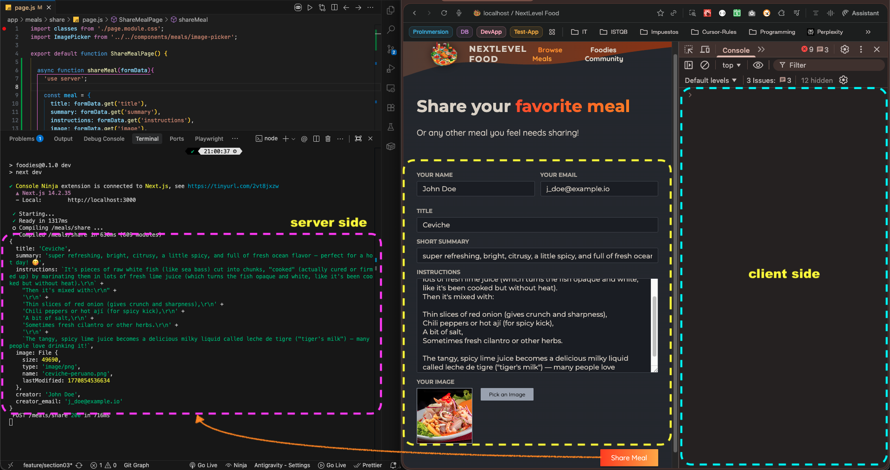

### 🐞 120.3 Issues:
| Issue | Status | Log/Error |
|---|---|---|
| No input validation in Server Action | ⚠️ Identified | `app/meals/share/page.js:6-17` — The `shareMeal` function extracts `formData` values without any validation (e.g., empty strings, invalid email format, missing image). Malicious or malformed data could be processed. |
| Debug `console.log` left in Server Action | ℹ️ Low Priority | `app/meals/share/page.js:17` — `console.log(meal)` is useful for development but should be removed or replaced with proper logging before production. |
| No user feedback after form submission | ⚠️ Identified | `app/meals/share/page.js:29` — After the Server Action completes, the page does not display a success/error message or redirect. The user has no indication that their submission was processed. |
| No data persistence | ℹ️ Informational | `app/meals/share/page.js:6-17` — The `shareMeal` action builds a `meal` object but does not save it anywhere (database, file system, etc.). This is expected at this lesson stage but must be addressed in future lessons. |
| Missing accessibility on submit button | ℹ️ Low Priority | `app/meals/share/page.js:59` — The "Share Meal" submit button lacks an `aria-label` attribute for screen readers. |

### 🧱 120.4 Pending Fixes (TODO)

- [ ] Add server-side input validation inside `shareMeal` (check for empty/missing fields, validate email format, verify image is a `File` instance) — `app/meals/share/page.js:9-16`
- [ ] Remove or replace `console.log(meal)` with a proper logging utility before deploying to production — `app/meals/share/page.js:17`
- [ ] Implement data persistence (e.g., save `meal` to a database or file system) inside the Server Action — `app/meals/share/page.js:6-17`
- [ ] Add user feedback after submission: either redirect to a success page via `redirect()` from `next/navigation`, or use `useFormState` to display success/error messages — `app/meals/share/page.js:29`
- [ ] Add `aria-label="Share your meal"` to the submit button for improved accessibility — `app/meals/share/page.js:59`
- [ ] Consider extracting the `shareMeal` Server Action into a dedicated `app/meals/share/actions.js` file with `'use server'` at the module level for better separation of concerns and reusability

[↑ top — 120. Lesson 120 — *Introducing & Using Server Actions for Handling Form Submissions*](#-120-lesson-120--introducing--using-server-actions-for-handling-form-submissions)


<br>

## 🔧 121. Lesson 121 — *Storing Server Actions in Separate Files*

[🧳 Section 03: *NextJS Essential (App Router)*](#-section-03-nextjs-essential-app-router)

### 📑 Table of Contents:
- [121. Lesson 121 — *Storing Server Actions in Separate Files*](#-121-lesson-121--storing-server-actions-in-separate-files)
- [121.1 Context](#-1211-context)
- [121.2 Updating code according the context](#️-1212-updating-codetheory-according-the-context)
  - [121.2.1 `server actions` does not work in `use client` component](#12121-server-actions-does-not-work-in-use-client-component)
  - [121.2.2 For `client` component, remove the `server action` away](#12122-for-client-component-remove-the-server-action-away)
  - [121.2.3 `server action` move aways due to `client` component](#12123-server-action-move-aways-due-to-client-component)
  - [121.2.4 Import the `server action` into `use client` component](#12124-import-the-server-action-into-use-client-component)
- [121.3 Issues](#-1213-issues)
- [121.4 Pending Fixes (TODO)](#-1214-pending-fixes-todo)

### 🧠 121.1 Context:

This lesson addresses a **fundamental constraint** of Next.js Server Actions: **inline Server Actions (functions with `'use server'` in their body) cannot be defined inside Client Components** (`'use client'`). The solution is to extract the Server Action into a **dedicated file** that declares `'use server'` at the **module level**, and then import that function into the Client Component.

This pattern is essential whenever a component needs client-side interactivity (state, effects, event handlers, browser APIs) **and** also needs to trigger a server-side mutation via a Server Action.

#### Key Concepts

1. **`'use server'` at module level** — When placed at the very top of a file (before any imports or code), the `'use server'` directive marks **every exported function** in that file as a Server Action. This is the required approach when the consuming component is a Client Component.
2. **Separation of concerns** — Moving Server Actions to a dedicated file (e.g., `lib/actions.js`) cleanly separates server-side mutation logic from client-side rendering and interaction logic.
3. **Named exports** — Functions in a `'use server'` module must be individually exported (`export async function shareMeal(...)`) so they can be imported by name in Client Components.
4. **Client Component constraint** — React/Next.js disallows the `'use server'` directive inside a function body when the containing module is marked `'use client'`. The two directives are mutually exclusive at the inline level.
5. **Import-based wiring** — After extraction, the Client Component imports the Server Action by name and passes it to the `<form action={...}>` prop exactly as before. The behavior is identical — only the file organization changes.

#### Advantages

- **Enables Server Actions in Client Components** — The primary advantage: without this pattern, Client Components cannot use Server Actions at all.
- **Reusability** — A Server Action defined in `lib/actions.js` can be imported and used by multiple components across the application, avoiding code duplication.
- **Cleaner component files** — Removing server-side logic from the component file makes it easier to read, test, and maintain.
- **Scalability** — As the application grows, a centralized `actions.js` (or multiple action files) provides a single place to manage all server-side mutations.
- **Clear boundaries** — The file-level `'use server'` directive makes it immediately obvious that the entire file contains server-only code; there is no ambiguity.

#### Disadvantages / Gotchas

- **Extra file / indirection** — For simple cases, having the action in a separate file adds a layer of indirection that may feel unnecessary when the action is small and tightly coupled to a single component.
- **Module-level `'use server'` marks all exports** — Every exported function in the file becomes a Server Action. If you accidentally export a helper that should not be a public server endpoint, it could be invoked from the client.
- **Import path dependency** — The Client Component now depends on a correct import path (`@/lib/actions`). Path aliasing (via `jsconfig.json` or `tsconfig.json`) helps, but misconfigurations can lead to confusing errors.
- **Commented-out `'use server'` inside the function** — When the module-level directive is present, an inline `'use server'` inside each function is redundant. Leaving it commented out (as in the lesson code) can confuse future readers who may not understand why it is there.

#### When to Consider Alternatives

- If the component that uses the Server Action **is already a Server Component** (no `'use client'`), you can define the action inline — no separate file is needed.
- If you prefer **co-location over separation**, you can keep Server Actions in a sibling file next to the component (e.g., `app/meals/share/actions.js`) instead of a global `lib/actions.js`.
- For **very large applications** with many mutations, consider organizing actions by domain (e.g., `lib/actions/meals.js`, `lib/actions/users.js`) rather than a single catch-all file.

### ⚙️ 121.2 Updating code/theory according the context:

#### **Summary**
- This section walks through four incremental steps that demonstrate why Server Actions cannot be defined inline inside a Client Component and how to solve the problem by extracting them into a separate file.
- **121.2.1** shows the conflict: a `'use server'` function defined inside a `'use client'` module triggers a build/runtime error.
- **121.2.2** removes (comments out) the inline Server Action from the Client Component, preparing for extraction.
- **121.2.3** creates the new `lib/actions.js` file with `'use server'` at the module level and the exported `shareMeal` function.
- **121.2.4** completes the cycle by importing `shareMeal` from `@/lib/actions` back into the Client Component and wiring it to the form's `action` prop.
- Together, the four steps form a **refactoring recipe** that can be applied whenever you need to use a Server Action inside a Client Component.

#### 121.2.1 `server actions` does not work in `use client` component

**Subsection Summary**
- Demonstrates the **error scenario**: a `'use server'` function (`shareMeal`) is defined inline inside a module that also has `'use client'` at the top.
- Next.js / React rejects this combination because the two directives are mutually exclusive at the inline level — the client bundle cannot contain code that is supposed to run only on the server.
- The screenshot (`sectio03-lecture121-001.png`) shows the resulting error in the browser or terminal, confirming the incompatibility.
- This establishes the **motivation** for the rest of the lesson: the action must be moved to a separate server-only file.

```jsx
/* app/meals/share/page.js */
"use client";                                                   // 👈🏽 ✅ (2) client component
import classes from './page.module.css';
import ImagePicker from '../../components/meals/image-picker';
export default function ShareMealPage() {
  async function shareMeal(formData){
    'use server';                                               // 👈🏽 ✅ (1) server action
    const meal = {
      title: formData.get('title'),
      summary: formData.get('summary'),
      instructions: formData.get('instructions'),
      image: formData.get('image'),
      creator: formData.get('name'),
      creator_email: formData.get('email'),
    }
    console.log(meal);
  }
  return (
    <>
      <header className={classes.header}>
        <h1>
          Share your <span className={classes.highlight}>favorite meal</span>
        </h1>
        <p>Or any other meal you feel needs sharing!</p>
      </header>
      <main className={classes.main}>
        <form className={classes.form} action={shareMeal}>
          <div className={classes.row}>
            <p>
              <label htmlFor="name">Your name</label>
              <input type="text" id="name" name="name" required />
            </p>
            <p>
              <label htmlFor="email">Your email</label>
              <input type="email" id="email" name="email" required />
            </p>
          </div>
          <p>
            <label htmlFor="title">Title</label>
            <input type="text" id="title" name="title" required />
          </p>
          <p>
            <label htmlFor="summary">Short Summary</label>
            <input type="text" id="summary" name="summary" required />
          </p>
          <p>
            <label htmlFor="instructions">Instructions</label>
            <textarea
              id="instructions"
              name="instructions"
              rows="10"
              required
            ></textarea>
          </p>
          <ImagePicker label="Your image" name="image" />
          <p className={classes.actions}>
            <button type="submit">Share Meal</button>
          </p>
        </form>
      </main>
    </>
  );
}
```

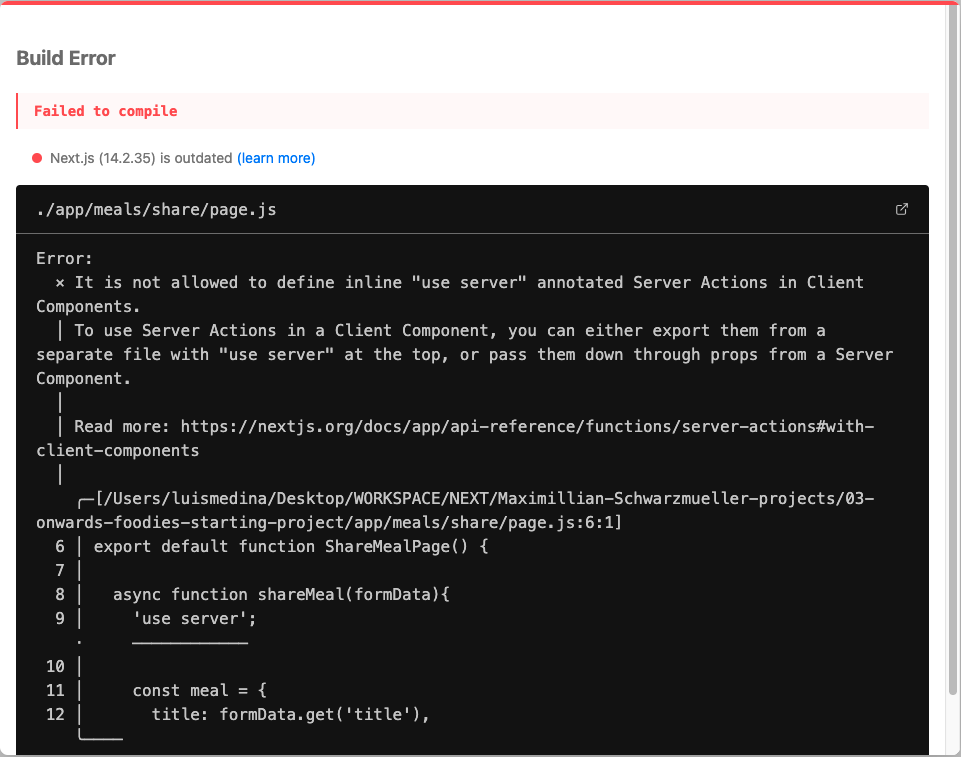

#### 121.2.2 For `client` component, remove the `server action` away:

**Subsection Summary**
- Shows the **first refactoring step**: the inline `shareMeal` Server Action is commented out inside the Client Component.
- The comment `// copy/paste to lib/actions.js file` serves as a reminder that the code is being relocated, not deleted.
- At this intermediate stage the form's `action={shareMeal}` reference is **broken** (the function no longer exists in scope), so the component would fail to compile. This is intentional — the next two subsections complete the migration.
- Keeps the `'use client'` directive untouched, confirming the component remains a Client Component.

```jsx
/* app/meals/share/page.js */
'use client';                                                   // 👈🏽 ✅ (1)
import classes from './page.module.css';
import ImagePicker from '../../components/meals/image-picker';

export default function ShareMealPage() {

  // copy/paste to lib/actions.js file                          // 👈🏽 ✅ (2)
  // async function shareMeal(formData){
  //   'use server';

  //   const meal = {
  //     title: formData.get('title'),
  //     summary: formData.get('summary'),
  //     instructions: formData.get('instructions'),
  //     image: formData.get('image'),
  //     creator: formData.get('name'),
  //     creator_email: formData.get('email'),
  //   }
  //   console.log(meal);
  // }

  return (
    <>
      <header className={classes.header}>
        <h1>
          Share your <span className={classes.highlight}>favorite meal</span>
        </h1>
        <p>Or any other meal you feel needs sharing!</p>
      </header>
      <main className={classes.main}>
        <form className={classes.form} action={shareMeal}>
          <div className={classes.row}>
            <p>
              <label htmlFor="name">Your name</label>
              <input type="text" id="name" name="name" required />
            </p>
            <p>
              <label htmlFor="email">Your email</label>
              <input type="email" id="email" name="email" required />
            </p>
          </div>
          <p>
            <label htmlFor="title">Title</label>
            <input type="text" id="title" name="title" required />
          </p>
          <p>
            <label htmlFor="summary">Short Summary</label>
            <input type="text" id="summary" name="summary" required />
          </p>
          <p>
            <label htmlFor="instructions">Instructions</label>
            <textarea
              id="instructions"
              name="instructions"
              rows="10"
              required
            ></textarea>
          </p>
          <ImagePicker label="Your image" name="image" />
          <p className={classes.actions}>
            <button type="submit">Share Meal</button>
          </p>
        </form>
      </main>
    </>
  );
}
```

#### 121.2.3 `server action` move aways due to `client` component:

**Subsection Summary**
- Creates the new file `lib/actions.js` which contains the extracted `shareMeal` Server Action.
- The `'use server'` directive is placed at the **module level** (line 1), marking every exported function in this file as a Server Action — this is the key difference from the inline approach.
- The function is prefixed with `export` so it can be imported by name from any component.
- The commented-out `// 'use server'` inside the function body (annotation ✅ (3)) is left as a reminder that it is **no longer needed** when the module-level directive is present; it would be redundant.
- The function body itself is unchanged from the previous lesson — it extracts form data and logs the `meal` object.

```jsx
/* lib/actions.js */
'use server';                                       // 👈🏽 ✅ (1)

export async function shareMeal(formData){          // 👈🏽 ✅ (2)
    //'use server';                                 // 👈🏽 ✅ (3)

    const meal = {
      title: formData.get('title'),
      summary: formData.get('summary'),
      instructions: formData.get('instructions'),
      image: formData.get('image'),
      creator: formData.get('name'),
      creator_email: formData.get('email'),
    }
    console.log(meal);
  }
```

#### 121.2.4 Import the `server action` into `use client` component:

**Subsection Summary**
- Completes the refactoring by importing `shareMeal` from `@/lib/actions` into the Client Component (annotation ✅ (1)).
- The `@/` path alias resolves to the project root, making the import clean and independent of relative directory depth.
- The `<form action={shareMeal}>` usage (annotation ✅ (2)) is identical to the previous lesson — the only change is where the function comes from (an import instead of an inline definition).
- The commented-out code from 121.2.2 has been removed entirely, leaving a clean component with no dead code.
- The component now has a clear separation: **rendering and interactivity** live in the Client Component, while **server-side mutation logic** lives in `lib/actions.js`.

```jsx
/* app/meals/share/page.js */
'use client';
import classes from './page.module.css';
import ImagePicker from '../../components/meals/image-picker';
import { shareMeal } from '@/lib/actions';                          // 👈🏽 ✅ (1)

export default function ShareMealPage() {
  return (
    <>
      <header className={classes.header}>
        <h1>
          Share your <span className={classes.highlight}>favorite meal</span>
        </h1>
        <p>Or any other meal you feel needs sharing!</p>
      </header>
      <main className={classes.main}>
        <form className={classes.form} action={shareMeal}>          {/* 👈🏽 ✅ (2) */}
          <div className={classes.row}>
            <p>
              <label htmlFor="name">Your name</label>
              <input type="text" id="name" name="name" required />
            </p>
            <p>
              <label htmlFor="email">Your email</label>
              <input type="email" id="email" name="email" required />
            </p>
          </div>
          <p>
            <label htmlFor="title">Title</label>
            <input type="text" id="title" name="title" required />
          </p>
          <p>
            <label htmlFor="summary">Short Summary</label>
            <input type="text" id="summary" name="summary" required />
          </p>
          <p>
            <label htmlFor="instructions">Instructions</label>
            <textarea
              id="instructions"
              name="instructions"
              rows="10"
              required
            ></textarea>
          </p>
          <ImagePicker label="Your image" name="image" />
          <p className={classes.actions}>
            <button type="submit">Share Meal</button>
          </p>
        </form>
      </main>
    </>
  );
}
```

[👉🏽 visit this link](http://localhost:3000/meals/share)

### 🐞 121.3 Issues:

- The commented-out `'use server'` inside `shareMeal` in `lib/actions.js` is redundant and may confuse readers.
- The commented-out dead code left in `app/meals/share/page.js` (intermediate step 121.2.2) should not remain in the final codebase.
- No input validation is performed in the Server Action before processing `formData`.
- `console.log(meal)` is still present as a debug statement — not suitable for production.

| Issue | Status | Log/Error |
|---|---|---|
| Redundant commented-out `'use server'` inside function | ℹ️ Low Priority | `lib/actions.js:4` — The inline `// 'use server'` is unnecessary when the module-level `'use server'` directive is present on line 1. It should be removed to avoid confusion. |
| Dead commented-out code in Client Component | ℹ️ Low Priority | `app/meals/share/page.js:8-21` — The commented-out `shareMeal` function body was left as a migration breadcrumb but should be removed now that the extraction is complete. |
| No input validation in Server Action | ⚠️ Identified | `lib/actions.js:3-14` — The `shareMeal` function extracts `formData` values without any validation (empty strings, invalid email, missing image). Malicious or malformed data could be processed. |
| Debug `console.log` left in Server Action | ℹ️ Low Priority | `lib/actions.js:14` — `console.log(meal)` is useful during development but should be removed or replaced with proper logging before production. |
| All exports become Server Actions | ℹ️ Informational | `lib/actions.js:1` — The module-level `'use server'` directive means **every** exported function in this file is exposed as a callable server endpoint. If non-action helpers are added later and exported, they would unintentionally become server-callable. |

### 🧱 121.4 Pending Fixes (TODO)

- [ ] Remove the redundant commented-out `// 'use server'` inside the `shareMeal` function — `lib/actions.js:4`
- [ ] Remove the commented-out dead code block (old inline `shareMeal`) from the Client Component — `app/meals/share/page.js:8-21`
- [ ] Add server-side input validation inside `shareMeal` (check for empty/missing fields, validate email format, verify image is a `File` instance) — `lib/actions.js:6-13`
- [ ] Remove or replace `console.log(meal)` with a structured logging utility before production — `lib/actions.js:14`
- [ ] Consider splitting `lib/actions.js` into domain-specific files (e.g., `lib/actions/meals.js`) as the number of Server Actions grows, to prevent accidental exposure of helper functions
- [ ] Add `aria-label="Share your meal"` to the submit button for improved accessibility — `app/meals/share/page.js:62`

[↑ top — 121. Lesson 121 — *Storing Server Actions in Separate Files*](#-121-lesson-121--storing-server-actions-in-separate-files)


<br>

## 🔧 122. Lesson 122 — *Creating a Slug & Sanitizing User Input for XSS Protection*

[🧳 Section 03: *NextJS Essential (App Router)*](#-section-03-nextjs-essential-app-router)

### 📑 Table of Contents:
- [122. Lesson 122 — *Creating a Slug & Sanitizing User Input for XSS Protection*](#-122-lesson-122--creating-a-slug--sanitizing-user-input-for-xss-protection)
- [122.1 Context](#-1221-context)
- [122.2 Updating code according the context](#️-1222-updating-codetheory-according-the-context)
  - [122.2.1 Create `saveMeal` function in `lib/meals.js` file](#12221-create-savemeal-function-in-libmealsjs-file)
  - [122.2.2 Compare meal properties from `actions.js` file and `db.prepare` attribute from `initdb.js` file](#12222-compare-meal-properties-from-actionsjs-file-and-dbprepare-attribute-from-initdbjs-file)
  - [122.2.3 Install `slugify` package](#12223-install-slugify-package)
  - [122.2.4 Update the `saveMeal` function](#12224-update-the-savemeal-function)
- [122.3 Issues](#-1223-issues)
- [122.4 Pending Fixes (TODO)](#-1224-pending-fixes-todo)

### 🧠 122.1 Context:

This lesson addresses the preparation of user-submitted meal data **before** it can be safely persisted to the SQLite database. Two specific problems are solved: (1) generating a URL-friendly **slug** from the meal title (required by the `meals` table schema but absent from the form data), and (2) **sanitizing** the user-provided `instructions` field to prevent **Cross-Site Scripting (XSS)** attacks.

The approach uses two lightweight npm packages — `slugify` and `xss` — which are imported into `lib/meals.js` and applied inside the new `saveMeal` utility function. This function mutates the `meal` object in-place, adding the `slug` property and overwriting `instructions` with a sanitized version, so the data is ready for a database `INSERT` in a subsequent lesson.

#### Key Concepts

1. **Slug generation** — A *slug* is a URL-safe, lowercase, hyphen-separated string derived from a human-readable title (e.g., `"Juicy Cheese Burger"` → `"juicy-cheese-burger"`). The `slugify` library handles Unicode transliteration, whitespace replacement, and special-character removal.
2. **XSS sanitization** — Cross-Site Scripting occurs when untrusted user input containing `<script>` tags or event-handler attributes is rendered as HTML. The `xss` library parses HTML content and strips or escapes dangerous elements/attributes while preserving safe markup.
3. **In-place mutation** — Instead of creating new local variables (`const slug = ...`), the lesson deliberately assigns back to the `meal` object (`meal.slug = ...`, `meal.instructions = ...`). This keeps the calling code simple because the same object reference is enriched with all required fields.
4. **Schema alignment** — The `meals` table requires a `slug TEXT NOT NULL UNIQUE` column. Because the share form does not collect a slug from the user, it must be derived server-side before insertion.
5. **Defense in depth** — Sanitization at the data-entry layer (Server Action / utility function) is a first line of defense. It should be complemented by output escaping at render time (React handles this by default for JSX expressions) and parameterized SQL queries (already used via `better-sqlite3` placeholders).

#### Advantages

- **Automatic slug creation** — Users never have to manually craft a URL-friendly identifier; it is derived deterministically from the title.
- **XSS prevention at the source** — Cleaning user input before storage means the database never contains raw malicious markup, reducing risk even if output escaping is accidentally bypassed.
- **Minimal footprint** — Both `slugify` (~5 KB) and `xss` (~30 KB) are lightweight, well-maintained packages with no heavy dependency trees.
- **Centralized logic** — Placing slug generation and sanitization inside `saveMeal` ensures every code path that persists a meal applies the same rules, avoiding scattered, inconsistent handling.

#### Disadvantages / Gotchas

- **Slug collisions** — `slugify` alone does not guarantee uniqueness. Two meals with the same title will produce the same slug, violating the `UNIQUE` constraint in the database. A suffix strategy (e.g., appending a timestamp or random string) is needed for production.
- **Overly aggressive sanitization** — The default `xss` configuration may strip legitimate HTML that the author intended (e.g., `` tags, custom class attributes). Depending on requirements, the whitelist may need tuning.
- **In-place mutation** — Mutating the incoming `meal` object can surprise callers who do not expect side effects. A functional (immutable) approach — returning a new object — is often considered safer.
- **No validation** — Sanitization removes dangerous content but does **not** validate that the remaining content is meaningful (e.g., an empty string after stripping could still pass through).
- **Typo in comment** — The lesson code contains `// sanatize` instead of `// sanitize`, which is a minor but notable quality issue.

#### When to Consider Alternatives

- If you need **guaranteed unique slugs**, consider appending a short hash, UUID segment, or auto-increment suffix rather than relying solely on `slugify`.
- If the `instructions` field should only accept **plain text** (no HTML at all), use a simple regex strip or `DOMPurify` with an empty allowlist instead of `xss`.
- For **large-scale applications**, consider a dedicated validation + sanitization middleware layer (e.g., `zod` for schema validation combined with `DOMPurify`) rather than ad-hoc calls inside each utility function.
- If **immutability** is preferred in your codebase, return a new object from `saveMeal` (`return { ...meal, slug, instructions }`) instead of mutating the parameter.

### ⚙️ 122.2 Updating code/theory according the context:

#### **Summary**
- This section walks through four steps to prepare user-submitted meal data for database insertion by generating a slug and sanitizing HTML input.
- **122.2.1** introduces the empty `saveMeal` function scaffold in `lib/meals.js`.
- **122.2.2** compares the `meal` object from `lib/actions.js` against the `meals` table schema in `initdb.js`, revealing that the `slug` column has no corresponding form field and must be derived server-side.
- **122.2.3** installs the `slugify` and `xss` npm packages required to create slugs and sanitize HTML.
- **122.2.4** completes `saveMeal` by importing both packages and using them to set `meal.slug` and overwrite `meal.instructions` with sanitized content.
- Together, the four steps form a **data-preparation recipe** that sits between form submission (Server Action) and database persistence (not yet implemented).

Goal:
- Storing meal from `lib/actions.js` file

#### 122.2.1 Create `saveMeal` function in `lib/meals.js` file:

**Subsection Summary**
- Adds an empty `saveMeal` function export to `lib/meals.js`, establishing the scaffold that will hold slug generation and sanitization logic.
- At this stage the function accepts a `meal` parameter but has no body — it serves as a placeholder for the implementation that follows in 122.2.4.
- The existing `getMeals` and `getMeal` exports remain untouched; only a new export is appended.

```jsx
/* lib/meals.js */
import sql from 'better-sqlite3';
const db = sql('meals.db');
export async function getMeals() {
  await new Promise((resolve) => setTimeout(resolve, 2000));
  return db.prepare('SELECT * FROM meals').all();
}

export function getMeal(slug){
  return db.prepare('SELECT * FROM meals WHERE slug = ?').get(slug)
}
export function saveMeal(meal){....}              // 👈🏽 ✅ (1)
```

#### 122.2.2 Compare meal properties from `actions.js` file and `db.prepare` attribute from `initdb.js` file:

**Subsection Summary**
- Performs a **side-by-side comparison** between the `meal` object constructed in the Server Action (`lib/actions.js`) and the `CREATE TABLE` schema defined in `initdb.js`.
- The `meal` object has six properties: `title`, `summary`, `instructions`, `image`, `creator`, and `creator_email`. The table, however, also requires `slug TEXT NOT NULL UNIQUE`.
- This mismatch is the **core motivation** for the lesson: `slug` must be generated programmatically before the meal can be inserted.
- The `id` column is `AUTOINCREMENT` and handled by SQLite, so it does not need to be in the `meal` object.

```jsx
/* lib/actions.js */
....
const meal = {
  title: formData.get('title'),
  summary: formData.get('summary'),
  instructions: formData.get('instructions'),
  image: formData.get('image'),
  creator: formData.get('name'),
  creator_email: formData.get('email'),
}
....
```

and

```js
....
`CREATE TABLE IF NOT EXISTS meals (
    id INTEGER PRIMARY KEY AUTOINCREMENT,
    slug TEXT NOT NULL UNIQUE,    -- 👈🏽 ✅ 🤔
    title TEXT NOT NULL,
    image TEXT NOT NULL,
    summary TEXT NOT NULL,
    instructions TEXT NOT NULL,
    creator TEXT NOT NULL,
    creator_email TEXT NOT NULL
)`
....
```

`slug` is missing in `meal` from `lib/actions.js` file.


#### 122.2.3 Install `slugify` package:

**Subsection Summary**
- Installs two npm packages in a single command: `slugify` (for URL-friendly slug generation) and `xss` (for HTML sanitization against Cross-Site Scripting attacks).
- The dev server must be stopped before running `npm install` to avoid lock-file conflicts or hot-reload issues.
- After installation, `package.json` gains `"slugify": "^1.6.6"` and `"xss": "^1.0.15"` under `dependencies`.

1. quit the server.
2. Run from terminal:
```bash
npm install slugify xss
```
> xss: it protects from cross-site scripting attacks.

#### 122.2.4 Update the `saveMeal` function:

**Subsection Summary**
- Imports `slugify` and `xss` at the top of `lib/meals.js` (annotation ✅ (1)).
- Inside `saveMeal`, generates a lowercase slug from `meal.title` using `slugify(meal.title, { lower: true })` and assigns it directly to `meal.slug` (annotation ✅ (3)). The commented-out line (annotation ✅ (2)) shows the alternative of storing the slug in a local variable, which was rejected in favor of in-place mutation.
- Sanitizes `meal.instructions` by passing it through `xss()`, which strips dangerous HTML tags and attributes. The result overwrites the original `instructions` value on the `meal` object (annotation ✅ (3)).
- The commented-out alternatives (annotation ✅ (2)) are left for educational comparison, illustrating the difference between local-variable assignment and in-place mutation.

```jsx
/* lib/meals.js */
import sql from 'better-sqlite3';
import slugify from 'slugify';                                          // 👈🏽 ✅ (1)
import xss from 'xss';                                                  // 👈🏽 ✅ (1)

const db = sql('meals.db');

export async function getMeals() {
  await new Promise((resolve) => setTimeout(resolve, 2000));
  return db.prepare('SELECT * FROM meals').all();
}

export function getMeal(slug){
  return db.prepare('SELECT * FROM meals WHERE slug = ?').get(slug)
}
export function saveMeal(meal){
  //const slug = slugify(meal.title, { lower: true });                    // 👈🏽 ✅ (2)
  meal.slug = slugify(meal.title, { lower: true });                       // 👈🏽 ✅ (3)
  
  //const instructions = xss(meal.instructions);  // sanatize its content.    // 👈🏽 ✅ (2)
  meal.instructions = xss(meal.instructions);                                 // 👈🏽 ✅ (3)
}
```

### 🐞 122.3 Issues:

- Slug generation does not handle collisions — duplicate titles will produce the same slug, violating the `UNIQUE` database constraint.
- The `saveMeal` function mutates the incoming `meal` object in-place, which can lead to unexpected side effects for callers.
- The commented-out code (alternative local-variable approach) adds noise and may confuse future readers.
- The comment `// sanatize its content.` contains a typo ("sanatize" → "sanitize").
- No validation is performed to ensure `meal.title` is non-empty before passing it to `slugify`.
- The `saveMeal` function is not yet called from anywhere (the Server Action in `lib/actions.js` does not invoke it yet).

| Issue | Status | Log/Error |
|---|---|---|
| Slug uniqueness not guaranteed | ⚠️ Identified | `lib/meals.js:17` — `slugify(meal.title, { lower: true })` produces the same slug for identical titles. A second meal with the same title will throw a `UNIQUE constraint failed: meals.slug` SQLite error on insertion. |
| In-place mutation of `meal` parameter | ℹ️ Informational | `lib/meals.js:17,20` — `meal.slug = ...` and `meal.instructions = ...` mutate the caller's object. If any upstream code retains a reference to the original `meal`, it will see the mutated values unexpectedly. |
| Commented-out dead code | ℹ️ Low Priority | `lib/meals.js:16,19` — The commented-out local-variable alternatives (`const slug = ...`, `const instructions = ...`) are educational but should be removed in a production codebase. |
| Typo in comment | ℹ️ Low Priority | `lib/meals.js:19` — `// sanatize its content.` should read `// sanitize its content.` |
| No validation before slugification | ⚠️ Identified | `lib/meals.js:17` — If `meal.title` is `undefined`, `null`, or an empty string, `slugify` will return an empty string, creating an invalid slug. |
| `saveMeal` not yet invoked | ℹ️ Informational | `lib/actions.js:3-12` — The `shareMeal` Server Action constructs the `meal` object but does not call `saveMeal(meal)`. This will be addressed in a future lesson. |

### 🧱 122.4 Pending Fixes (TODO)

- [ ] Add a uniqueness suffix strategy (e.g., append a timestamp or short hash) to prevent slug collisions — `lib/meals.js:17`
- [ ] Add validation to ensure `meal.title` is a non-empty string before calling `slugify` — `lib/meals.js:17`
- [ ] Remove commented-out dead code (local-variable alternatives) once no longer needed for reference — `lib/meals.js:16,19`
- [ ] Fix the typo `sanatize` → `sanitize` in the inline comment — `lib/meals.js:19`
- [ ] Consider returning a new object from `saveMeal` instead of mutating the parameter for immutability — `lib/meals.js:15-21`
- [ ] Wire `saveMeal` into the `shareMeal` Server Action so the data-preparation logic is actually executed — `lib/actions.js:12`
- [ ] Add unit tests for `saveMeal` to verify slug generation and XSS sanitization behavior — `lib/meals.js:15-21`

[↑ top — 122. Lesson 122 — *Creating a Slug & Sanitizing User Input for XSS Protection*](#-122-lesson-122--creating-a-slug--sanitizing-user-input-for-xss-protection)


<br>

## 🔧 123. Lesson 123 — *Storing Uploaded Images & Storing Data in the Database*

[🧳 Section 03: *NextJS Essential (App Router)*](#-section-03-nextjs-essential-app-router)

### 📑 Table of Contents:
- [123. Lesson 123 — *Storing Uploaded Images & Storing Data in the Database*](#-123-lesson-123--storing-uploaded-images--storing-data-in-the-database)
- [123.1 Context](#-1231-context)
- [123.2 Updating code according the context](#️-1232-updating-codetheory-according-the-context)
  - [123.2.1 Extract the file extension and build a unique file name with a timestamp](#12321-extract-the-file-extension-and-build-a-unique-file-name-with-a-timestamp)
  - [123.2.2 Import Node.js `fs`, write the image to disk, and store the public path](#12322-import-nodejs-fs-write-the-image-to-disk-and-store-the-public-path)
  - [123.2.3 Refactor the timestamp helper and add the `INSERT INTO meals` SQL statement](#12323-refactor-the-timestamp-helper-and-add-the-insert-into-meals-sql-statement)
  - [123.2.4 Wire `saveMeal` into the `shareMeal` Server Action](#12324-wire-savemeal-into-the-sharemeal-server-action)
  - [123.2.5 Redirect the user to `/meals` after saving](#12325-redirect-the-user-to-meals-after-saving)
- [123.3 Issues](#-1233-issues)
- [123.4 Pending Fixes (TODO)](#-1234-pending-fixes-todo)

### 🧠 123.1 Context:

This lesson completes the **meal-creation pipeline** started in Lesson 122. Where the previous lesson prepared the data (slug + XSS sanitization), this lesson tackles the two remaining persistence steps: (1) **writing the uploaded image file to the filesystem** under `public/images/`, and (2) **inserting the complete meal record into the SQLite database** via a parameterized `INSERT` statement. A `redirect('/meals')` call at the end of the Server Action sends the user back to the meals list so they immediately see the newly added meal.

Images are stored on the **filesystem** rather than as BLOBs inside SQLite. This is a deliberate architectural choice — databases are optimized for structured, queryable data; large binary files are better served directly by the web server or a CDN. The database row only stores the **public path** (`/images/<fileName>`) so the front-end can reference it in ``.

#### Key Concepts

1. **File-system storage for uploads** — The uploaded `File` object is read into memory via `arrayBuffer()`, then written to disk through a Node.js `fs.createWriteStream`. The resulting path (`/images/<fileName>`) is stored in the database, not the binary data itself.
2. **Unique file naming with a timestamp** — To prevent file-name collisions when two meals share the same slug, a datetime tag (e.g., `20260212_201322`) is appended to every file name. The helper function `getTimeTag()` produces this from `new Date().toISOString()`.
3. **`Buffer.from(arrayBuffer)`** — The Web API `File.arrayBuffer()` returns an `ArrayBuffer`; Node.js streams expect a `Buffer`. `Buffer.from()` bridges the two APIs.
4. **Parameterized SQL with `better-sqlite3`** — Named placeholders (`@title`, `@slug`, etc.) map directly to properties of the object passed to `.run(meal)`, avoiding manual value ordering and protecting against SQL injection.
5. **`redirect()` from `next/navigation`** — After a successful mutation, calling `redirect('/meals')` inside a Server Action triggers a server-side redirect. This is the idiomatic Next.js pattern for post-mutation navigation and prevents the user from re-submitting by refreshing.
6. **Stream error callback** — `stream.write()` accepts an optional callback whose first argument is an `error` object. If writing fails (e.g., disk full, permission denied), the callback can throw to surface the problem.

#### Advantages

- **Performance** — Serving images directly from the filesystem (or a CDN in production) is far more efficient than reading BLOBs from a database on every request.
- **Simplicity** — A single `fs.createWriteStream` + `stream.write` pair is all that is needed; no third-party upload library is required for local development.
- **Collision avoidance** — The timestamp suffix ensures unique filenames even when slugs repeat, complementing the `UNIQUE` constraint on the `slug` column itself.
- **End-to-end flow** — With `saveMeal` wired into `shareMeal` and followed by `redirect`, the user has a seamless create → persist → view experience without manual page navigation.
- **Parameterized queries** — Using `@property` placeholders delegates escaping to `better-sqlite3`, eliminating SQL injection risk.

#### Disadvantages / Gotchas

- **`public/` directory caveat** — Files saved to `public/images/` during development are available immediately, but in a **production build** Next.js only copies `public/` at build time. Dynamically written files after the build will not be served unless additional server configuration is provided (e.g., a custom static middleware or an external storage service like S3).
- **No error propagation from the stream callback** — In the lesson code the `stream.write` callback references `error` but the original snippet (123.2.2) does not declare `error` as a parameter (fixed in the actual `lib/meals.js`). Even with the fix, throwing inside an async callback does **not** reject the enclosing `async` function's promise — the error may be swallowed silently.
- **No file-size or MIME-type validation** — Any file the user selects is written to disk without checking size limits or verifying it is actually an image, opening the door to abuse.
- **In-place mutation continues** — `meal.image` is overwritten from a `File` object to a string path (`/images/…`), which could confuse callers that still expect a `File`.
- **Synchronous `db.prepare(…).run(meal)` after async file I/O** — Mixing a synchronous SQLite call with an async stream write means the database row may be inserted before the file has finished flushing to disk.

#### When to Consider Alternatives

- For **production deployments**, replace the local filesystem write with an **object-storage service** (AWS S3, Cloudflare R2, Vercel Blob) so uploaded files survive container restarts and can be served via a CDN.
- If **file validation** is critical, use a library like `file-type` to verify the MIME type from the file's magic bytes before saving, and enforce a maximum file size.
- For **guaranteed write completion**, consider using `fs.promises.writeFile()` (or wrapping the stream in a `Promise`) instead of `stream.write` with a callback, so `await` properly gates the subsequent database insert.
- If you need **transactional guarantees** (image + DB row succeed or both roll back), wrap the two operations in a try/catch that deletes the written file if the `INSERT` fails.
- For **large-scale apps**, consider a dedicated upload endpoint with progress tracking and resumable uploads rather than processing the file inside a Server Action.

### ⚙️ 123.2 Updating code/theory according the context:

#### **Summary**
- This section implements the full **image-to-disk + data-to-database** pipeline across five incremental steps, completing the meal-creation feature.
- **123.2.1** extracts the file extension from the uploaded image and constructs a unique filename by appending a datetime tag to the slug.
- **123.2.2** imports Node.js `fs`, creates a write stream to `public/images/`, reads the image into a buffer, writes it to disk, and stores the resulting public path on the `meal` object.
- **123.2.3** refactors the timestamp into a concise `getTimeTag()` helper and adds the `INSERT INTO meals` SQL statement that persists the entire `meal` object to SQLite.
- **123.2.4** wires the `saveMeal` function into the `shareMeal` Server Action so form submissions are actually persisted.
- **123.2.5** adds `redirect('/meals')` after `saveMeal` to navigate the user to the meals list upon success.
- Together, the five steps transform a raw form submission into a stored database record with an image on the filesystem and then navigate the user to see the result.

* Image should be store on the file system, not in the database.
* storing file in the database is a bad idea.
* bad for performance

#### 123.2.1 Extract the file extension and build a unique file name with a timestamp

**Subsection Summary**
- Extends the `saveMeal` function (from Lesson 122) with logic to derive a **unique filename** for the uploaded image.
- Extracts the file extension (e.g., `.png`, `.jpg`) by splitting the image name on `.` and taking the last segment (annotation ✅ (1)).
- Generates a datetime string (e.g., `20260212_201322`) from `Date.now()` to use as a collision-avoidance suffix (annotation ✅ (2)).
- Combines the slug, datetime, and extension into the final filename (annotation ✅ (3)).
- At this stage the function does **not** yet write the file to disk — that is handled in 123.2.2.

```jsx
/* lib/meals.js */
import sql from 'better-sqlite3';
import slugify from 'slugify';
import xss from 'xss';

const db = sql('meals.db');

export async function getMeals() {
  await new Promise((resolve) => setTimeout(resolve, 2000));
  return db.prepare('SELECT * FROM meals').all();
}

export function getMeal(slug){
  return db.prepare('SELECT * FROM meals WHERE slug = ?').get(slug)
}
export function saveMeal(meal){
  meal.slug = slugify(meal.title, { lower: true });
  meal.instructions = xss(meal.instructions);

  // add datetime in order to avoid the override of the same file     // 👈🏽 ✅ (2)
  const myTime = Date.now();
  const myDate = new Date(myTime)
    .toISOString()
    .replace('T', '_')
    .replace(/\..*/,'')
    .replace(/:/g,'');

  const extension = meal.image.split('.').pop();                      // 👈🏽 ✅ (1) get the extension of the image: .png .jpeg .jpg
  const fileName = `${meal.slug}_${myDate}.${extension}`;             // 👈🏽 ✅ (3)
}
```

#### 123.2.2 Import Node.js `fs`, write the image to disk, and store the public path

**Subsection Summary**
- Imports Node.js built-in `fs` module using the `node:` protocol prefix (annotation ✅ (1)).
- Changes `saveMeal` from synchronous to `async` so the image can be read with `await meal.image.arrayBuffer()` (annotation ✅ (3)).
- Opens a **write stream** targeting `public/images/<fileName>` via `fs.createWriteStream` (annotation ✅ (2)).
- Adds `.name` to `meal.image.name.split('.')` because `meal.image` is a Web API `File` object (not a plain string), so `.name` is needed to access the original filename (annotation ✅ (4)).
- Converts the `ArrayBuffer` to a Node.js `Buffer` and writes it to disk with `stream.write(Buffer.from(bufferedImage), callback)` (annotation ✅ (5)). The callback checks for errors.
- Overwrites `meal.image` with the **public web path** (`/images/<fileName>`) so the database stores a URL-friendly reference instead of the binary file (annotation ✅ (6)).

```jsx
/* lib/meals.js */
import fs from 'node:fs';                                           // 👈🏽 ✅ (1)

import sql from 'better-sqlite3';
import slugify from 'slugify';
import xss from 'xss';

const db = sql('meals.db');

export async function getMeals() {
  await new Promise((resolve) => setTimeout(resolve, 2000));
  return db.prepare('SELECT * FROM meals').all();
}

export function getMeal(slug){
  return db.prepare('SELECT * FROM meals WHERE slug = ?').get(slug)
}
export async function saveMeal(meal){                                 // 👈🏽 ✅ (3) 'async'
  meal.slug = slugify(meal.title, { lower: true });
  meal.instructions = xss(meal.instructions);

  const myTime = Date.now();
  const myDate = new Date(myTime)
    .toISOString()
    .replace('T', '_')
    .replace(/\..*/,'')
    .replace(/:/g,'');

  const extension = meal.image.name.split('.').pop();                 // 👈🏽 ✅ (4) ".name" added
  const fileName = `${meal.slug}_${myDate}.${extension}`;

  // Opens a file-writing stream to save the image inside public/images/
  // 1. You prepare an empty bucket and say:  
  //    "From now on, anything I put in this bucket goes straight into a file called cat.jpg"
  const stream = fs.createWriteStream(`public/images/${fileName}`);   // 👈🏽 ✅ (2)

  // Reads the uploaded image file into memory as raw bytes
  // 2. You take the photo that came from the internet form
  //    and you load ALL of it into your computer's memory (RAM)
  const bufferedImage = await meal.image.arrayBuffer();               // 👈🏽 ✅ (3) 'await'

  // Writes those bytes to the file on disk
  // 3. You start pouring the toy box (photo) into the funnel (stream)
  stream.write(Buffer.from(bufferedImage), () => {                    // 👈🏽 ✅ (5)
    if(error) {
      throw new Error('Saving image failed!')
    }
  });

  // Stores the public web path of the image (so it can be shown in )
  meal.image = `/images/${fileName}`;                                 // 👈🏽 ✅ (6)
}
```

#### 123.2.3 Refactor the timestamp helper and add the `INSERT INTO meals` SQL statement

**Subsection Summary**
- Refactors the verbose timestamp logic from 123.2.1/123.2.2 into a compact arrow function `getTimeTag()` that chains `toISOString().slice(0,19).replaceAll(…)` into a single expression.
- Adds the `db.prepare(…).run(meal)` call (annotation ✅ (1)) that **inserts the meal record into SQLite** — this is the first time actual data reaches the database.
- The SQL `INSERT INTO meals` statement (annotation ✅ (2)) lists all seven non-auto-increment columns and uses named placeholders (`@title`, `@slug`, etc.) that `better-sqlite3` maps directly to properties of the `meal` object.
- `.run(meal)` (annotation ✅ (3)) executes the prepared statement with the enriched `meal` object (which now contains `slug`, sanitized `instructions`, and the filesystem image path).
- The `stream.write` callback still references an undeclared `error` parameter — this bug is carried over from 123.2.2 and is noted in the Issues section.

```jsx
/* lib/meals.js */
import fs from 'node:fs';
import sql from 'better-sqlite3';
import slugify from 'slugify';
import xss from 'xss';

const db = sql('meals.db');

export async function getMeals() {
  await new Promise((resolve) => setTimeout(resolve, 2000));
  return db.prepare('SELECT * FROM meals').all();
}

export function getMeal(slug){
  return db.prepare('SELECT * FROM meals WHERE slug = ?').get(slug)
}

export async function saveMeal(meal){
  meal.slug = slugify(meal.title, { lower: true });
  meal.instructions = xss(meal.instructions);

  const getTimeTag = () => 
    new Date().toISOString().slice(0, 19).replaceAll('-', '').replace('T', '_').replaceAll(':', '');

  const extension = meal.image.name.split('.').pop(); 
  const fileName = `${meal.slug}_${getTimeTag()}.${extension}`;
  const stream = fs.createWriteStream(`public/images/${fileName}`);
  const bufferedImage = await meal.image.arrayBuffer();
  stream.write(Buffer.from(bufferedImage), () => {
    if(error) {
      throw new Error('Saving image failed!')
    }
  });
  meal.image = `/images/${fileName}`;

  // saving in the database:
  db.prepare(`                                                              // 👈🏽 ✅ (1)
    INSERT INTO meals                                                       // 👈🏽 ✅ (2)
      (title, summary, instructions, creator, creator_email, image, slug)      
    VALUES (                                                                // 👈🏽 ✅ (2)
      @title,
      @summary,
      @instructions,
      @creator,
      @creator_email,
      @image,
      @slug
    )
  `).run(meal)                                                              // 👈🏽 ✅ (3)
}
```

#### 123.2.4 Wire `saveMeal` into the `shareMeal` Server Action

**Subsection Summary**
- Updates `lib/actions.js` to actually **import** `saveMeal` from `./meals` (annotation ✅ (1)) and **call** it with the constructed `meal` object (annotation ✅ (2)).
- This closes the gap identified in Lesson 122 where `saveMeal` existed but was never invoked from the Server Action.
- The `console.log(meal)` line is commented out, indicating it was used for debugging and is no longer needed.
- The import path uses `'./meals'` (relative) rather than the `@/lib/meals` alias — this is corrected in 123.2.5.
- The screenshot (`section03-lecture123-001.png`) shows the result of a successful submission in the browser, confirming the pipeline works end-to-end.

```jsx
/* lib/actions.js */
'use server';

import { saveMeal } from './meals';                                         // 👈🏽 ✅ (1)

export async function shareMeal(formData){
    const meal = {
      title: formData.get('title'),
      summary: formData.get('summary'),
      instructions: formData.get('instructions'),
      image: formData.get('image'),
      creator: formData.get('name'),
      creator_email: formData.get('email'),
    }
    //console.log(meal);
    
    await saveMeal(meal);                                                   // 👈🏽 ✅ (2)
  }
```

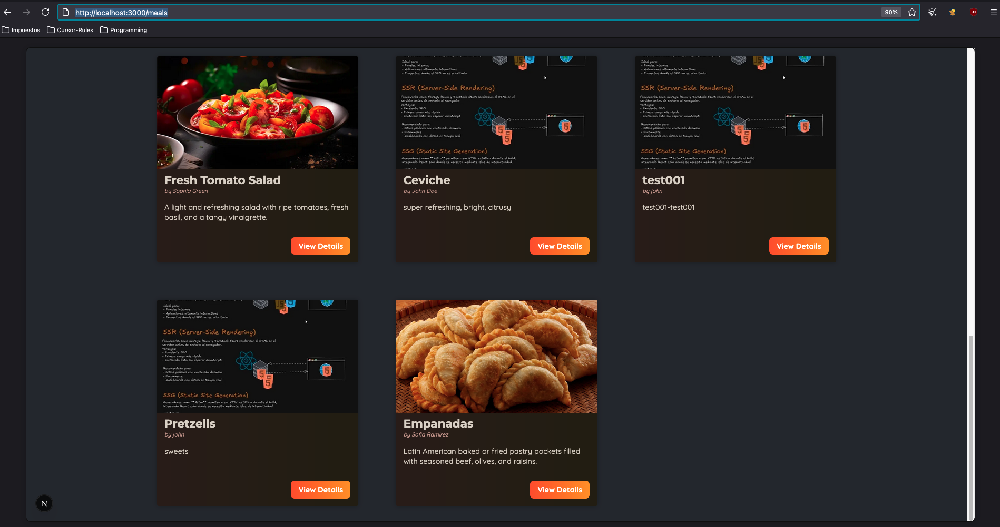

#### 123.2.5 Redirect the user to `/meals` after saving

**Subsection Summary**
- Imports `redirect` from `next/navigation` (annotation ✅ (1)) — the Next.js utility for performing server-side redirects from Server Actions.
- After `await saveMeal(meal)` completes, calls `redirect('/meals')` (annotation ✅ (1)) to navigate the user to the meals listing page where the newly created meal will appear.
- The import path for `saveMeal` is updated to use the `@/lib/meals` alias (Next.js module alias) for consistency with the rest of the project.
- This is the **final step** of the meal-creation feature: the user fills the form → the Server Action extracts data → `saveMeal` writes the image and inserts the DB row → `redirect` sends the user to `/meals`.

```jsx
/* lib/actions.js */
'use server';
import { saveMeal } from '@/lib/meals';
import { redirect } from 'next/navigation';                                 // 👈🏽 ✅ (1)

export async function shareMeal(formData){
  const meal = {
    title: formData.get('title'),
    summary: formData.get('summary'),
    instructions: formData.get('instructions'),
    image: formData.get('image'),
    creator: formData.get('name'),
    creator_email: formData.get('email'),
  }
  await saveMeal(meal);
  redirect('/meals');                                                       // 👈🏽 ✅ (1)  
}
```

### 🐞 123.3 Issues:
| Issue | Status | Log/Error |
|---|---|---|
| `public/images/` not served after production build | ⚠️ Identified | `lib/meals.js:27` — `fs.createWriteStream('public/images/…')` writes files that exist at runtime but are absent from the build-time `public/` snapshot. In production, uploaded images will 404. |
| No file-size or MIME-type validation | ⚠️ Identified | `lib/meals.js:24-29` — The uploaded `File` is written to disk without any checks. A user could upload a 500 MB non-image file and it would be stored. |
| Error inside `stream.write` callback is not awaited | ⚠️ Identified | `lib/meals.js:31-34` — `throw new Error('Saving image failed!')` inside the callback does not propagate to the `async saveMeal` promise. The DB insert at line 39 runs regardless of whether the write succeeded. |
| No rollback on failed `INSERT` | ⚠️ Identified | `lib/meals.js:27,39-51` — If `db.prepare(…).run(meal)` throws (e.g., `UNIQUE constraint failed`), the already-written image file at `public/images/<fileName>` is not deleted, creating an orphan. |
| In-place mutation of `meal.image` from `File` to `string` | ℹ️ Informational | `lib/meals.js:37` — `meal.image = '/images/…'` silently changes the type from a `File` object to a string path. Callers retaining a reference to the original `meal` will see this change. |

### 🧱 123.4 Pending Fixes (TODO)

- [ ] Replace the `stream.write` callback pattern with `fs.promises.writeFile()` (or wrap the stream in a `Promise`) so errors properly reject the enclosing `async` function — `lib/meals.js:27-35`
- [ ] Add file-size and MIME-type validation before writing to disk (e.g., reject files > 5 MB or non-image types) — `lib/meals.js:24-29`
- [ ] Wrap the file write + DB insert in a try/catch that deletes the written image if the `INSERT` fails — `lib/meals.js:27-51`
- [ ] For production, migrate image storage to an external service (S3, Cloudflare R2, Vercel Blob) instead of writing to `public/images/` — `lib/meals.js:27`
- [ ] Consider returning a new object from `saveMeal` instead of mutating `meal` in-place — `lib/meals.js:17-51`
- [ ] Add input validation to ensure all required fields (`title`, `summary`, `instructions`, `image`, `creator`, `creator_email`) are present and non-empty before processing — `lib/meals.js:17-19`
- [ ] Add unit/integration tests for the full `saveMeal` flow (file write + DB insert + error paths) — `lib/meals.js:17-51`

[↑ top — 123. Lesson 123 — *Storing Uploaded Images & Storing Data in the Database*](#-123-lesson-123--storing-uploaded-images--storing-data-in-the-database)


<br>

## 🔧 124. Lesson 124 — *Managing the Form Submission Status with useFormStatus*

[🧳 Section 03: *NextJS Essential (App Router)*](#-section-03-nextjs-essential-app-router)

### 📑 Table of Contents:
- [124. Lesson 124 — *Managing the Form Submission Status with useFormStatus*](#-124-lesson-124--managing-the-form-submission-status-with-useformstatus)
- [124.1 Context](#-1241-context)
- [124.2 Updating code according the context](#️-1242-updating-codetheory-according-the-context)
  - [124.2.1 First attempt — using `useFormStatus` directly in the page component](#12421-first-attempt--using-useformstatus-directly-in-the-page-component)
  - [124.2.2 Rollback — reverting `ShareMealPage` to a Server Component](#12422-rollback--reverting-sharemealpage-to-a-server-component)
  - [124.2.3 Correct approach — extracting a `MealsFormSubmit` Client Component](#12423-correct-approach--extracting-a-mealsformsubmit-client-component)
  - [124.2.4 Integrating `MealsFormSubmit` into the share page](#12424-integrating-mealsformsubmit-into-the-share-page)
- [124.3 Issues](#-1243-issues)
- [124.4 Pending Fixes (TODO)](#-1244-pending-fixes-todo)

### 🧠 124.1 Context:

After implementing the meal-creation pipeline (Lessons 122–123), the form works but provides **no visual feedback** while the Server Action is running. Because `saveMeal` writes an image to disk, inserts a database row, and then redirects, the operation can take several seconds — during which the user sees nothing and may click "Share Meal" again, risking duplicate submissions. This lesson introduces the React DOM hook **`useFormStatus`** to solve that UX gap.

`useFormStatus` is a React 18+ hook exported from `react-dom` that reports the current status of the **nearest ancestor `<form>`**. Its most commonly used property is `pending` — a boolean that is `true` while the form's `action` function is executing. This allows the UI to disable the submit button and swap the label to "Submitting…" during processing.

A critical constraint is that `useFormStatus` is a **client-side hook**, which means it requires `'use client'`. The lesson walks through the mistake of placing it directly in the page component (which would force the entire page — and all its children — into a Client Component), and then demonstrates the correct pattern: extracting a small, focused **Client Component** (`MealsFormSubmit`) that contains only the hook and the submit button, keeping the rest of the page as a Server Component.

#### Key Concepts

1. **`useFormStatus` hook** — Imported from `react-dom`, it returns an object with a `pending` boolean that reflects whether the enclosing `<form>`'s action is currently executing. It must be called from a component that is **rendered inside** a `<form>`, not in the component that renders the `<form>` itself.
2. **Client Component boundary** — React Server Components cannot use hooks. Adding `'use client'` to a page file converts the entire page (and its descendants) into Client Components, negating the benefits of server rendering. The solution is to push the hook into the smallest possible Client Component.
3. **Component extraction pattern** — Instead of converting a page to a Client Component, extract only the interactive element (e.g., the submit button) into its own `'use client'` file. This keeps data-fetching, SEO-critical markup, and Server Actions on the server.
4. **Pending state UX** — Disabling the button and changing its label while `pending` is `true` prevents duplicate submissions and communicates progress to the user.
5. **Destructuring** — `const { pending } = useFormStatus()` extracts only the `pending` property; the hook also exposes `data`, `method`, and `action`, which are ignored here.

#### Advantages

- **Prevents duplicate submissions** — Disabling the button while the Server Action runs makes it impossible for the user to accidentally submit the form twice.
- **Immediate feedback** — Swapping the button label to "Submitting…" signals that the action is in progress, improving perceived responsiveness.
- **Minimal client-side footprint** — By isolating the hook in a tiny `MealsFormSubmit` component, the `ShareMealPage` and most of the form remain Server Components with zero client-side JavaScript overhead.
- **No external dependencies** — `useFormStatus` ships with `react-dom`; no additional libraries are needed.
- **Composable** — The extracted `MealsFormSubmit` can be reused in any form that uses Server Actions, not just the share-meal page.

#### Disadvantages / Gotchas

- **Must be called inside a `<form>` descendant** — If `useFormStatus` is called in the component that _renders_ the `<form>` (rather than a child of it), `pending` will always be `false`. This is a common mistake and is demonstrated in step 124.2.1.
- **Requires `'use client'`** — The hook cannot be used in a Server Component. Placing it directly in a page component forces the entire page to become a Client Component, which is the anti-pattern shown in this lesson.
- **Only tracks the nearest ancestor form** — If your component is nested inside multiple forms, `useFormStatus` only reflects the closest one.
- **No error state** — `useFormStatus` does not expose whether the action succeeded or failed; additional error-handling logic (e.g., `useActionState`) is needed for that.
- **Button-only feedback** — The current implementation only changes the button; there is no loading spinner, progress bar, or toast notification.

#### When to Consider Alternatives

- If you need **detailed error and success state** management (not just "pending"), consider `useActionState` (React 19) or a custom state machine that tracks the full lifecycle.
- If **multiple elements** need to react to the form status (e.g., input fields should also be disabled, a progress indicator should appear elsewhere), consider lifting state or using a context provider wrapping the form.
- For **optimistic UI updates** (showing the result before the server confirms), use `useOptimistic` in combination with `useFormStatus`.
- If the form is entirely client-rendered and does not use Server Actions, standard `useState` + `onSubmit` handlers may be simpler.

### ⚙️ 124.2 Updating code/theory according the context:

#### **Summary**
- This section demonstrates the problem of adding submission feedback to a Server Action form and walks through two failed/suboptimal approaches before arriving at the correct pattern.
- **124.2.1** attempts to use `useFormStatus` directly inside the page component, which triggers a build error because the page is a Server Component.
- **124.2.2** rolls back the page to its original Server Component state after recognizing that adding `'use client'` would convert the entire page into a Client Component.
- **124.2.3** implements the correct solution: a small, dedicated `MealsFormSubmit` Client Component that encapsulates `useFormStatus` and the submit button.
- **124.2.4** integrates `MealsFormSubmit` into the share page, replacing the plain `<button>` while keeping the page as a Server Component.
- Together, these steps illustrate the **component extraction pattern** — the standard Next.js technique for using client-side hooks without sacrificing server rendering.

#### 124.2.1 First attempt — using `useFormStatus` directly in the page component

**Subsection Summary**
- Imports `useFormStatus` from `react-dom` directly in `app/meals/share/page.js` (annotation ✅ (1)) and calls it at the top of the component (annotation ✅ (2)).
- Changes the button label to `"Submitting..."` (annotation ✅ (3)) as a static placeholder — the conditional logic is not yet wired.
- This approach fails because `ShareMealPage` is a **Server Component** and hooks are not allowed in Server Components. The screenshot (`section03-lecture124-001.png`) shows the resulting error.
- Two possible fixes are discussed: (a) adding `'use client'` to the top of the file, or (b) extracting the hook into a separate Client Component. Option (a) is rejected because it would convert the **entire page** into a Client Component, which is undesirable.

```jsx
/* app/meals/share/page.js */
import { useFormStatus } from 'react-dom';                                            // 👈🏽 ✅ (1)
import ImagePicker from '../../components/meals/image-picker';
import { shareMeal } from '@/lib/actions';
import classes from './page.module.css';

export default function ShareMealPage() {
  const status = useFormStatus();       // "status.pending"                           // 👈🏽 ✅ (2)
  return (
    <>
      <header className={classes.header}>
        <h1>
          Share your <span className={classes.highlight}>favorite meal</span>
        </h1>
        <p>Or any other meal you feel needs sharing!</p>
      </header>
      <main className={classes.main}>
        <form className={classes.form} action={shareMeal}>
            <div className={classes.row}>
            <p>
              <label htmlFor="name">Your name</label>
              <input type="text" id="name" name="name" required />
            </p>
            <p>
              <label htmlFor="email">Your email</label>
              <input type="email" id="email" name="email" required />
            </p>
          </div>
          <p>
            <label htmlFor="title">Title</label>
            <input type="text" id="title" name="title" required />
          </p>
          <p>
            <label htmlFor="summary">Short Summary</label>
            <input type="text" id="summary" name="summary" required />
          </p>
          <p>
            <label htmlFor="instructions">Instructions</label>
            <textarea
              id="instructions"
              name="instructions"
              rows="10"
              required
            ></textarea>
          </p>
          <ImagePicker label="Your image" name="image" />
          <p className={classes.actions}>
            <button type="submit">Submitting...</button>                                {/* 👈🏽 ✅ (3) */}
          </p>
        </form>
      </main>
    </>
  );
}
```

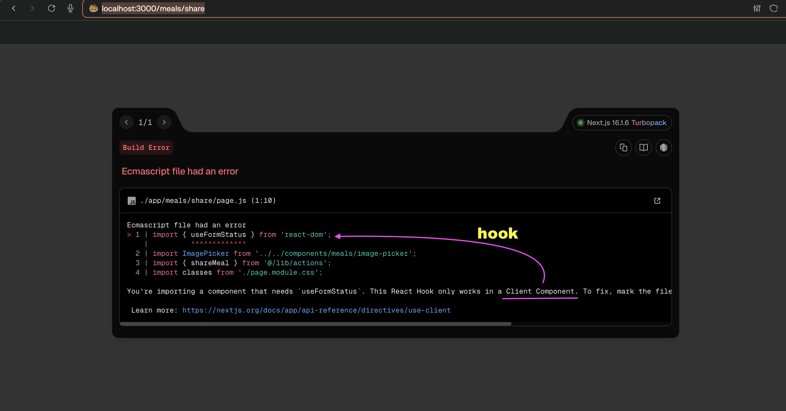

Posible Solutions:
* adding `'use client'` at top.

Another issue:
* This component become a total `client` component due to `<button type="submit">Share Meal</button>`

#### 124.2.2 Rollback — reverting `ShareMealPage` to a Server Component

**Subsection Summary**
- Reverts all changes from 124.2.1 — removes the `useFormStatus` import and the hook call — restoring the page to a plain Server Component.
- The submit button goes back to its original static `"Share Meal"` label with no pending-state logic.
- This rollback is necessary because the approach in 124.2.1 would have required `'use client'`, converting the entire page (including data-fetching and layout markup) into a Client Component.
- The clean rollback sets the stage for the correct solution in 124.2.3: extracting only the submit button into its own Client Component.

```jsx
/* app/meals/share/page.js */
import ImagePicker from '../../components/meals/image-picker';
import { shareMeal } from '@/lib/actions';
import classes from './page.module.css';

export default function ShareMealPage() {
  return (
    <>
      <header className={classes.header}>
        <h1>
          Share your <span className={classes.highlight}>favorite meal</span>
        </h1>
        <p>Or any other meal you feel needs sharing!</p>
      </header>
      <main className={classes.main}>
        <form className={classes.form} action={shareMeal}>
            <div className={classes.row}>
            <p>
              <label htmlFor="name">Your name</label>
              <input type="text" id="name" name="name" required />
            </p>
            <p>
              <label htmlFor="email">Your email</label>
              <input type="email" id="email" name="email" required />
            </p>
          </div>
          <p>
            <label htmlFor="title">Title</label>
            <input type="text" id="title" name="title" required />
          </p>
          <p>
            <label htmlFor="summary">Short Summary</label>
            <input type="text" id="summary" name="summary" required />
          </p>
          <p>
            <label htmlFor="instructions">Instructions</label>
            <textarea
              id="instructions"
              name="instructions"
              rows="10"
              required
            ></textarea>
          </p>
          <ImagePicker label="Your image" name="image" />
          <p className={classes.actions}>
            <button type="submit">Share Meal</button>
          </p>
        </form>
      </main>
    </>
  );
}
```

#### 124.2.3 Correct approach — extracting a `MealsFormSubmit` Client Component

**Subsection Summary**
- Creates a new file `app/components/meals/meals-form-submit.js` containing a dedicated Client Component for the submit button (annotation ✅ (1)).
- Marks the file with `'use client'` (annotation ✅ (2)) so the hook can be used without affecting the parent page's Server Component status.
- Imports `useFormStatus` from `react-dom` and destructures `{ pending }` (annotation ✅ (3)).
- Uses `pending` in two places: to **disable** the button via the `disabled` attribute (annotation ✅ (4)) and to **conditionally render** the label as `"Submitting..."` or `"Share Meal"` (annotation ✅ (3)).
- This is the **component extraction pattern** — the standard Next.js approach for using client-side hooks in an otherwise server-rendered page.

```jsx
/* app/components/meals/meals-form-submit.js */
'use client'                                              // 👈🏽 ✅ (2)
import { useFormStatus } from 'react-dom';                // 👈🏽 ✅ (3)
const MealsFormSubmit = () => {                           // 👈🏽 ✅ (1)
  const { pending } = useFormStatus();                    // 👈🏽 ✅ (3)

  return (
    <button disabled={pending}>                           {/* 👈🏽 ✅ (4) */}
      { pending ? 'Submitting...' : "Share Meal" }        {/* 👈🏽 ✅ (3) */}
    </button>
  )
}
export default MealsFormSubmit;
```

#### 124.2.4 Integrating `MealsFormSubmit` into the share page

**Subsection Summary**
- Imports the newly created `MealsFormSubmit` component using the `@/` alias (annotation ✅ (1)).
- Replaces the plain `<button type="submit">Share Meal</button>` with `<MealsFormSubmit />` (annotation ✅ (2)). The original button is commented out for reference.
- The page remains a **Server Component** — only the `MealsFormSubmit` child is a Client Component, keeping the client-side JavaScript footprint minimal.
- The screenshot (`section03-lecture124-002.png`) shows the button in its "Submitting…" disabled state during form submission, confirming the hook works correctly.

```jsx
/* app/meals/share/page.js */
import ImagePicker from '../../components/meals/image-picker';
import { shareMeal } from '@/lib/actions';
import classes from './page.module.css';
import MealsFormSubmit from '@/app/components/meals/meals-form-submit';                     // 👈🏽 ✅ (1)

export default function ShareMealPage() {
  return (
    <>
      <header className={classes.header}>
        <h1>
          Share your <span className={classes.highlight}>favorite meal</span>
        </h1>
        <p>Or any other meal you feel needs sharing!</p>
      </header>
      <main className={classes.main}>
        <form className={classes.form} action={shareMeal}>
            <div className={classes.row}>
            <p>
              <label htmlFor="name">Your name</label>
              <input type="text" id="name" name="name" required />
            </p>
            <p>
              <label htmlFor="email">Your email</label>
              <input type="email" id="email" name="email" required />
            </p>
          </div>
          <p>
            <label htmlFor="title">Title</label>
            <input type="text" id="title" name="title" required />
          </p>
          <p>
            <label htmlFor="summary">Short Summary</label>
            <input type="text" id="summary" name="summary" required />
          </p>
          <p>
            <label htmlFor="instructions">Instructions</label>
            <textarea
              id="instructions"
              name="instructions"
              rows="10"
              required
            ></textarea>
          </p>
          <ImagePicker label="Your image" name="image" />
          <p className={classes.actions}>
            {/* <button type="submit">Share Meal</button> */}
            <MealsFormSubmit />                                                             {/* 👈🏽 ✅ (2) */}
          </p>
        </form>
      </main>
    </>
  );
}
```

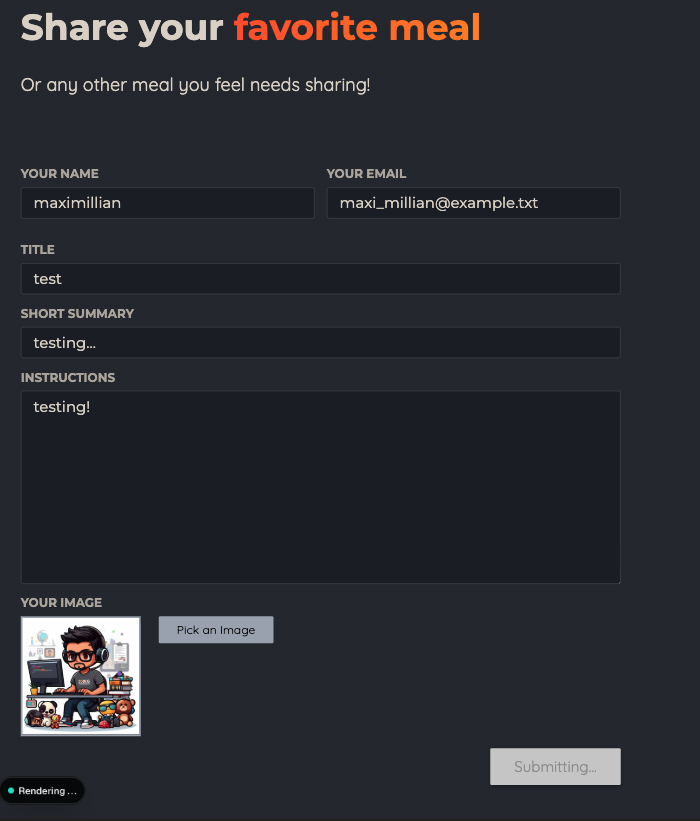

### 🐞 124.3 Issues:
| Issue | Status | Log/Error |
|---|---|---|
| No visual loading indicator | ℹ️ Low Priority | `app/components/meals/meals-form-submit.js:10-12` — The button only changes its text label to "Submitting…"; there is no spinner, animation, or other visual cue to reinforce that the action is in progress. |
| Commented-out dead code | ℹ️ Low Priority | `app/meals/share/page.js:46` — `{/* <button type="submit">Share Meal</button> */}` is left in for reference but is dead code in production. |
| Missing accessibility attributes | ℹ️ Informational | `app/components/meals/meals-form-submit.js:10` — The button is disabled via `disabled={pending}` but does not set `aria-busy="true"` or `aria-label` to communicate the pending state to screen readers. |
| No error feedback to user | ⚠️ Identified | `app/components/meals/meals-form-submit.js:6-13` — `useFormStatus` only exposes `pending`; if the Server Action throws, the user sees the button re-enable with no error message. A complementary error-handling mechanism (e.g., `useActionState`) is needed. |

### 🧱 124.4 Pending Fixes (TODO)

- [ ] Add a loading spinner or CSS animation alongside the "Submitting…" text for stronger visual feedback — `app/components/meals/meals-form-submit.js:10-12`
- [ ] Remove the commented-out `<button>` from the share page once it is no longer needed for reference — `app/meals/share/page.js:46`
- [ ] Add `aria-busy={pending}` to the `<button>` for improved screen-reader accessibility — `app/components/meals/meals-form-submit.js:10`
- [ ] Implement error handling using `useActionState` to display validation or server errors to the user — `app/meals/share/page.js`, `app/components/meals/meals-form-submit.js`
- [ ] Consider disabling all form inputs (not just the button) while the submission is pending to prevent editing during processing — `app/meals/share/page.js:16-48`

[↑ top — 124. Lesson 124 — *Managing the Form Submission Status with useFormStatus*](#-124-lesson-124--managing-the-form-submission-status-with-useformstatus)


<br>

## 🔧 125. Lesson 125 — *Adding Server-Side Input Validation*

[🧳 Section 03: *NextJS Essential (App Router)*](#-section-03-nextjs-essential-app-router)

### 📑 Table of Contents:
- [125. Lesson 125 — *Adding Server-Side Input Validation*](#-125-lesson-125--adding-server-side-input-validation)
- [125.1 Context](#-1251-context)
- [125.2 Updating code according the context](#️-1252-updating-codetheory-according-the-context)
  - [125.2.1 The problem — browser-only validation can be bypassed](#12521-the-problem--browser-only-validation-can-be-bypassed)
  - [125.2.2 Adding server-side validation with `isInvalidText` in the Server Action](#12522-adding-server-side-validation-with-isinvalidtext-in-the-server-action)
  - [125.2.3 Adding an error boundary to handle validation failures gracefully](#12523-adding-an-error-boundary-to-handle-validation-failures-gracefully)
  - [125.2.4 Testing — bypassing browser validation to trigger the server guard](#12524-testing--bypassing-browser-validation-to-trigger-the-server-guard)
- [125.3 Issues](#-1253-issues)
- [125.4 Pending Fixes (TODO)](#-1254-pending-fixes-todo)

### 🧠 125.1 Context:

After implementing the meal-sharing form (Lessons 122–124), every input field carries the HTML `required` attribute, which means the browser prevents empty submissions. However, **client-side (browser) validation is never trustworthy on its own** — any user can open DevTools, remove the `required` attribute from every `<input>`, and submit the form with empty or malicious values. The Server Action would then call `saveMeal` with garbage data, potentially inserting incomplete or corrupt rows into the database.

This lesson adds a **server-side validation guard** inside the `shareMeal` Server Action. A small helper function `isInvalidText` checks whether a string is falsy or blank after trimming. The guard validates all text fields, confirms the email contains an `@`, and verifies that the image `File` object exists and has a non-zero `size`. If any check fails, the action throws an `Error('Invalid input')`, which Next.js surfaces through the nearest **error boundary** — a `'use client'` `error.js` file placed in the same route segment.

#### Key Concepts

1. **Defense in depth** — Client-side validation (`required` attribute, `type="email"`, etc.) provides a good user experience but is **not a security measure**. Server-side validation is the authoritative check because the server is the only environment the developer fully controls.
2. **`isInvalidText` helper** — A reusable predicate that returns `true` when a value is `null`, `undefined`, an empty string, or a string containing only whitespace. It consolidates the repeated `!value || value.trim() === ''` pattern into a single function.
3. **Compound validation guard** — Multiple conditions are combined with `||` inside a single `if` block. If **any** condition is truthy, the entire submission is rejected. This covers text fields, email format (the `@` check), and the image file (existence + non-zero `size`).
4. **Throwing inside a Server Action** — When a Server Action throws, Next.js does **not** crash the server. Instead, it serializes the error and sends it to the client, where the nearest `error.js` error boundary catches it and renders a fallback UI.
5. **Route-segment error boundary (`error.js`)** — A special Next.js file convention. Placing `error.js` inside `app/meals/share/` creates a React Error Boundary scoped to that route segment. It must be a Client Component (`'use client'`), and it automatically wraps the page's content so thrown errors are caught and a user-friendly message is displayed.

#### Advantages

- **Security** — Even if a malicious user disables browser validation, the server rejects invalid data before it reaches `saveMeal` or the database.
- **Data integrity** — Guarantees that every inserted meal row has non-empty `title`, `summary`, `instructions`, `creator`, a valid-ish `creator_email`, and a real image file.
- **Reusable helper** — `isInvalidText` is a pure function that can be reused across other Server Actions or validation layers.
- **Graceful error handling** — The `error.js` boundary catches the thrown error and shows a friendly message instead of an unhandled exception or a blank page.
- **No external dependencies** — The validation logic uses only plain JavaScript; no validation library (Zod, Yup, etc.) is needed for this scope.

#### Disadvantages / Gotchas

- **Generic error message** — `throw new Error('Invalid input')` does not tell the user **which** field failed. The error boundary renders a generic "An error occurred!" message, making it hard for the user to correct the problem.
- **No field-level feedback** — Unlike a client-side validation library, this approach does not highlight the specific invalid input or display per-field error messages.
- **`@` check is minimal** — `!meal.creator_email.includes('@')` is a very loose email validation. Strings like `"@@"` or `"@"` would pass. A regex or a dedicated validator would be more robust.
- **Image validation is shallow** — Checking `!meal.image || meal.image.size === 0` confirms a file was attached but does not verify its MIME type, maximum size, or whether it is actually an image.
- **Error boundary replaces the form** — When the error boundary renders, the user loses their form input. They must navigate back and re-enter all data from scratch, which is a poor user experience.
- **Typo in error boundary** — The `error.js` file contains `"An error occured!"` — a misspelling of "occurred."

#### When to Consider Alternatives

- For **per-field error messages** returned from the server, use `useActionState` (React 19) to return a state object with field-level errors instead of throwing.
- For **schema-based validation**, consider libraries like **Zod** or **Yup** that provide declarative schemas, automatic type coercion, and detailed error objects — especially if validation rules grow complex.
- For **email validation beyond the `@` check**, use a well-tested regex pattern or a library like `validator.js` to handle edge cases.
- For **image validation**, inspect the file's magic bytes with a library like `file-type` and enforce size limits before writing to disk.
- If **preserving form state on error** is important, return the error as data (via `useActionState`) rather than throwing, so the form remains mounted and the user can correct the mistake without re-entering everything.

### ⚙️ 125.2 Updating code/theory according the context:

#### **Summary**
- This section addresses the critical gap between **browser-side HTML validation** (which can be trivially bypassed) and **server-side validation** (which cannot).
- **125.2.1** demonstrates the vulnerability: removing `required` attributes via DevTools allows empty form submissions to reach the Server Action unchecked.
- **125.2.2** adds a `isInvalidText` helper and a compound `if` guard inside `shareMeal` that validates all fields and throws on invalid input.
- **125.2.3** creates an `error.js` error boundary in `app/meals/share/` to catch the thrown error and display a user-friendly fallback.
- **125.2.4** tests the full flow by removing browser validation in DevTools and confirming the server-side guard rejects the submission and the error boundary renders.

#### 125.2.1 The problem — browser-only validation can be bypassed

**Subsection Summary**
- Explains that the share-meal form currently relies solely on the HTML `required` attribute in `app/meals/share/page.js` for input validation.
- There is **no server-side validation** in `lib/actions.js` — the `shareMeal` function passes `formData` values directly to `saveMeal` without any checks.
- A user can open the browser DevTools, select each `<input>` element, remove the `required` attribute, and submit the form with empty or invalid values.
- The screenshot (`section03-lecture125-001.png`) shows this exact scenario: the user manipulating the DOM to bypass client-side validation.

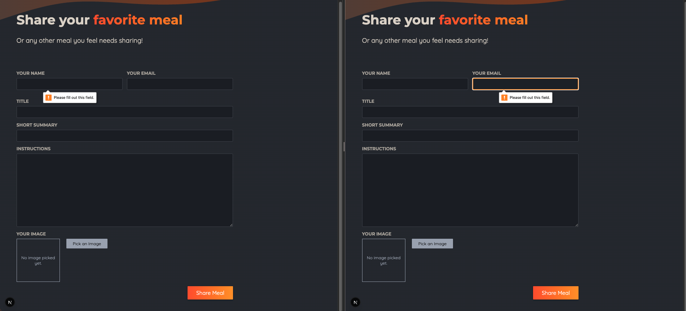

#### 125.2.2 Adding server-side validation with `isInvalidText` in the Server Action

**Subsection Summary**
- Defines an `isInvalidText` helper function (annotation ✅ (1)) that returns `true` if the input is falsy or a whitespace-only string. This consolidates the repeated null/empty check into a single reusable predicate.
- Adds a compound `if` guard (annotation ✅ (2)) inside `shareMeal` that validates every field before calling `saveMeal`:
  - All text fields (`title`, `summary`, `instructions`, `creator`, `creator_email`) are checked via `isInvalidText`.
  - The email must contain an `@` character (annotation ✅ (3)).
  - The image must exist and have a non-zero `size` (annotation ✅ (4)).
- If any condition fails, the action `throw new Error('Invalid input')` (annotation ✅ (5)), which stops execution and prevents the invalid data from reaching the database.
- A commented-out line (`//if(!meal.title || meal.title.trim() === ''){}`) shows the initial inline approach before it was refactored into the `isInvalidText` helper.

```jsx
/* lib/actions.js */
'use server';
import { saveMeal } from '@/lib/meals';
import { redirect } from 'next/navigation';

const isInvalidText = (text) => {                                               // 👈🏽 ✅ (1)
  return !text || text.trim() === '';
}

export async function shareMeal(formData){
  const meal = {
    title: formData.get('title'),
    summary: formData.get('summary'),
    instructions: formData.get('instructions'),
    image: formData.get('image'),
    creator: formData.get('name'),
    creator_email: formData.get('email'),
  };

  //if(!meal.title || meal.title.trim() === ''){}
  if(                                                                           // 👈🏽 ✅ (2)
    isInvalidText(meal.title) ||
    isInvalidText(meal.summary) ||
    isInvalidText(meal.instructions) ||
    isInvalidText(meal.creator) ||
    isInvalidText(meal.creator_email) ||
    !meal.creator_email.includes('@') ||                                        // 👈🏽 ✅ (3)
    !meal.image ||                                                              // 👈🏽 ✅ (4)
    meal.image.size === 0                                                       // 👈🏽 ✅ (4)
  ){
    throw new Error('Invalid input');                                            // 👈🏽 ✅ (5)
  }

  await saveMeal(meal);
  redirect('/meals');
}
```

#### 125.2.3 Adding an error boundary to handle validation failures gracefully

**Subsection Summary**
- Creates a new file `app/meals/share/error.js` (annotation ✅ (1)) — a **route-segment error boundary** that Next.js uses to catch errors thrown within this route.
- Marks the component with `"use client"` (annotation ✅ (2)) because Next.js error boundaries must be Client Components.
- Renders a simple fallback UI with an error heading and a descriptive paragraph asking the user to try again.
- When the `shareMeal` Server Action throws `'Invalid input'`, Next.js catches the error and renders this `Error` component instead of crashing the page.
- Contains a typo: `"An error occured!"` should be `"An error occurred!"`.

```jsx
/* app/meals/share/error.js */
"use client"                                                                    // 👈🏽 ✅ (2)
export default function Error() {                                               // 👈🏽 ✅ (1)
  return <main className="error">
    <h1>An error occured!</h1>
    <p>Failed to create meal, please try again later.</p>
  </main>
}
```

#### 125.2.4 Testing — bypassing browser validation to trigger the server guard

**Subsection Summary**
- Demonstrates the end-to-end test: open DevTools on the share-meal page, select each `<input>` and `<textarea>`, remove the `required` attribute, then submit the form with empty fields.
  * Delete all `required` in HTML from `app/meals/share/page.js` in the browser to skip validation
- Because the browser no longer blocks the submission, the `shareMeal` Server Action executes, the `isInvalidText` guard catches the empty values, and `throw new Error('Invalid input')` fires.
- Next.js catches the error and renders the `error.js` error boundary, confirming the server-side validation works as expected.
- The screenshot (`section03-lecture125-002.png`) shows the error boundary rendered in the browser after the invalid submission.


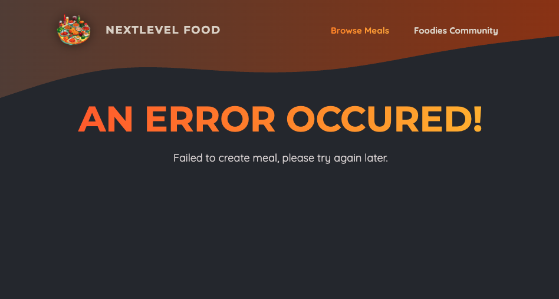

### 🐞 125.3 Issues:
| Issue | Status | Log/Error |
|---|---|---|
| Generic error message — no field-level feedback | ⚠️ Identified | `lib/actions.js:30` — `throw new Error('Invalid input')` does not specify which field failed. The user sees only "An error occurred!" with no guidance on what to fix. |
| Minimal email validation | ⚠️ Identified | `lib/actions.js:26` — `!meal.creator_email.includes('@')` accepts strings like `"@@"` or `"@"` as valid. A stricter regex or validation library is recommended. |
| Shallow image validation | ⚠️ Identified | `lib/actions.js:27-28` — Only checks that the image exists and has `size > 0`. Does not verify MIME type, file extension, or enforce a maximum file size. |
| Typo in error boundary | ℹ️ Low Priority | `app/meals/share/error.js:4` — `"An error occured!"` should be `"An error occurred!"`. |
| Form state lost on error | ℹ️ Informational | `app/meals/share/error.js:2-7` — When the error boundary renders, the form is unmounted and the user loses all entered data. Returning errors via `useActionState` would preserve the form state. |
| Commented-out dead code | ℹ️ Low Priority | `lib/actions.js:19` — `//if(!meal.title || meal.title.trim() === ''){}` is left for reference but is dead code. |

### 🧱 125.4 Pending Fixes (TODO)

- [ ] Replace `throw new Error('Invalid input')` with a `useActionState`-based approach that returns per-field error messages to the form without unmounting it — `lib/actions.js:30`
- [ ] Strengthen the email validation with a proper regex pattern or a library like `validator.js` — `lib/actions.js:26`
- [ ] Add MIME-type and file-size checks for the uploaded image (e.g., reject files > 5 MB or non-image types) — `lib/actions.js:27-28`
- [ ] Fix the typo `"occured"` → `"occurred"` in the error boundary heading — `app/meals/share/error.js:4`
- [ ] Remove the commented-out inline validation once it is no longer needed for reference — `lib/actions.js:19`
- [ ] Consider adding an `Error` component prop for `error` and a `reset` callback to allow the user to retry without navigating away — `app/meals/share/error.js:2`
- [ ] Add a "Back to form" link or button in the error boundary so the user can return to the share page easily — `app/meals/share/error.js:5`

[↑ top — 125. Lesson 125 — *Adding Server-Side Input Validation*](#-125-lesson-125--adding-server-side-input-validation)


---

<br>
<br>
<br>

🔥 🔥 🔥 

<br>

## 🔧 XXX. Lesson XXX — *{{TITLE_NAME}}*

### 🧠 XXX.1 Context:

### ⚙️ XXX.2 Updating code/theory according the context:

#### XXX.2.1 
```jsx
/*  */

```

#### XXX.2.2
```jsx
/*  */

```

#### XXX.2.3
```jsx
/*  */

```

#### XXX.2.4
```jsx
/*  */

```

### 🐞 XXX.3 Issues:
| Issue | Status | Log/Error |
|---|---|---|

### 🧱 XXX.4 Pending Fixes (TODO)

- [ ]